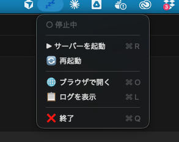

<div align="center">
  
  <h1>Claude Code UI</h1>
  <p><strong>🏃 PCを立ち上げっぱなしにして、ジムやウォーキングに出かけよう</strong></p>
  <p>スマートフォンからセキュアにClaude Codeを操作できるリモートUI</p>
  <br>
  <p>
    <a href="https://github.com/RVCA212/claude-code-ui">📦 Original Repository (RVCA212)</a> からフォーク
  </p>
</div>

---

## コンセプト

**Claude Code UI** は、自宅のPCで動作する Claude Code / Cursor CLI / Codex を、外出先からスマートフォンでセキュアに操作するためのWebベースUIです。

```
🏠 自宅PC                          📱 外出先
┌─────────────────┐               ┌─────────────────┐
│ Claude Code UI  │◄──セキュア────►│   スマホブラウザ  │
│ (常時起動)      │   トンネル      │   ジム/散歩中    │
│                 │               │                 │
│ ☁️ メニューバー   │               │  タスクを確認    │
│    から制御     │               │  指示を送信      │
└─────────────────┘               └─────────────────┘
```

**こんな使い方ができます：**
- 🏋️ ジムで運動しながら、コード生成の進捗を確認
- 🚶 散歩中に、AIへ追加の指示を送信
- ☕ カフェで、長時間タスクの結果をチェック
- 🛋️ リビングから、デスクのPCを操作

## スクリーンショット

<div align="center">

<table>
<tr>
<td align="center">
<h3>デスクトップ</h3>

<br>
<em>プロジェクト一覧とチャットUI</em>
</td>
<td align="center">
<h3>スマートフォン</h3>

<br>
<em>外出先からタッチ操作で制御</em>
</td>
</tr>
</table>

</div>

## 主な機能

- **📱 レスポンシブUI** - スマートフォン・タブレット・デスクトップで最適化
- **💬 チャットインターフェース** - Claude Code / Cursor / Codex との対話
- **🖥️ 統合ターミナル** - 直接CLIを操作
- **📁 ファイルエクスプローラー** - プロジェクトのファイルを閲覧・編集
- **🔀 Git操作** - ステージング、コミット、ブランチ切り替え
- **🔐 セキュアアクセス** - Cloudflare Tunnel + Access で安全に外部公開

---

## クイックスタート

### 必要なもの

- macOS / Linux / Windows
- [Node.js](https://nodejs.org/) v20以上
- [Claude Code CLI](https://docs.anthropic.com/en/docs/claude-code)（または [Cursor CLI](https://docs.cursor.com/en/cli/overview) / [Codex](https://developers.openai.com/codex)）

### 方法1: npxで即座に起動（お試し）

```bash
npx @siteboon/claude-code-ui
```

ブラウザで `http://localhost:3001` にアクセス。

### 方法2: グローバルインストール（推奨）

```bash
# インストール
npm install -g @siteboon/claude-code-ui

# 起動
claude-code-ui

# または
cloudcli
```

### 方法3: ソースからインストール（開発者向け）

```bash
# リポジトリをクローン
git clone https://github.com/siteboon/claudecodeui.git
cd claudecodeui

# 依存関係をインストール
npm install

# 開発モードで起動
npm run dev
```

---

## 開発者向けコマンド一覧

ソースからインストールした場合の各コマンドです。

### ポート設定

| ポート | 用途 |
|--------|------|
| `3001` | バックエンドサーバー（API/WebSocket） |
| `5173` | フロントエンド開発サーバー（Vite） |

> **Note**: 開発時は `http://localhost:5173` にアクセスします。本番ビルド時は `http://localhost:3001` のみで動作します。

### 起動コマンド

| コマンド | 用途 | 説明 |
|----------|------|------|
| `npm run dev` | ローカル開発 | フロントエンド + バックエンドを同時起動（開発モード） |
| `npm run dev:tunnel` | リモート開発 | 上記 + Cloudflare Tunnelを同時起動 |
| `npm run server` | バックエンドのみ | APIサーバーのみ起動（ポート3001） |
| `npm run client` | フロントエンドのみ | Vite開発サーバーのみ起動（ポート5173） |
| `npm run tunnel` | Tunnelのみ | Cloudflare Tunnelのみ起動（要事前設定） |
| `npm run start` | 本番起動 | ビルド後にサーバーを起動 |

### 使い分けガイド

```bash
# 🏠 ローカルで開発・テストする場合
npm run dev
# → http://localhost:5173 でアクセス

# 📱 スマホからリモートアクセスしたい場合
npm run dev:tunnel
# → https://claude.your-domain.com でアクセス

# ☁️ Tunnelだけ別ターミナルで起動したい場合
npm run dev      # ターミナル1
npm run tunnel   # ターミナル2（別窓）

# 🖥️ メニューバーアプリから起動する場合
# → アプリが npm run dev を自動実行します
```

### Cloudflare Tunnel 単独起動

Tunnelのみを起動する場合は、事前に以下が必要です：

1. `cloudflared tunnel login` で認証済み
2. `cloudflared tunnel create claudeui` でトンネル作成済み
3. `~/.cloudflared/config.yml` に設定ファイル作成済み

```bash
# Tunnelのみ起動（バックエンドは別途起動が必要）
npm run tunnel

# または直接コマンド
cloudflared tunnel run claudeui
```

> **Tip**: `npm run tunnel` は `caffeinate` コマンドを使用してMacのスリープを防止します。

---

## macOS メニューバーアプリ

macOSでは、メニューバーから簡単にサーバーを起動・停止できるネイティブアプリを作成できます。

<div align="center">
  
  <br>
  <em>メニューバーからワンクリックで制御</em>
</div>

### インストール

```bash
# リポジトリをクローン（まだの場合）
git clone https://github.com/siteboon/claudecodeui.git
cd claudecodeui

# メニューバーアプリを作成
./scripts/create-native-menubar-app.sh
```

アプリは `~/Applications/ClaudeCodeUI.app` に作成されます。

### 機能

| アイコン | 状態 |
|---------|------|
| ☁️ | サーバー実行中 |
| 💤 | サーバー停止中 |

**メニュー項目：**
- ▶ サーバーを起動
- ⏹ サーバーを停止
- 🔄 再起動
- 🌐 ブラウザで開く
- 📋 ログを表示
- ❌ 終了

### ログイン時に自動起動

1. **システム設定** を開く
2. **一般** → **ログイン項目**
3. **+** をクリックして `~/Applications/ClaudeCodeUI.app` を追加

これで、Macを起動するだけでサーバーが自動的に立ち上がります。

---

## 外部からセキュアにアクセス（Cloudflare Tunnel）

外出先からスマートフォンでアクセスするには、Cloudflare Tunnelを使用します。

### アーキテクチャ

```
📱 スマートフォン（外出先）
        ↓ HTTPS
   インターネット
        ↓
  Cloudflare CDN
        ↓
  Cloudflare Access (認証レイヤー) ← メール/Google/GitHub認証
        ↓
  Cloudflare Tunnel (暗号化トンネル)
        ↓
🏠 自宅PC: localhost:3001 ← Claude Code UI
```

**メリット：**
- ✅ **ポート開放不要** - ルーター設定不要、ファイアウォールそのまま
- ✅ **全通信が暗号化** - HTTPS強制、中間者攻撃を防止
- ✅ **ゼロトラスト認証** - 許可したユーザーのみアクセス可能
- ✅ **無料で利用可能** - Cloudflare Free Planで十分

### 前提条件

- Cloudflareアカウント（無料）
- 独自ドメイン（Cloudflareで管理）または `*.trycloudflare.com`

### Step 1: cloudflaredをインストール

**macOS:**
```bash
brew install cloudflare/cloudflare/cloudflared
```

**Linux:**
```bash
wget https://github.com/cloudflare/cloudflared/releases/latest/download/cloudflared-linux-amd64
sudo mv cloudflared-linux-amd64 /usr/local/bin/cloudflared
sudo chmod +x /usr/local/bin/cloudflared
```

**Windows:**
```powershell
choco install cloudflared
```

### Step 2: Tunnelを作成

```bash
# Cloudflareにログイン（ブラウザが開く）
cloudflared tunnel login

# トンネルを作成
cloudflared tunnel create claudeui
# → トンネルIDが発行される（例: a1b2c3d4-...）

# DNSを設定（your-domain.comは自分のドメインに変更）
cloudflared tunnel route dns claudeui claude.your-domain.com
```

### Step 3: 設定ファイルを作成

`~/.cloudflared/config.yml`:
```yaml
tunnel: <your-tunnel-id>
credentials-file: ~/.cloudflared/<tunnel-id>.json

ingress:
  - hostname: claude.your-domain.com
    service: http://localhost:3001
  - service: http_status:404
```

### Step 4: Cloudflare Accessで認証を設定

Tunnelだけでは**URLを知っている人は誰でもアクセス可能**です。
Cloudflare Accessで認証を追加しましょう。

1. [Zero Trust Dashboard](https://one.dash.cloudflare.com/) にアクセス
2. **Access** → **Applications** → **Add an application**
3. **Self-hosted** を選択
4. 設定:
   - **Application name**: `Claude Code UI`
   - **Application domain**: `claude.your-domain.com`
   - **Session Duration**: `24 hours`

5. **Add a Policy** で認証ルールを作成:
   - **Policy name**: `Allow Me`
   - **Action**: `Allow`
   - **Include**: `Emails` → `your-email@example.com`

6. **Save application**

これで、指定したメールアドレスでログインした人のみアクセス可能になります。

### Step 5: 起動

```bash
# Claude Code UIを起動
npm run server

# 別ターミナルでTunnelを起動
cloudflared tunnel run claudeui
```

または一括起動:
```bash
npm run dev:tunnel
```

### Step 6: アクセス

1. スマートフォンで `https://claude.your-domain.com` にアクセス
2. Cloudflare Accessのログイン画面が表示
3. メールアドレスを入力 → OTPコードを受信 → ログイン
4. Claude Code UIにアクセス完了！

**詳細な設定手順：** [CLOUDFLARE_SETUP.md](CLOUDFLARE_SETUP.md) を参照

---

## CLI リファレンス

グローバルインストール後、以下のコマンドが使えます：

| コマンド | 説明 |
|---------|------|
| `cloudcli` | サーバーを起動（デフォルト） |
| `cloudcli start` | サーバーを明示的に起動 |
| `cloudcli status` | 設定と状態を表示 |
| `cloudcli update` | 最新版に更新 |
| `cloudcli help` | ヘルプを表示 |
| `cloudcli version` | バージョンを表示 |

**オプション：**
```bash
cloudcli -p 8080              # ポートを指定
cloudcli --database-path ./db  # DBパスを指定
```

---

## PM2でバックグラウンド実行（サーバー向け）

Linux/Windowsサーバーで常時起動する場合：

```bash
# PM2をインストール
npm install -g pm2

# バックグラウンドで起動
pm2 start cloudcli --name "claude-code-ui"

# システム起動時に自動起動
pm2 startup
pm2 save
```

---

## アーキテクチャ

```
┌─────────────────┐    ┌─────────────────┐    ┌─────────────────┐
│   フロントエンド   │    │   バックエンド    │    │    CLI連携      │
│  (React/Vite)   │◄──►│ (Express/WS)    │◄──►│ Claude/Cursor   │
│                 │    │                 │    │    /Codex       │
└─────────────────┘    └─────────────────┘    └─────────────────┘
         ↑
         │
    ┌────┴────┐
    │ スマホ   │  ← Cloudflare Tunnel経由でアクセス
    └─────────┘
```

### バックエンド（Node.js + Express）
- RESTful API + WebSocket
- pty（擬似端末）でCLIプロセス管理
- グレースフルシャットダウン対応

### フロントエンド（React + Vite）
- レスポンシブデザイン
- CodeMirrorエディタ
- PWA対応（ホーム画面に追加可能）

---

## セキュリティ設定

### ツールの有効化

セキュリティのため、Claude Codeのツールは**デフォルトで無効**です。

1. サイドバーの⚙️（設定）をクリック
2. 必要なツールのみを有効化
3. 設定を保存

### 推奨設定

| 環境 | 推奨 |
|-----|------|
| ローカルのみ | 必要なツールを有効化 |
| リモートアクセス | 最小限のツール + Cloudflare Access認証 |

---

## トラブルシューティング

### 「No Claude projects found」

```bash
# Claude CLIを一度実行してプロジェクトを初期化
cd /path/to/your/project
claude

# プロジェクトディレクトリの確認
ls -la ~/.claude/projects/
```

### サーバーが停止しない

```bash
# ポート3001を使用しているプロセスを確認
lsof -i :3001

# 強制終了
kill -9 <PID>
```

### メニューバーアプリが起動しない

```bash
# アプリを再作成
./scripts/create-native-menubar-app.sh

# Gatekeeperの許可（初回のみ）
xattr -d com.apple.quarantine ~/Applications/ClaudeCodeUI.app
```

---

## コントリビューション

プルリクエスト歓迎です！

1. リポジトリをフォーク
2. 機能ブランチを作成: `git checkout -b feature/amazing-feature`
3. 変更をコミット: `git commit -m 'Add amazing feature'`
4. プッシュ: `git push origin feature/amazing-feature`
5. プルリクエストを作成

---

## ライセンス

GNU General Public License v3.0 - [LICENSE](LICENSE) を参照

---

## 謝辞

**本プロジェクトは [RVCA212/claude-code-ui](https://github.com/RVCA212/claude-code-ui) からフォークしました。**
オリジナルの素晴らしいプロジェクトに感謝します。

- [Original Claude Code UI](https://github.com/RVCA212/claude-code-ui) - RVCA212（本家）
- [Claude Code](https://docs.anthropic.com/en/docs/claude-code) - Anthropic
- [Cursor CLI](https://docs.cursor.com/en/cli/overview) - Cursor
- [Codex](https://developers.openai.com/codex) - OpenAI
- [Cloudflare Tunnel](https://developers.cloudflare.com/cloudflare-one/connections/connect-apps/) - Cloudflare

---

<div align="center">
  <strong>🏃 PCに仕事を任せて、外に出かけよう</strong>
  <br><br>
  <a href="https://github.com/siteboon/claudecodeui">⭐ Star this repo</a> ・
  <a href="https://github.com/siteboon/claudecodeui/issues">🐛 Report Bug</a> ・
  <a href="https://github.com/siteboon/claudecodeui/issues">💡 Request Feature</a>
</div>
