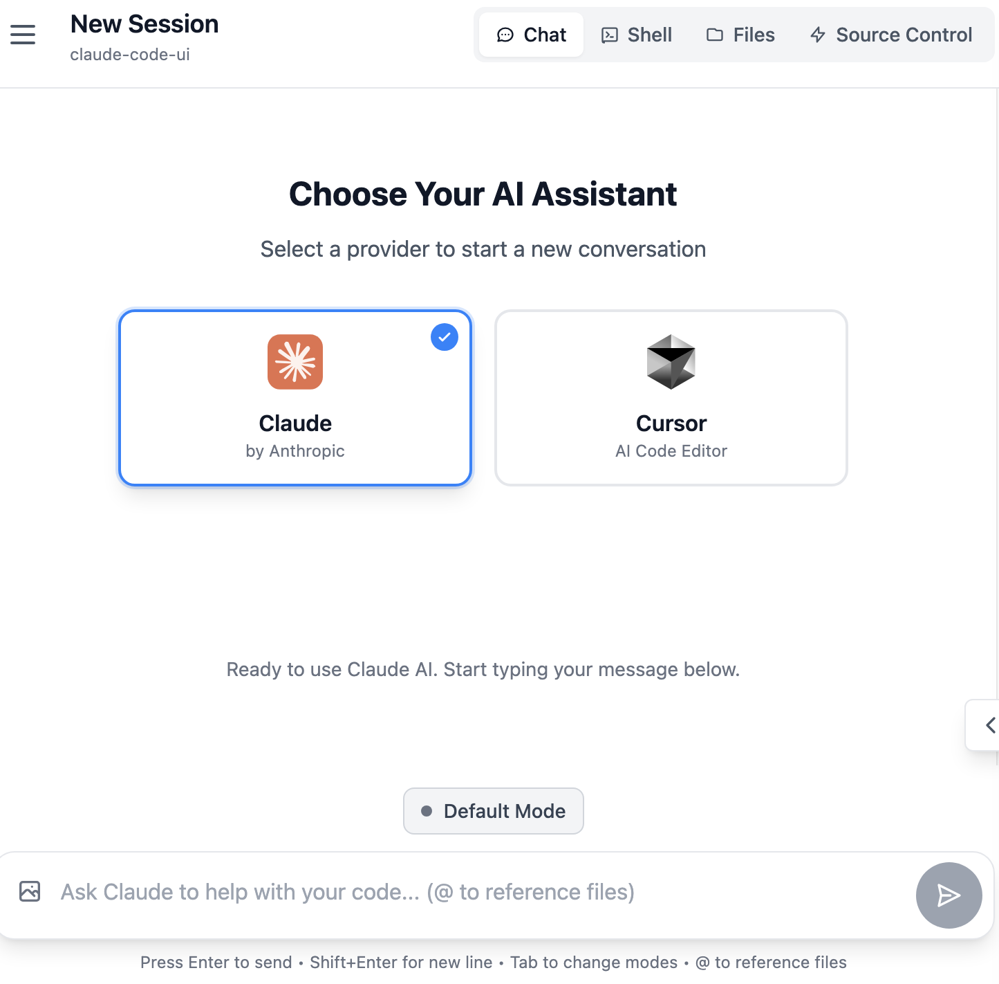

<div align="center">
  
  <h1>Cloud CLI (aka Claude Code UI)</h1>
</div>


A desktop and mobile UI for [Claude Code](https://docs.anthropic.com/en/docs/claude-code), [Cursor CLI](https://docs.cursor.com/en/cli/overview) and [Codex](https://developers.openai.com/codex). You can use it locally or remotely to view your active projects and sessions in Claude Code, Cursor, or Codex and make changes to them from everywhere (mobile or desktop). This gives you a proper interface that works everywhere. 

## Screenshots

<div align="center">
  
<table>
<tr>
<td align="center">
<h3>Desktop View</h3>

<br>
<em>Main interface showing project overview and chat</em>
</td>
<td align="center">
<h3>Mobile Experience</h3>

<br>
<em>Responsive mobile design with touch navigation</em>
</td>
</tr>
<tr>
<td align="center" colspan="2">
<h3>CLI Selection</h3>

<br>
<em>Select between Claude Code, Cursor CLI and Codex</em>
</td>
</tr>
</table>


</div>

## Features

- **Responsive Design** - Works seamlessly across desktop, tablet, and mobile so you can also use Claude Code, Cursor, or Codex from mobile 
- **Interactive Chat Interface** - Built-in chat interface for seamless communication with Claude Code, Cursor, or Codex
- **Integrated Shell Terminal** - Direct access to Claude Code, Cursor CLI, or Codex through built-in shell functionality
- **File Explorer** - Interactive file tree with syntax highlighting and live editing
- **Git Explorer** - View, stage and commit your changes. You can also switch branches 
- **Session Management** - Resume conversations, manage multiple sessions, and track history
- **TaskMaster AI Integration** *(Optional)* - Advanced project management with AI-powered task planning, PRD parsing, and workflow automation
- **Model Compatibility** - Works with Claude Sonnet 4.5, Opus 4.5, and GPT-5.2 


## Quick Start

### Prerequisites

- [Node.js](https://nodejs.org/) v20 or higher
- [Claude Code CLI](https://docs.anthropic.com/en/docs/claude-code) installed and configured, and/or
- [Cursor CLI](https://docs.cursor.com/en/cli/overview) installed and configured, and/or
- [Codex](https://developers.openai.com/codex) installed and configured

### One-click Operation (Recommended)

No installation required, direct operation:

```bash
npx @siteboon/claude-code-ui
```

The server will start and be accessible at `http://localhost:3001` (or your configured PORT).

**To restart**: Simply run the same `npx` command again after stopping the server
### Global Installation (For Regular Use)

For frequent use, install globally once:

```bash
npm install -g @siteboon/claude-code-ui
```

Then start with a simple command:

```bash
claude-code-ui
```


**To restart**: Stop with Ctrl+C and run `claude-code-ui` again.

**To update**:
```bash
cloudcli update
```

### CLI Usage

After global installation, you have access to both `claude-code-ui` and `cloudcli` commands:

| Command / Option | Short | Description |
|------------------|-------|-------------|
| `cloudcli` or `claude-code-ui` | | Start the server (default) |
| `cloudcli start` | | Start the server explicitly |
| `cloudcli status` | | Show configuration and data locations |
| `cloudcli update` | | Update to the latest version |
| `cloudcli help` | | Show help information |
| `cloudcli version` | | Show version information |
| `--port <port>` | `-p` | Set server port (default: 3001) |
| `--database-path <path>` | | Set custom database location |

**Examples:**
```bash
cloudcli                          # Start with defaults
cloudcli -p 8080              # Start on custom port
cloudcli status                   # Show current configuration
```

### Docker Deployment

Deploy Claude Code UI in a containerized environment with Docker. The container comes with Claude CLI pre-installed and bundled.

#### Prerequisites

- [Docker](https://www.docker.com/) v20.10 or higher
- [Docker Compose](https://docs.docker.com/compose/) v2.0 or higher (optional, for orchestration)

#### Option 1: Pull from GitHub Container Registry (Recommended)

Use the pre-built multi-platform image (supports amd64 and arm64):

```bash
# Pull the latest image
docker pull ghcr.io/nickbolles/claudecodeui:latest

# Run the container
docker run -d \
  --name claudecodeui \
  -p 3002:3001 \
  -v claudecodeui-data:/data \
  -v claudecodeui-config:/config \
  -v claudecodeui-claude:/home/node/.claude \
  -v ~/Projects:~/Projects \
  -e PORT=3001 \
  -e DATABASE_PATH=/data/auth.db \
  -e CONTEXT_WINDOW=160000 \
  --restart unless-stopped \
  ghcr.io/nickbolles/claudecodeui:latest
```

Access the application at `http://localhost:3002`

#### Option 2: Build from Source

Build the Docker image locally:

```bash
# Clone the repository
git clone https://github.com/siteboon/claudecodeui.git
cd claudecodeui

# Build the image
docker build -t claudecodeui:local .

# Run the container
docker run -d \
  --name claudecodeui \
  -p 3002:3001 \
  -v claudecodeui-data:/data \
  -v claudecodeui-config:/config \
  -v claudecodeui-claude:/home/node/.claude \
  -v ~/Projects:~/Projects \
  --restart unless-stopped \
  claudecodeui:local
```

#### Option 3: Docker Compose (Recommended for Production)

Create a `.env` file in the project root:

```bash
# Server Configuration
PORT=3001
EXTERNAL_PORT=3002

# Database
DATABASE_PATH=/data/auth.db

# Claude Configuration
CONTEXT_WINDOW=160000
CLAUDE_CLI_PATH=claude

# Node Environment
NODE_ENV=production
```

Start with docker-compose:

```bash
# Start the service
docker-compose up -d

# View logs
docker-compose logs -f

# Stop the service
docker-compose down

# Update and restart
docker-compose pull
docker-compose up -d
```

#### Environment Variables

| Variable | Default | Description |
|----------|---------|-------------|
| `PORT` | `3001` | Internal application port |
| `DATABASE_PATH` | `/data/auth.db` | SQLite database location |
| `CONTEXT_WINDOW` | `160000` | Claude context window size |
| `CLAUDE_CLI_PATH` | `claude` | Path to Claude CLI executable (pre-installed) |
| `NODE_ENV` | `production` | Node environment mode |

#### Volume Configuration

The Docker setup uses several volumes for data persistence:

| Volume | Purpose | Description |
|--------|---------|-------------|
| `claudecodeui-data` | Application data | SQLite database and user data |
| `claudecodeui-config` | Configuration | Application settings and config files |
| `claudecodeui-claude` | Claude CLI data | Claude authentication and session data |
| `~/Projects` | Project files | Mount your local projects (adjust path as needed) |

**Important**: Adjust the `~/Projects` mount path to match your local project locations. You can add multiple volume mounts for different project directories:

```bash
-v ~/Projects:~/Projects \
-v ~/Work:~/Work \
-v ~/Code:~/Code
```

#### Health Checks

The container includes built-in health monitoring:

```bash
# Check container health
docker ps

# View health check logs
docker inspect --format='{{json .State.Health}}' claudecodeui
```

The health check queries `http://localhost:3001/api/health` every 30 seconds.

#### Managing the Container

```bash
# View logs
docker logs -f claudecodeui

# Restart container
docker restart claudecodeui

# Stop container
docker stop claudecodeui

# Remove container (data persists in volumes)
docker rm claudecodeui

# View resource usage
docker stats claudecodeui
```

#### Troubleshooting Docker Deployment

**Container won't start:**
- Check logs: `docker logs claudecodeui`
- Verify port 3002 is not already in use: `lsof -i :3002`
- Ensure volumes have proper permissions

**Cannot access Claude CLI:**
- The Claude CLI is pre-installed in the container
- Authentication data is stored in the `claudecodeui-claude` volume
- First-time setup may require authenticating through the UI

**Project files not visible:**
- Verify volume mount paths match your local directories
- Ensure mounted directories have read permissions
- Check docker-compose.yml volume configuration

### Unraid Deployment

Deploy Claude Code UI on Unraid servers with the official Community Applications template.

#### Installation via Community Applications (Recommended - Coming Soon)

Once approved for Community Applications:

1. Open Unraid WebUI
2. Navigate to **Apps** tab
3. Search for **"claudecodeui"** or **"Claude Code UI"**
4. Click **Install**
5. Configure settings:
   - Set **WebUI Port** (default: 3002)
   - Map **project directories** to your Unraid shares
   - Adjust **appdata paths** if needed (defaults are fine for most users)
6. Click **Apply**

Access the WebUI at `http://[UNRAID-IP]:3002`

#### Manual Template Installation

Until available in Community Applications, install manually:

1. Go to **Docker** > **Add Container**
2. Set **Template URL** to:
   ```
   https://raw.githubusercontent.com/siteboon/claudecodeui/main/unraid/claudecodeui.xml
   ```
3. Click **Apply**

#### Configuration Tips

**Project Directory Mapping:**
- Map your actual project locations (e.g., `/mnt/user/projects`)
- Container paths must match host paths for Claude Code to work
- You can configure up to 3 project directories

**Default Paths:**
- Application Data: `/mnt/user/appdata/claudecodeui/data`
- Configuration: `/mnt/user/appdata/claudecodeui/config`
- Claude CLI Data: `/mnt/user/appdata/claudecodeui/claude`

**Port Configuration:**
- Default WebUI Port: `3002`
- Ensure port doesn't conflict with other containers

For detailed Unraid setup instructions, troubleshooting, and configuration options, see [unraid/README.md](unraid/README.md).

### Run as Background Service (Recommended for Production)

For production use, run Claude Code UI as a background service using PM2 (Process Manager 2):

#### Install PM2

```bash
npm install -g pm2
```

#### Start as Background Service

```bash
# Start the server in background
pm2 start claude-code-ui --name "claude-code-ui"

# Or using the shorter alias
pm2 start cloudcli --name "claude-code-ui"

# Start on a custom port
pm2 start cloudcli --name "claude-code-ui" -- --port 8080
```


#### Auto-Start on System Boot

To make Claude Code UI start automatically when your system boots:

```bash
# Generate startup script for your platform
pm2 startup

# Save current process list
pm2 save
```


### Local Development Installation

1. **Clone the repository:**
```bash
git clone https://github.com/siteboon/claudecodeui.git
cd claudecodeui
```

2. **Install dependencies:**
```bash
npm install
```

3. **Configure environment:**
```bash
cp .env.example .env
# Edit .env with your preferred settings
```

4. **Start the application:**
```bash
# Development mode (with hot reload)
npm run dev

```
The application will start at the port you specified in your .env

5. **Open your browser:**
   - Development: `http://localhost:3001`

## Security & Tools Configuration

**🔒 Important Notice**: All Claude Code tools are **disabled by default**. This prevents potentially harmful operations from running automatically.

### Enabling Tools

To use Claude Code's full functionality, you'll need to manually enable tools:

1. **Open Tools Settings** - Click the gear icon in the sidebar
3. **Enable Selectively** - Turn on only the tools you need
4. **Apply Settings** - Your preferences are saved locally

<div align="center">


*Tools Settings interface - enable only what you need*

</div>

**Recommended approach**: Start with basic tools enabled and add more as needed. You can always adjust these settings later.

## TaskMaster AI Integration *(Optional)*

Claude Code UI supports **[TaskMaster AI](https://github.com/eyaltoledano/claude-task-master)** (aka claude-task-master) integration for advanced project management and AI-powered task planning.

It provides
- AI-powered task generation from PRDs (Product Requirements Documents)
- Smart task breakdown and dependency management  
- Visual task boards and progress tracking

**Setup & Documentation**: Visit the [TaskMaster AI GitHub repository](https://github.com/eyaltoledano/claude-task-master) for installation instructions, configuration guides, and usage examples.
After installing it you should be able to enable it from the Settings


## Usage Guide

### Core Features

#### Project Management
It automatically discovers Claude Code, Cursor or Codex sessions when available and groups them together into projects
session counts
- **Project Actions** - Rename, delete, and organize projects
- **Smart Navigation** - Quick access to recent projects and sessions
- **MCP support** - Add your own MCP servers through the UI 

#### Chat Interface
- **Use responsive chat or Claude Code/Cursor CLI/Codex CLI** - You can either use the adapted chat interface or use the shell button to connect to your selected CLI. 
- **Real-time Communication** - Stream responses from your selected CLI (Claude Code/Cursor/Codex) with WebSocket connection
- **Session Management** - Resume previous conversations or start fresh sessions
- **Message History** - Complete conversation history with timestamps and metadata
- **Multi-format Support** - Text, code blocks, and file references

#### File Explorer & Editor
- **Interactive File Tree** - Browse project structure with expand/collapse navigation
- **Live File Editing** - Read, modify, and save files directly in the interface
- **Syntax Highlighting** - Support for multiple programming languages
- **File Operations** - Create, rename, delete files and directories

#### Git Explorer


#### TaskMaster AI Integration *(Optional)*
- **Visual Task Board** - Kanban-style interface for managing development tasks
- **PRD Parser** - Create Product Requirements Documents and parse them into structured tasks
- **Progress Tracking** - Real-time status updates and completion tracking

#### Session Management
- **Session Persistence** - All conversations automatically saved
- **Session Organization** - Group sessions by project and timestamp
- **Session Actions** - Rename, delete, and export conversation history
- **Cross-device Sync** - Access sessions from any device

### Mobile App
- **Responsive Design** - Optimized for all screen sizes
- **Touch-friendly Interface** - Swipe gestures and touch navigation
- **Mobile Navigation** - Bottom tab bar for easy thumb navigation
- **Adaptive Layout** - Collapsible sidebar and smart content prioritization
- **Add shortcut to Home Screen** - Add a shortcut to your home screen and the app will behave like a PWA

## Architecture

### System Overview

```
┌─────────────────┐    ┌─────────────────┐    ┌─────────────────┐
│   Frontend      │    │   Backend       │    │  Agent     │
│   (React/Vite)  │◄──►│ (Express/WS)    │◄──►│  Integration    │
│                 │    │                 │    │                │
└─────────────────┘    └─────────────────┘    └─────────────────┘
```

### Backend (Node.js + Express)
- **Express Server** - RESTful API with static file serving
- **WebSocket Server** - Communication for chats and project refresh
- **Agent Integration (Claude Code / Cursor CLI / Codex)** - Process spawning and management
- **File System API** - Exposing file browser for projects

### Frontend (React + Vite)
- **React 18** - Modern component architecture with hooks
- **CodeMirror** - Advanced code editor with syntax highlighting


### Contributing

We welcome contributions! Please follow these guidelines:

#### Getting Started
1. **Fork** the repository
2. **Clone** your fork: `git clone <your-fork-url>`
3. **Install** dependencies: `npm install`
4. **Create** a feature branch: `git checkout -b feature/amazing-feature`

#### Development Process
1. **Make your changes** following the existing code style
2. **Test thoroughly** - ensure all features work correctly
3. **Run quality checks**: `npm run lint && npm run format`
4. **Commit** with descriptive messages following [Conventional Commits](https://conventionalcommits.org/)
5. **Push** to your branch: `git push origin feature/amazing-feature`
6. **Submit** a Pull Request with:
   - Clear description of changes
   - Screenshots for UI changes
   - Test results if applicable

#### What to Contribute
- **Bug fixes** - Help us improve stability
- **New features** - Enhance functionality (discuss in issues first)
- **Documentation** - Improve guides and API docs
- **UI/UX improvements** - Better user experience
- **Performance optimizations** - Make it faster

## Troubleshooting

### Common Issues & Solutions


#### "No Claude projects found"
**Problem**: The UI shows no projects or empty project list
**Solutions**:
- Ensure [Claude Code](https://docs.anthropic.com/en/docs/claude-code) is properly installed
- Run `claude` command in at least one project directory to initialize
- Verify `~/.claude/projects/` directory exists and has proper permissions

#### File Explorer Issues
**Problem**: Files not loading, permission errors, empty directories
**Solutions**:
- Check project directory permissions (`ls -la` in terminal)
- Verify the project path exists and is accessible
- Review server console logs for detailed error messages
- Ensure you're not trying to access system directories outside project scope


## License

GNU General Public License v3.0 - see [LICENSE](LICENSE) file for details.

This project is open source and free to use, modify, and distribute under the GPL v3 license.

## Acknowledgments

### Built With
- **[Claude Code](https://docs.anthropic.com/en/docs/claude-code)** - Anthropic's official CLI
- **[Cursor CLI](https://docs.cursor.com/en/cli/overview)** - Cursor's official CLI
- **[Codex](https://developers.openai.com/codex)** - OpenAI Codex
- **[React](https://react.dev/)** - User interface library
- **[Vite](https://vitejs.dev/)** - Fast build tool and dev server
- **[Tailwind CSS](https://tailwindcss.com/)** - Utility-first CSS framework
- **[CodeMirror](https://codemirror.net/)** - Advanced code editor
- **[TaskMaster AI](https://github.com/eyaltoledano/claude-task-master)** *(Optional)* - AI-powered project management and task planning

## Support & Community

### Stay Updated
- **Star** this repository to show support
- **Watch** for updates and new releases
- **Follow** the project for announcements

### Sponsors
- [Siteboon - AI powered website builder](https://siteboon.ai)
---

<div align="center">
  <strong>Made with care for the Claude Code, Cursor and Codex community.</strong>
</div>
