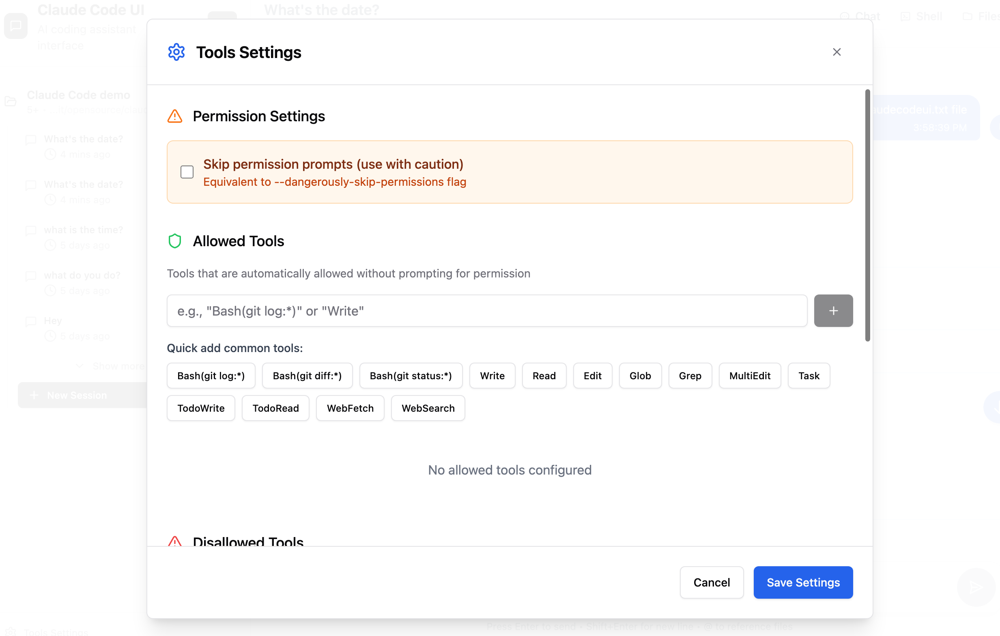

<div align="center">
  
  <h1>Claude Code UI</h1>
</div>


A desktop and mobile UI for [Claude Code](https://docs.anthropic.com/en/docs/claude-code), Anthropic's official CLI for AI-assisted coding. You can use it locally or remotely to view your active projects and sessions in claude code and make changes to them the same way you would do it in claude code CLI. This gives you a proper interface that works everywhere. 

## Screenshots

<div align="center">
  
<table>
<tr>
<td align="center">
<h3>Desktop View</h3>

<br>
<em>Main interface showing project overview and chat</em>
</td>
<td align="center">
<h3>Mobile Experience</h3>

<br>
<em>Responsive mobile design with touch navigation</em>
</td>
</tr>
</table>


</div>

## Features

- **Responsive Design** - Works seamlessly across desktop, tablet, and mobile so you can also use Claude Code from mobile 
- **Interactive Chat Interface** - Built-in chat interface for seamless communication with Claude Code
- **Integrated Shell Terminal** - Direct access to Claude Code CLI through built-in shell functionality
- **File Explorer** - Interactive file tree with syntax highlighting and live editing
- **Git Explorer** - View, stage and commit your changes. You can also switch branches 
- **Session Management** - Resume conversations, manage multiple sessions, and track history


## Quick Start

### Prerequisites

- [Node.js](https://nodejs.org/) v20 or higher (for local development)
- [Docker](https://www.docker.com/) and Docker Compose (for containerized deployment)
- [Claude Code CLI](https://docs.anthropic.com/en/docs/claude-code) installed and configured
- [Anthropic API Key](https://console.anthropic.com/) for Claude functionality

### Installation

1. **Clone the repository:**
```bash
git clone https://github.com/siteboon/claudecodeui.git
cd claudecodeui
```

2. **Install dependencies:**
```bash
npm install
```

3. **Configure environment:**
```bash
cp .env.example .env
# Edit .env with your preferred settings
```

4. **Start the application:**
```bash
# Development mode (with hot reload)
npm run dev

```
The application will start at the port you specified in your .env

5. **Open your browser:**
   - Development: `http://localhost:3009` (or your configured VITE_PORT)

## 🐳 Docker Deployment (Recommended)

Docker provides the easiest and most reliable way to run Claude Code UI with all dependencies properly configured.

### Quick Docker Start

1. **Clone the repository:**
```bash
git clone https://github.com/siteboon/claudecodeui.git
cd claudecodeui
```

2. **Setup environment:**
```bash
# Copy the Docker environment template
cp .env.docker .env

# Edit the environment file with your settings
nano .env
```

3. **Configure your environment variables:**
```bash
# Required: Your Anthropic API key
ANTHROPIC_API_KEY=sk-ant-your-api-key-here

# Optional: Default admin credentials (created on first startup)
DEFAULT_ADMIN_USERNAME=admin
DEFAULT_ADMIN_PASSWORD=your-secure-password

# Optional: Custom workspace path for your projects
HOST_WORKSPACE_PATH=${HOME}/Desktop

# Optional: Custom user paths (defaults to current user's home)
CLAUDE_PROJECTS_PATH=${HOME}/.claude/projects
CLAUDE_CONFIG_DIR=${HOME}/.claude
USER_HOME_DIR=${HOME}
```

4. **Start with Docker Compose:**
```bash
# Development mode (with hot reload)
docker-compose -f docker-compose.dev.yml up

# Or run in background
docker-compose -f docker-compose.dev.yml up -d

# Production mode
docker-compose up -d
```

5. **Access the application:**
   - Frontend: `http://localhost:2009`
   - Backend API: `http://localhost:2008`

### Environment Variables Reference

The application supports comprehensive configuration through environment variables. Different defaults apply for local development vs Docker deployment:

#### Core Application Settings

| Variable | Description | Local Default | Docker Default | Required |
|----------|-------------|---------------|----------------|----------|
| `PORT` | Backend server port | `3008` | `2008` | ❌ |
| `VITE_PORT` | Frontend dev server port | `3009` | `2009` | ❌ |
| `NODE_ENV` | Environment mode | `development` | `development` | ❌ |
| `DB_PATH` | Database file location | `server/database/auth.db` | `/app/server/database/auth.db` | ❌ |

#### Authentication & Security

| Variable | Description | Default | Required |
|----------|-------------|---------|----------|
| `ANTHROPIC_API_KEY` | Your Claude API key | - | ✅ |
| `JWT_SECRET` | JWT signing secret | auto-generated | ❌ |
| `DEFAULT_ADMIN_USERNAME` | Initial admin username | `admin` | ❌ |
| `DEFAULT_ADMIN_PASSWORD` | Initial admin password | `change-this-secure-password` | ❌ |
| `SESSION_TIMEOUT` | Session timeout (milliseconds) | `86400000` (24h) | ❌ |

#### Claude Integration

| Variable | Description | Default | Required |
|----------|-------------|---------|----------|
| `CLAUDE_EXECUTABLE_PATH` | Custom Claude CLI path | `/usr/local/bin/claude` | ❌ |
| `CLAUDE_DEFAULT_MODEL` | Default Claude model | `sonnet` | ❌ |
| `CLAUDE_MAX_TOKENS` | Max tokens per request | `4096` | ❌ |

#### Workspace & File System

| Variable | Description | Default | Required |
|----------|-------------|---------|----------|
| `HOST_WORKSPACE_PATH` | Host directory for projects (Docker) | `${HOME}/Desktop` | ❌ |
| `WORKSPACE_PATH` | Internal workspace path | `/workspace` | ❌ |
| `ALLOWED_DIRECTORIES` | Comma-separated allowed paths | `/workspace,/home/projects,${HOME}/Desktop` | ❌ |
| `CLAUDE_PROJECTS_PATH` | Claude CLI projects directory | `${HOME}/.claude/projects` | ❌ |
| `CLAUDE_CONFIG_DIR` | Claude configuration directory | `${HOME}/.claude` | ❌ |
| `USER_HOME_DIR` | User home directory (Docker) | `${HOME}` | ❌ |

#### Development & Debugging

| Variable | Description | Default | Required |
|----------|-------------|---------|----------|
| `CHOKIDAR_USEPOLLING` | Enable file watching polling | `true` | ❌ |
| `WATCHPACK_POLLING` | Enable webpack polling | `true` | ❌ |
| `DEBUG` | Debug logging scope | `claude-ui:*` | ❌ |
| `LOG_LEVEL` | Logging level | `info` | ❌ |

#### Network & CORS

| Variable | Description | Default | Required |
|----------|-------------|---------|----------|
| `CORS_ORIGIN` | CORS allowed origin | `http://localhost:3009` | ❌ |
| `CORS_CREDENTIALS` | Allow CORS credentials | `true` | ❌ |
| `RATE_LIMIT_WINDOW` | Rate limit window (ms) | `900000` (15min) | ❌ |
| `RATE_LIMIT_MAX` | Max requests per window | `100` | ❌ |

#### Production Settings

| Variable | Description | Default | Required |
|----------|-------------|---------|----------|
| `SSL_ENABLED` | Enable SSL/TLS | `false` | ❌ |
| `SSL_CERT_PATH` | SSL certificate path | `/etc/ssl/certs/cert.pem` | ❌ |
| `SSL_KEY_PATH` | SSL key path | `/etc/ssl/private/key.pem` | ❌ |
| `BEHIND_PROXY` | Running behind proxy | `false` | ❌ |
| `TRUST_PROXY` | Trust proxy headers | `false` | ❌ |

#### Monitoring & Analytics

| Variable | Description | Default | Required |
|----------|-------------|---------|----------|
| `TELEMETRY_ENABLED` | Enable telemetry | `false` | ❌ |
| `ANALYTICS_ENABLED` | Enable analytics | `false` | ❌ |
| `SENTRY_DSN` | Sentry error tracking DSN | - | ❌ |

### Docker Commands Reference

#### Development Commands
```bash
# Start development environment (with hot reload)
docker-compose -f docker-compose.dev.yml up

# Start in background
docker-compose -f docker-compose.dev.yml up -d

# View real-time logs
docker-compose -f docker-compose.dev.yml logs -f

# View logs for specific service
docker-compose -f docker-compose.dev.yml logs -f app-dev

# Stop development services
docker-compose -f docker-compose.dev.yml down

# Rebuild after code changes
docker-compose -f docker-compose.dev.yml build --no-cache

# Rebuild and restart
docker-compose -f docker-compose.dev.yml up --build

# Access container shell
docker-compose -f docker-compose.dev.yml exec app-dev bash

# Check container status
docker-compose -f docker-compose.dev.yml ps
```

#### Production Commands
```bash
# Start production environment
docker-compose up -d

# View production logs
docker-compose logs -f

# Stop production services
docker-compose down

# Rebuild production containers
docker-compose build --no-cache

# Scale services (if needed)
docker-compose up -d --scale app=2
```

#### Maintenance Commands
```bash
# Clean up containers and images
docker-compose down --rmi all --volumes --remove-orphans

# View container resource usage
docker stats

# Inspect container configuration
docker-compose config

# Export container logs
docker-compose logs > docker-logs.txt

# Backup database
docker cp claude-code-ui-dev:/app/server/database ./database-backup
```

### Workspace Access in Docker

The Docker setup automatically mounts your projects directory for Claude to access:

```bash
# Default mounting
${HOME}/Desktop → /workspace (read-only)

# Custom mounting (in .env)
HOST_WORKSPACE_PATH=/path/to/your/projects
```

**Important**: Ensure your Claude projects are within the mounted directory for proper access.

### Docker Troubleshooting

**Port conflicts:**
```bash
# Check what's using the ports
lsof -i :2008 -i :2009

# Stop conflicting services
docker-compose down
pkill -f "npm run dev"
```

**Permission issues:**
```bash
# Fix database directory permissions
sudo chown -R 1001:1001 ./data
```

**For complete Docker documentation, see [DOCKER.md](DOCKER.md)**

## Security & Tools Configuration

**🔒 Important Notice**: All Claude Code tools are **disabled by default**. This prevents potentially harmful operations from running automatically.

### Enabling Tools

To use Claude Code's full functionality, you'll need to manually enable tools:

1. **Open Tools Settings** - Click the gear icon in the sidebar
3. **Enable Selectively** - Turn on only the tools you need
4. **Apply Settings** - Your preferences are saved locally

<div align="center">


*Tools Settings interface - enable only what you need*

</div>

**Recommended approach**: Start with basic tools enabled and add more as needed. You can always adjust these settings later.

## Usage Guide

### Core Features

#### Project Management
The UI automatically discovers Claude Code projects from `~/.claude/projects/` and provides:
- **Visual Project Browser** - All available projects with metadata and session counts
- **Project Actions** - Rename, delete, and organize projects
- **Smart Navigation** - Quick access to recent projects and sessions

#### Chat Interface
- **Use responsive chat or Claude Code CLI** - You can either use the adapted chat interface or use the shell button to connect to Claude Code CLI. 
- **Real-time Communication** - Stream responses from Claude with WebSocket connection
- **Session Management** - Resume previous conversations or start fresh sessions
- **Message History** - Complete conversation history with timestamps and metadata
- **Multi-format Support** - Text, code blocks, and file references

#### File Explorer & Editor
- **Interactive File Tree** - Browse project structure with expand/collapse navigation
- **Live File Editing** - Read, modify, and save files directly in the interface
- **Syntax Highlighting** - Support for multiple programming languages
- **File Operations** - Create, rename, delete files and directories

#### Git Explorer


#### Session Management
- **Session Persistence** - All conversations automatically saved
- **Session Organization** - Group sessions by project and timestamp
- **Session Actions** - Rename, delete, and export conversation history
- **Cross-device Sync** - Access sessions from any device

### Mobile App
- **Responsive Design** - Optimized for all screen sizes
- **Touch-friendly Interface** - Swipe gestures and touch navigation
- **Mobile Navigation** - Bottom tab bar for easy thumb navigation
- **Adaptive Layout** - Collapsible sidebar and smart content prioritization
- **Add shortcut to Home Screen** - Add a shortcut to your home screen and the app will behave like a PWA

## Architecture

### System Overview

```
┌─────────────────┐    ┌─────────────────┐    ┌─────────────────┐
│   Frontend      │    │   Backend       │    │  Claude CLI     │
│   (React/Vite)  │◄──►│ (Express/WS)    │◄──►│  Integration    │
└─────────────────┘    └─────────────────┘    └─────────────────┘
```

### Backend (Node.js + Express)
- **Express Server** - RESTful API with static file serving
- **WebSocket Server** - Communication for chats and project refresh
- **Claude CLI Integration** - Process spawning and management
- **Session Management** - JSONL parsing and conversation persistence
- **File System API** - Exposing file browser for projects

### Frontend (React + Vite)
- **React 18** - Modern component architecture with hooks
- **CodeMirror** - Advanced code editor with syntax highlighting


### Contributing

We welcome contributions! Please follow these guidelines:

#### Getting Started
1. **Fork** the repository
2. **Clone** your fork: `git clone <your-fork-url>`
3. **Install** dependencies: `npm install`
4. **Create** a feature branch: `git checkout -b feature/amazing-feature`

#### Development Process
1. **Make your changes** following the existing code style
2. **Test thoroughly** - ensure all features work correctly
3. **Run quality checks**: `npm run lint && npm run format`
4. **Commit** with descriptive messages following [Conventional Commits](https://conventionalcommits.org/)
5. **Push** to your branch: `git push origin feature/amazing-feature`
6. **Submit** a Pull Request with:
   - Clear description of changes
   - Screenshots for UI changes
   - Test results if applicable

#### What to Contribute
- **Bug fixes** - Help us improve stability
- **New features** - Enhance functionality (discuss in issues first)
- **Documentation** - Improve guides and API docs
- **UI/UX improvements** - Better user experience
- **Performance optimizations** - Make it faster

## Troubleshooting

### Common Issues & Solutions

#### "No Claude projects found"
**Problem**: The UI shows no projects or empty project list
**Solutions**:
- Ensure [Claude CLI](https://docs.anthropic.com/en/docs/claude-code) is properly installed
- Run `claude` command in at least one project directory to initialize
- Verify `~/.claude/projects/` directory exists and has proper permissions
- **For Docker**: Ensure your projects are within the mounted workspace directory
- **For Docker**: Check that `HOST_WORKSPACE_PATH` in `.env` points to the correct directory

#### File Explorer Issues
**Problem**: Files not loading, permission errors, empty directories
**Solutions**:
- Check project directory permissions (`ls -la` in terminal)
- Verify the project path exists and is accessible
- Review server console logs for detailed error messages
- Ensure you're not trying to access system directories outside project scope


## License

GNU General Public License v3.0 - see [LICENSE](LICENSE) file for details.

This project is open source and free to use, modify, and distribute under the GPL v3 license.

## Acknowledgments

### Built With
- **[Claude Code](https://docs.anthropic.com/en/docs/claude-code)** - Anthropic's official CLI
- **[React](https://react.dev/)** - User interface library
- **[Vite](https://vitejs.dev/)** - Fast build tool and dev server
- **[Tailwind CSS](https://tailwindcss.com/)** - Utility-first CSS framework
- **[CodeMirror](https://codemirror.net/)** - Advanced code editor


## Support & Community

### Stay Updated
- **Star** this repository to show support
- **Watch** for updates and new releases
- **Follow** the project for announcements

### Sponsors
- [Siteboon - AI powered website builder](https://siteboon.ai)
---

<div align="center">
  <strong>Made with care for the Claude Code community.</strong>
</div>
