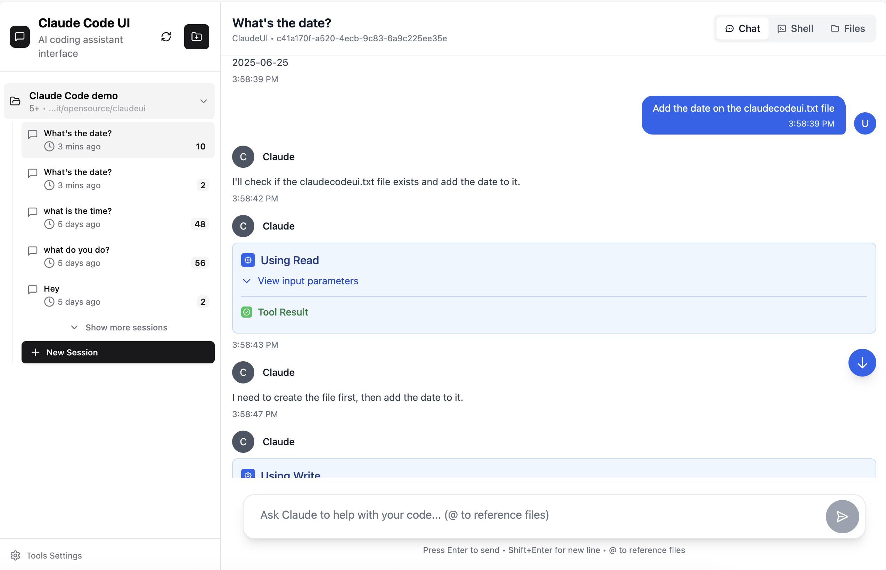
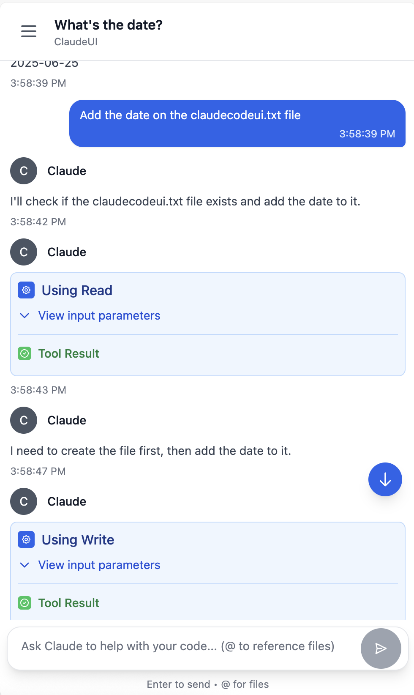

<div align="center">
  
  <h1>Claude Code UI</h1>
</div>


A desktop and mobile UI for [Claude Code](https://docs.anthropic.com/en/docs/claude-code), Anthropic's official CLI for AI-assisted coding. You can use it locally or remotely to view your active projects and sessions in claude code and make changes to them the same way you would do it in claude code CLI. This gives you a proper interface that works everywhere. 

## Screenshots

<div align="center">
  
<table>
<tr>
<td align="center">
<h3>Desktop View</h3>

<br>
<em>Main interface showing project overview and chat</em>
</td>
<td align="center">
<h3>Mobile Experience</h3>

<br>
<em>Responsive mobile design with touch navigation</em>
</td>
</tr>
</table>


</div>

## Features

- **Responsive Design** - Works seamlessly across desktop, tablet, and mobile so you can also use Claude Code from mobile 
- **Interactive Chat Interface** - Built-in chat interface for seamless communication with Claude Code
- **Integrated Shell Terminal** - Direct access to Claude Code CLI through built-in shell functionality
- **File Explorer** - Interactive file tree with syntax highlighting and live editing
- **Git Explorer** - View, stage and commit your changes. You can also switch branches 
- **Session Management** - Resume conversations, manage multiple sessions, and track history
- **TTS Voice Notifications** - Audio notifications with high-quality neural voices (ElevenLabs, Deepgram, OpenAI)
- **Claude Code Hooks Integration** - Comprehensive lifecycle hooks system for enhanced automation


## Quick Start

### Prerequisites

- [Node.js](https://nodejs.org/) v20 or higher
- [Claude Code CLI](https://docs.anthropic.com/en/docs/claude-code) installed and configured

### Installation

1. **Clone the repository:**
```bash
git clone https://github.com/siteboon/claudecodeui.git
cd claudecodeui
```

2. **Install dependencies:**
```bash
npm install
```

3. **Configure environment:**
```bash
cp .env.example .env
# Edit .env with your preferred settings and TTS API keys (optional)
```

4. **Start the application:**
```bash
# Development mode (with hot reload)
npm run dev

```
The application will start at the port you specified in your .env

5. **Open your browser:**
   - Development: `http://localhost:3001`

## Security & Tools Configuration

**🔒 Important Notice**: All Claude Code tools are **disabled by default**. This prevents potentially harmful operations from running automatically.

### Enabling Tools

To use Claude Code's full functionality, you'll need to manually enable tools:

1. **Open Tools Settings** - Click the gear icon in the sidebar
3. **Enable Selectively** - Turn on only the tools you need
4. **Apply Settings** - Your preferences are saved locally

<div align="center">


*Tools Settings interface - enable only what you need*

</div>

**Recommended approach**: Start with basic tools enabled and add more as needed. You can always adjust these settings later.

## Advanced Configuration

### TTS Voice Notifications Setup

ClaudeCodeUI supports multiple TTS providers for high-quality voice notifications. Configure your preferred provider:

#### Environment Variables
```bash
# ElevenLabs (Premium Neural TTS)
ELEVENLABS_API_KEY=your_elevenlabs_key
ELEVENLABS_VOICE_ID=WejK3H1m7MI9CHnIjW9K  # Default: Alice
ELEVENLABS_MODEL=eleven_turbo_v2_5

# Deepgram Aura (Fast, High-Quality)
DEEPGRAM_API_KEY=your_deepgram_key
DEEPGRAM_VOICE_MODEL=aura-helios-en  # Options: aura-helios-en, aura-luna-en, etc.

# OpenAI TTS
OPENAI_API_KEY=your_openai_key
OPENAI_TTS_VOICE=nova  # Options: nova, alloy, echo, fable, onyx, shimmer
OPENAI_TTS_MODEL=gpt-4o-mini-tts
OPENAI_TTS_INSTRUCTIONS="Speak with a professional, friendly tone"

# Personalization
ENGINEER_NAME=YourName
TTS_NAME_CHANCE=0.3  # 30% chance to include your name in notifications

# ClaudeCodeUI Integration
ENABLE_CLAUDECODEUI_NOTIFICATIONS=true
CLAUDECODEUI_URL=http://localhost:3000
```

#### Provider Priority
1. **ElevenLabs** - Highest quality neural voices
2. **Deepgram Aura** - Fast generation with natural voices  
3. **OpenAI TTS** - High quality with voice instructions
4. **pyttsx3** - Offline fallback (no API key required)
5. **Browser TTS** - Final fallback using Web Speech API

### Claude Code Hooks Configuration

ClaudeCodeUI includes a complete hooks system in the `.claude/hooks/` directory:

#### Hook Types
- **`notification.py`** - TTS notifications when Claude needs input
- **`pre_tool_use.py`** - Security validation before tool execution
- **`post_tool_use.py`** - Event logging after tool completion  
- **`stop.py`** - AI-generated completion messages
- **`subagent_stop.py`** - Subagent completion notifications

#### Hooks Configuration (.claude/settings.json)
```json
{
  "hooks": {
    "notification": ".claude/hooks/notification.py --notify",
    "pre_tool_use": ".claude/hooks/pre_tool_use.py",
    "post_tool_use": ".claude/hooks/post_tool_use.py",
    "stop": ".claude/hooks/stop.py",
    "subagent_stop": ".claude/hooks/subagent_stop.py"
  },
  "tools": {
    "bash": "enabled",
    "read": "enabled"
  }
}
```

#### Testing Hooks
```bash
# Test notification hook
uv run .claude/hooks/notification.py --notify

# Test TTS integration
echo '{"message": "Test notification"}' | uv run .claude/hooks/notification.py --notify

# Check hook logs
tail -f logs/notification_hook.log
tail -f logs/claudecodeui_debug.log
```

## Usage Guide

### Core Features

#### Project Management
The UI automatically discovers Claude Code projects from `~/.claude/projects/` and provides:
- **Visual Project Browser** - All available projects with metadata and session counts
- **Project Actions** - Rename, delete, and organize projects
- **Smart Navigation** - Quick access to recent projects and sessions

#### Chat Interface
- **Use responsive chat or Claude Code CLI** - You can either use the adapted chat interface or use the shell button to connect to Claude Code CLI. 
- **Real-time Communication** - Stream responses from Claude with WebSocket connection
- **Session Management** - Resume previous conversations or start fresh sessions
- **Message History** - Complete conversation history with timestamps and metadata
- **Multi-format Support** - Text, code blocks, and file references

#### File Explorer & Editor
- **Interactive File Tree** - Browse project structure with expand/collapse navigation
- **Live File Editing** - Read, modify, and save files directly in the interface
- **Syntax Highlighting** - Support for multiple programming languages
- **File Operations** - Create, rename, delete files and directories

#### Git Explorer
- **Git Status** - View modified, staged, and untracked files with clear indicators
- **Branch Management** - Switch branches, view commit history, and track changes
- **Commit Operations** - Stage changes and create commits directly from the interface
- **Visual Diff** - Compare file changes with syntax-highlighted diff viewer

#### TTS Voice Notifications
ClaudeCodeUI features an advanced Text-to-Speech system that provides audio notifications when Claude needs your input or completes tasks:

- **Multiple TTS Providers**: Support for ElevenLabs, Deepgram Aura, OpenAI TTS, and offline pyttsx3
- **High-Quality Neural Voices**: Professional-grade speech synthesis with natural-sounding voices
- **Backend Audio Streaming**: Server-side audio generation with seamless browser playback
- **Personalized Notifications**: Configurable engineer name integration with customizable frequency
- **Automatic Provider Selection**: Intelligent fallback from premium services to local synthesis
- **Real-time Configuration**: Update TTS settings and API keys through the web interface

**Setup**: Navigate to Settings → Audio Notifications to configure your preferred TTS provider and voice settings.

#### Claude Code Hooks Integration
ClaudeCodeUI includes a comprehensive hooks system that extends Claude Code's capabilities:

- **Pre-Tool Use Hooks**: Security validation and command blocking before tool execution
- **Post-Tool Use Hooks**: Event logging and transcript processing after tool completion
- **Notification Hooks**: TTS audio alerts when Claude requests user input
- **Stop Hooks**: AI-generated completion messages with continuation control
- **Subagent Hooks**: Notifications when background tasks complete

**Key Features**:
- **Security Layer**: Automatically blocks dangerous commands (`rm -rf`, sensitive file access)
- **Comprehensive Logging**: JSON-formatted event logs for debugging and audit trails
- **UV Single-File Scripts**: Self-contained Python scripts with embedded dependencies
- **Environment Integration**: Seamless .env configuration sharing between hooks and UI
- **Audio Streaming Pipeline**: Backend TTS generation with WebSocket delivery to browser

#### Session Management
- **Session Persistence** - All conversations automatically saved
- **Session Organization** - Group sessions by project and timestamp
- **Session Actions** - Rename, delete, and export conversation history
- **Cross-device Sync** - Access sessions from any device

### Mobile App
- **Responsive Design** - Optimized for all screen sizes
- **Touch-friendly Interface** - Swipe gestures and touch navigation
- **Mobile Navigation** - Bottom tab bar for easy thumb navigation
- **Adaptive Layout** - Collapsible sidebar and smart content prioritization
- **Add shortcut to Home Screen** - Add a shortcut to your home screen and the app will behave like a PWA

## Architecture

### System Overview

```
┌─────────────────┐    ┌─────────────────┐    ┌─────────────────┐
│   Frontend      │    │   Backend       │    │  Claude CLI     │
│   (React/Vite)  │◄──►│ (Express/WS)    │◄──►│  Integration    │
└─────────────────┘    └─────────────────┘    └─────────────────┘
```

### Backend (Node.js + Express)
- **Express Server** - RESTful API with static file serving
- **WebSocket Server** - Real-time communication for chats, notifications, and project updates
- **Claude CLI Integration** - Process spawning and PTY management  
- **Session Management** - JSONL parsing and conversation persistence
- **File System API** - Secure file browser for projects with path validation
- **TTS Audio Streaming** - Server-side audio generation and streaming endpoints
- **Hooks Integration** - UV script execution and environment synchronization

### Frontend (React + Vite)
- **React 18** - Modern component architecture with hooks
- **CodeMirror** - Advanced code editor with syntax highlighting
- **Audio Service** - WebSocket-based audio notification system with fallbacks
- **Real-time Updates** - Live project file monitoring and session synchronization


### Contributing

We welcome contributions! Please follow these guidelines:

#### Getting Started
1. **Fork** the repository
2. **Clone** your fork: `git clone <your-fork-url>`
3. **Install** dependencies: `npm install`
4. **Create** a feature branch: `git checkout -b feature/amazing-feature`

#### Development Process
1. **Make your changes** following the existing code style
2. **Test thoroughly** - ensure all features work correctly
3. **Run quality checks**: `npm run lint && npm run format`
4. **Commit** with descriptive messages following [Conventional Commits](https://conventionalcommits.org/)
5. **Push** to your branch: `git push origin feature/amazing-feature`
6. **Submit** a Pull Request with:
   - Clear description of changes
   - Screenshots for UI changes
   - Test results if applicable

#### What to Contribute
- **Bug fixes** - Help us improve stability
- **New features** - Enhance functionality (discuss in issues first)
- **Documentation** - Improve guides and API docs
- **UI/UX improvements** - Better user experience
- **Performance optimizations** - Make it faster
- **TTS Provider Integration** - Add support for new voice services
- **Hook Enhancements** - Extend the Claude Code hooks system
- **Audio/Voice Features** - Improve notification and accessibility features

## Troubleshooting

### Common Issues & Solutions

#### "No Claude projects found"
**Problem**: The UI shows no projects or empty project list
**Solutions**:
- Ensure [Claude CLI](https://docs.anthropic.com/en/docs/claude-code) is properly installed
- Run `claude` command in at least one project directory to initialize
- Verify `~/.claude/projects/` directory exists and has proper permissions
d

#### File Explorer Issues
**Problem**: Files not loading, permission errors, empty directories
**Solutions**:
- Check project directory permissions (`ls -la` in terminal)
- Verify the project path exists and is accessible
- Review server console logs for detailed error messages
- Ensure you're not trying to access system directories outside project scope

#### TTS Notifications Not Working
**Problem**: Audio notifications not playing or voice generation failing
**Solutions**:
- **Check API Keys**: Verify TTS provider API keys in `.env` file
- **Test Provider**: Use Settings → Audio Notifications → Test button to verify configuration
- **Check Browser Audio**: Ensure browser allows audio playback (check for blocked autoplay)
- **Review Logs**: Check `logs/claudecodeui_debug.log` for TTS generation errors
- **Provider Fallback**: If premium provider fails, ensure pyttsx3 or browser TTS works
- **Network Issues**: Verify internet connection for cloud TTS providers

#### Claude Code Hooks Issues
**Problem**: Hooks not executing or notification hooks failing
**Solutions**:
- **UV Installation**: Ensure `uv` is installed and available in PATH
- **Hook Permissions**: Check that hook scripts are executable (`chmod +x .claude/hooks/*.py`)
- **Environment Variables**: Verify `.env` file is properly loaded by hooks
- **Test Manually**: Run `uv run .claude/hooks/notification.py --notify` to test
- **Check Logs**: Review `logs/notification_hook.log` for hook execution details
- **Dependencies**: Ensure Python dependencies are available via UV script headers


## License

GNU General Public License v3.0 - see [LICENSE](LICENSE) file for details.

This project is open source and free to use, modify, and distribute under the GPL v3 license.

## Acknowledgments

### Built With
- **[Claude Code](https://docs.anthropic.com/en/docs/claude-code)** - Anthropic's official CLI
- **[React](https://react.dev/)** - User interface library
- **[Vite](https://vitejs.dev/)** - Fast build tool and dev server
- **[Tailwind CSS](https://tailwindcss.com/)** - Utility-first CSS framework
- **[CodeMirror](https://codemirror.net/)** - Advanced code editor


## Support & Community

### Stay Updated
- **Star** this repository to show support
- **Watch** for updates and new releases
- **Follow** the project for announcements

### Sponsors
- [Siteboon - AI powered website builder](https://siteboon.ai)
---

<div align="center">
  <strong>Made with care for the Claude Code community.</strong>
</div>
