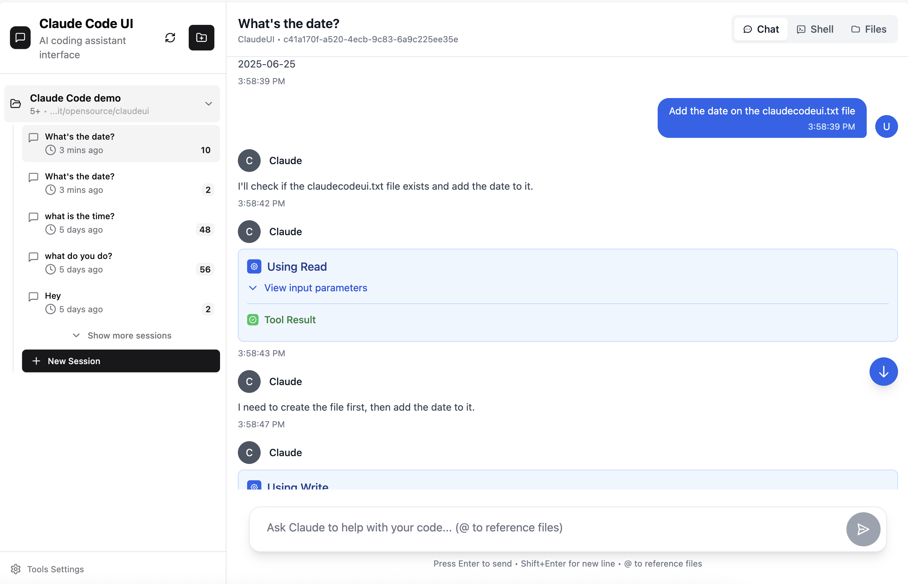
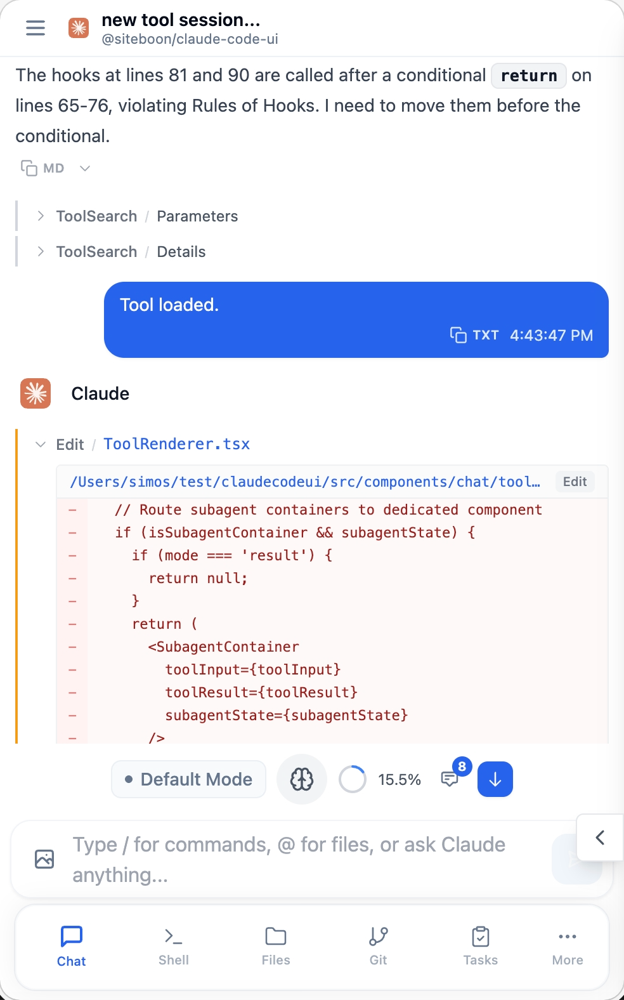
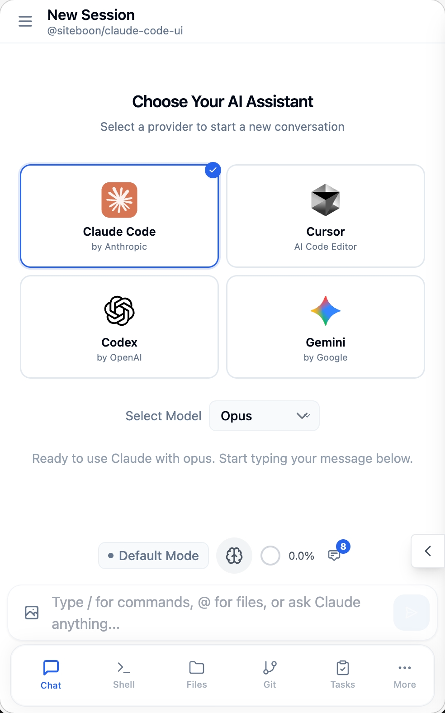
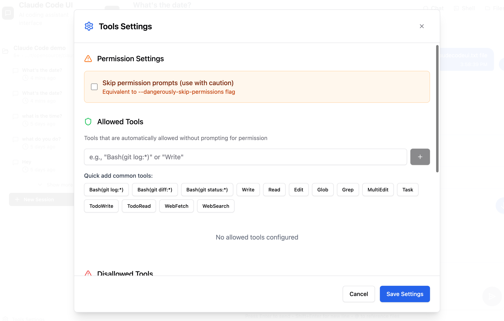

<div align="center">
 
 <h1>Cloud CLI (alias Claude Code UI)</h1>
 <p>UI desktop dan mobile untuk <a href="https://docs.anthropic.com/en/docs/claude-code">Claude Code</a>, <a href="https://docs.cursor.com/en/cli/overview">Cursor CLI</a>, dan <a href="https://developers.openai.com/codex">Codex</a>.<br>Gunakan secara lokal atau remote untuk melihat project dan session aktif Anda dari mana saja.</p>
</div>

<p align="center">
 <a href="https://cloudcli.ai">CloudCLI Cloud</a> · <a href="https://cloudcli.ai/docs">Dokumentasi</a> · <a href="https://discord.gg/buxwujPNRE">Discord</a> · <a href="https://github.com/siteboon/claudecodeui/issues">Laporan Bug</a> · <a href="../CONTRIBUTING.md">Kontribusi</a>
</p>

<p align="center">
 <a href="https://cloudcli.ai"></a>
 <a href="https://discord.gg/buxwujPNRE"></a>
 <br><br>
 <a href="https://trendshift.io/repositories/15586" target="_blank"></a>
</p>

<div align="right"><i><a href="../README.md">English</a> · <a href="./README.ru.md">Русский</a> · <a href="./README.de.md">Deutsch</a> · <a href="./README.ko.md">한국어</a> · <a href="./README.zh-CN.md">简体中文</a> · <a href="./README.zh-TW.md">繁體中文</a> · <a href="./README.ja.md">日本語</a> · <a href="./README.tr.md">Türkçe</a> · <b>Bahasa Indonesia</b></i></div>

---

## Tangkapan Layar

<div align="center">

<table>
<tr>
<td align="center">
<h3>Tampilan Desktop</h3>

<br>
<em>Antarmuka utama yang menampilkan ringkasan project dan chat</em>
</td>
<td align="center">
<h3>Pengalaman Mobile</h3>

<br>
<em>Desain mobile responsif dengan navigasi sentuh</em>
</td>
</tr>
<tr>
<td align="center" colspan="2">
<h3>Pemilihan CLI</h3>

<br>
<em>Pilih antara Claude Code, Cursor CLI, dan Codex</em>
</td>
</tr>
</table>


</div>

## Fitur

- **Desain Responsif** - Berfungsi mulus di desktop, tablet, dan mobile sehingga Anda juga dapat menggunakan agent dari perangkat mobile
- **Antarmuka Chat Interaktif** - Antarmuka chat bawaan untuk berkomunikasi dengan agent secara lancar
- **Terminal Shell Terintegrasi** - Akses langsung ke CLI agent melalui fungsi shell bawaan
- **File Explorer** - Struktur file interaktif dengan syntax highlighting dan pengeditan langsung
- **Git Explorer** - Lihat perubahan, lakukan stage dan commit, serta berpindah branch
- **Penggunaan Browser** - Buka session browser untuk riset web, pengujian, dan tugas browser yang dijalankan agent
- **Manajemen Session** - Lanjutkan percakapan, kelola beberapa session, dan lacak riwayat
- **Sistem Plugin** - Perluas CloudCLI dengan plugin kustom — tambahkan tab baru, layanan backend, dan integrasi. [Buat plugin Anda sendiri →](https://github.com/cloudcli-ai/cloudcli-plugin-starter)
- **Integrasi TaskMaster AI** *(Opsional)* - Manajemen project tingkat lanjut dengan perencanaan tugas berbasis AI, parsing PRD, dan otomatisasi workflow
- **Kompatibilitas Model** - Mendukung keluarga model Claude dan GPT (daftar lengkap model yang didukung tersedia saat runtime melalui `GET /api/providers/:provider/models`)


## Mulai Cepat

### CloudCLI Cloud (Direkomendasikan)

Cara tercepat untuk memulai — tanpa setup lokal. Dapatkan lingkungan pengembangan berbasis container yang dikelola sepenuhnya dan dapat diakses melalui web, aplikasi mobile, API, atau IDE favorit Anda.

**[Mulai dengan CloudCLI Cloud](https://cloudcli.ai)**

### Self-Hosted (Open Source)

#### npm

Coba CloudCLI UI langsung dengan **npx** (memerlukan **Node.js** v22+):

```
npx @cloudcli-ai/cloudcli
```

Atau instal secara **global** untuk penggunaan rutin:

```
npm install -g @cloudcli-ai/cloudcli
cloudcli
```

Buka `http://localhost:3001` — semua session Anda yang sudah ada akan ditemukan secara otomatis.

Kunjungi **[dokumentasi →](https://cloudcli.ai/docs)** untuk opsi konfigurasi lengkap, PM2, setup server remote, dan lainnya.

#### Docker Sandboxes (Eksperimental)

Jalankan agent di sandbox terisolasi dengan isolasi tingkat hypervisor. Claude Code dijalankan secara default. Memerlukan [`sbx` CLI](https://docs.docker.com/ai/sandboxes/get-started/).

```
npx @cloudcli-ai/cloudcli@latest sandbox ~/my-project
```

Mendukung Claude Code dan Codex. Lihat [dokumentasi sandbox](../docker/) untuk setup dan opsi tingkat lanjut.

### Aplikasi Pendamping Desktop

CloudCLI Desktop adalah aplikasi native pendamping opsional untuk CloudCLI Cloud dan Local CloudCLI. Aplikasi ini dirilis melalui GitHub Releases repository ini dan membuat CloudCLI tetap mudah diakses dari menu bar atau tray Anda.

- **[macOS](https://cloudcli.ai/download/macos)**
- **[Windows](https://cloudcli.ai/download/windows)**
- **[Halaman unduhan](https://cloudcli.ai/download)** · **[GitHub Releases dan checksum](https://github.com/siteboon/claudecodeui/releases)**

Gunakan untuk membuka lingkungan CloudCLI Cloud, berpindah antara workspace lokal dan remote, serta menyalin URL mobile/browser. Untuk bekerja secara lokal, pilih **Local CloudCLI** di aplikasi desktop; aplikasi akan menggunakan server lokal yang sedang berjalan atau menjalankannya untuk Anda.


---

## Opsi mana yang tepat untuk Anda?

CloudCLI UI adalah lapisan UI open source yang menjadi dasar CloudCLI Cloud. Anda dapat menjalankannya secara self-hosted di mesin sendiri, menjalankannya dalam Docker sandbox untuk isolasi, atau menggunakan CloudCLI Cloud untuk lingkungan yang dikelola sepenuhnya.

| | Self-Hosted (npm) | Self-Hosted (Docker Sandbox) *(Eksperimental)* | CloudCLI Cloud |
|---|---|---|---|
| **Paling cocok untuk** | Session agent lokal di mesin Anda sendiri | Agent terisolasi dengan IDE web/mobile | Tim yang ingin menjalankan agent di cloud |
| **Cara mengakses** | Browser melalui `[yourip]:port` | Browser melalui `localhost:port` | Browser, IDE apa pun, REST API, n8n |
| **Setup** | `npx @cloudcli-ai/cloudcli` | `npx @cloudcli-ai/cloudcli@latest sandbox ~/project` | Tidak perlu setup |
| **Isolasi** | Berjalan di host Anda | Sandbox tingkat hypervisor (microVM) | Isolasi cloud penuh |
| **Mesin harus tetap menyala** | Ya | Ya | Tidak |
| **Akses mobile** | Browser apa pun di jaringan Anda | Browser apa pun di jaringan Anda | Perangkat apa pun |
| **Aplikasi pendamping desktop** | Opsional. Pilih Local CloudCLI | Opsional. Pilih Local CloudCLI | Opsional. Membuka lingkungan cloud |
| **Agent yang didukung** | Claude Code, Cursor CLI, Codex | Claude Code, Codex | Claude Code, Cursor CLI, Codex |
| **File explorer dan Git** | Ya | Ya | Ya |
| **Konfigurasi MCP** | Disinkronkan dengan `~/.claude` | Dikelola melalui UI | Dikelola melalui UI |
| **REST API** | Ya | Ya | Ya |
| **Berbagi dengan tim** | Tidak | Tidak | Ya |
| **Biaya platform** | Gratis, open source | Gratis, open source | Mulai €7/bulan |

> Semua opsi menggunakan langganan AI Anda sendiri (Claude, Cursor, dll.) — CloudCLI menyediakan lingkungan, bukan AI.

---

## Konfigurasi Keamanan & Tools

**🔒 Pemberitahuan Penting**: Tools Claude Code tersedia secara default. Pengaturan tools dan mode izin menentukan tools yang dapat digunakan serta apakah suatu operasi memerlukan persetujuan atau dibatasi.

### Mengatur Tools dan Izin

Gunakan Pengaturan Tools untuk membatasi tools yang dapat digunakan. Permintaan API non-interaktif menggunakan `bypassPermissions`, sehingga tools yang tersedia dapat berjalan tanpa persetujuan interaktif:

1. **Buka Pengaturan Tools** - Klik ikon roda gigi di sidebar
2. **Batasi Secara Selektif** - Izinkan hanya tools yang Anda perlukan
3. **Terapkan Pengaturan** - Preferensi Anda disimpan secara lokal

<div align="center">


*Antarmuka Pengaturan Tools - aktifkan hanya yang Anda perlukan*

</div>

**Pendekatan yang direkomendasikan**: Batasi tools sesuai kebutuhan dan gunakan mode izin yang sesuai dengan tingkat akses yang Anda inginkan. Anda selalu dapat menyesuaikan pengaturan ini nanti.

---

## Plugin

CloudCLI memiliki sistem plugin yang memungkinkan Anda menambahkan tab kustom dengan UI frontend sendiri dan backend Node.js opsional. Instal plugin langsung dari repository Git melalui **Settings > Plugins**, atau buat plugin Anda sendiri.

### Plugin yang Tersedia

| Plugin | Deskripsi |
|---|---|
| **[Project Stats](https://github.com/cloudcli-ai/cloudcli-plugin-starter)** | Menampilkan jumlah file, baris kode, rincian jenis file, file terbesar, dan file yang baru diubah untuk project saat ini |
| **[Web Terminal](https://github.com/cloudcli-ai/cloudcli-plugin-terminal)** | Terminal xterm.js lengkap dengan dukungan multi-tab |
| **[Claude Watch](https://github.com/satsuki19980613/cloudcli-claude-watch)** | Memantau session Claude Code yang berjalan lama untuk mendeteksi hang dan menyediakan kontrol proses |
| **[CloudCLI Scheduler](https://github.com/grostim/cloudcli-cron)** | Membuat prompt terjadwal dalam lingkup workspace dan menjalankannya melalui CLI lokal seperti Codex atau Claude Code |
| **[PRISM CloudCLI](https://github.com/jakeefr/cloudcli-plugin-prism)** | Menyediakan informasi session untuk Claude Code di dalam CloudCLI, termasuk visibilitas penggunaan token |
| **[Sessions](https://github.com/strykereye2/cloudcli-plugin-session-manager)** | Melihat, mengelola, dan menghentikan session Claude Code yang aktif |
| **[Token Cost Calculator](https://github.com/NightmareAway/cloudcli-plugin-token-cost-calculator)** | Menghitung biaya API dari harga model dan penggunaan token, dengan dukungan preset harga model |
| **[Task Queue](https://github.com/TadMSTR/cloudcli-plugin-task-queue)** | Dashboard antrean tugas untuk melihat, memfilter, dan menjalankan tugas agent |
| **[GitHub Issues Board](https://github.com/szmidtpiotr/claude-github-issue)** | Papan Kanban untuk GitHub Issues dengan sinkronisasi TaskMaster dua arah dan instalasi otomatis skill CLI /github-task |

### Buat Plugin Anda Sendiri

**[Template Plugin Starter →](https://github.com/cloudcli-ai/cloudcli-plugin-starter)** — fork repository ini untuk membuat plugin Anda sendiri. Template ini menyertakan contoh yang berfungsi dengan rendering frontend, pembaruan konteks secara langsung, dan komunikasi RPC ke server backend.

**[Dokumentasi Plugin →](https://cloudcli.ai/docs/plugin-overview)** — panduan lengkap untuk API plugin, format manifest, model keamanan, dan lainnya.

---
## FAQ

<details>
<summary>Apa bedanya dengan Claude Code Remote Control?</summary>

Claude Code Remote Control memungkinkan Anda mengirim pesan ke session yang sudah berjalan di terminal lokal. Mesin Anda harus tetap menyala, terminal harus tetap terbuka, dan session akan timeout setelah sekitar 10 menit tanpa koneksi jaringan.

CloudCLI UI dan CloudCLI Cloud memperluas Claude Code, bukan berjalan sebagai sistem terpisah di sampingnya — MCP server, izin, pengaturan, dan session Anda sama persis dengan yang digunakan Claude Code secara native. Tidak ada yang diduplikasi atau dikelola secara terpisah.

Dalam praktiknya, ini berarti:

- **Semua session Anda, bukan hanya satu** — CloudCLI UI secara otomatis menemukan setiap session dari folder `~/.claude`. Remote Control hanya mengekspos satu session aktif agar tersedia di aplikasi mobile Claude.
- **Pengaturan Anda tetap menjadi sumber utama** — MCP server, izin tool, dan konfigurasi project yang Anda ubah di CloudCLI UI ditulis langsung ke konfigurasi Claude Code dan langsung berlaku, begitu pula sebaliknya.
- **Mendukung lebih banyak agent** — Claude Code, Cursor CLI, dan Codex, bukan hanya Claude Code.
- **UI lengkap, bukan sekadar jendela chat** — file explorer, integrasi Git, manajemen MCP, dan terminal shell semuanya sudah tersedia.
- **CloudCLI Cloud berjalan di cloud** — tutup laptop Anda dan agent tetap berjalan. Tidak ada terminal yang harus terus dipantau, dan tidak ada mesin yang harus terus menyala.

</details>

<details>
<summary>Apakah saya perlu membayar langganan AI secara terpisah?</summary>

Ya. CloudCLI menyediakan lingkungan, bukan AI. Anda menggunakan langganan Claude, Cursor, atau Codex milik Anda sendiri. CloudCLI Cloud mulai dari €7/bulan untuk lingkungan terkelola tersebut, di luar biaya langganan AI.

</details>

<details>
<summary>Bisakah saya menggunakan CloudCLI UI di ponsel?</summary>

Ya. Untuk self-hosted, jalankan server di mesin Anda lalu buka `[yourip]:port` di browser apa pun pada jaringan Anda. Untuk CloudCLI Cloud, buka dari perangkat apa pun — tanpa VPN, tanpa port forwarding, tanpa setup. Aplikasi native juga sedang dikembangkan.

</details>

<details>
<summary>Apakah perubahan yang saya buat di UI akan memengaruhi setup Claude Code lokal saya?</summary>

Ya, untuk self-hosted. CloudCLI UI membaca dan menulis konfigurasi `~/.claude` yang sama dengan yang digunakan Claude Code secara native. MCP server yang Anda tambahkan melalui UI akan langsung muncul di Claude Code, begitu pula sebaliknya.

</details>

---

## Komunitas & Dukungan

- **[Dokumentasi](https://cloudcli.ai/docs)** — instalasi, konfigurasi, fitur, dan pemecahan masalah
- **[Discord](https://discord.gg/buxwujPNRE)** — dapatkan bantuan dan terhubung dengan pengguna lain
- **[GitHub Issues](https://github.com/siteboon/claudecodeui/issues)** — laporan bug dan permintaan fitur
- **[Panduan Kontribusi](../CONTRIBUTING.md)** — cara berkontribusi pada project

## Lisensi

GNU Affero General Public License v3.0 atau yang lebih baru (AGPL-3.0-or-later) — lihat [LICENSE](../LICENSE) untuk teks lengkap, termasuk ketentuan tambahan pada Bagian 7.

Project ini bersifat open source dan bebas digunakan, dimodifikasi, serta didistribusikan berdasarkan lisensi AGPL-3.0-or-later. Jika Anda memodifikasi software ini dan menjalankannya sebagai layanan jaringan, Anda harus menyediakan kode sumber hasil modifikasi kepada pengguna layanan tersebut.

CloudCLI UI - (https://cloudcli.ai).

## Ucapan Terima Kasih

### Dibangun Dengan
- **[Claude Code](https://docs.anthropic.com/en/docs/claude-code)** - CLI resmi Anthropic
- **[Cursor CLI](https://docs.cursor.com/en/cli/overview)** - CLI resmi Cursor
- **[Codex](https://developers.openai.com/codex)** - OpenAI Codex
- **[React](https://react.dev/)** - Library antarmuka pengguna
- **[Vite](https://vitejs.dev/)** - Build tool cepat dan server pengembangan
- **[Tailwind CSS](https://tailwindcss.com/)** - Framework CSS utility-first
- **[CodeMirror](https://codemirror.net/)** - Editor kode tingkat lanjut
- **[TaskMaster AI](https://github.com/eyaltoledano/claude-task-master)** *(Opsional)* - Manajemen project dan perencanaan tugas berbasis AI


### Sponsor
- [Siteboon - pembuat website berbasis AI](https://siteboon.ai)
---

<div align="center">
 <strong>Dibuat dengan sepenuh hati untuk komunitas Claude Code, Cursor, dan Codex.</strong>
</div>
