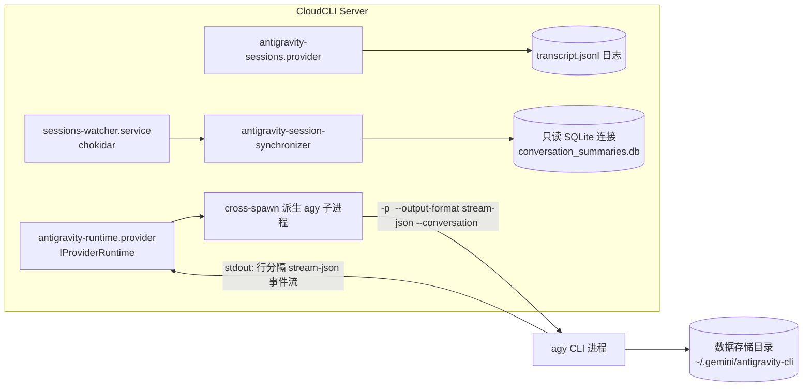

# Antigravity CLI (`agy`) 接入方案与实施计划 (Antigravity Integration Implementation Plan)

本计划基于 [Coding Agent 接入集成指南](./coding-agent-integration-guide.md) 的架构约定与 [后端模块规范](file:///Users/azrael/workspaces/cloudcli/.agents/skills/backend-module-standards/SKILL.md)，给出将 Google Antigravity CLI（`agy`）作为新 Provider（`antigravity`）接入 CloudCLI 的完整技术方案与实施细节。

---

## 1. 背景与架构决策

### 1.1 调研实测与方案取舍

| 路线 | 说明 | 结论 |
| :--- | :--- | :--- |
| **A. CLI Stream-JSON 子进程模式**（采用） | 每次对话派生 `agy -p "<prompt>" --output-format stream-json`，行级解析 stdout 流 | `agy` 官方第一方原生支持；支持 `--conversation <UUID>` 多轮续接；支持 `--dangerously-skip-permissions`；天然进程隔离，支持 `SIGTERM` 精准中断。**最佳实践路线** |
| B. 常驻 App-Server 协议模式 | 探索是否有长连接 JSON-RPC 服务 | `agy` 目前无开放的独立 app-server 子命令，且 CLI 本身冷启动响应在 1-2 秒内，子进程模式足够高效稳定。**不采用** |
| C. 云端 API 直连 | 直接调用 Google Gemini / Vertex API | 脱离了用户本机的 Antigravity Agent 环境（丢失本地技能、MCP、权限控制与工具执行）。**不采用** |

### 1.2 目标架构



核心决策：
1. **独立 CLI 子进程驱动**：单次运行单进程，利用 `agy` 原生的 `--output-format stream-json` 捕获结构化事件，通过进程生命周期实现会话的精确控制与强隔离。
2. **实时流与历史解耦**：实时交互走 stdout 行级事件解析，离线历史与索引走 `conversation_summaries.db`（SQLite 只读连接）和 `transcript.jsonl` 文件读取。
3. **数据双向互通**：CloudCLI 建立的会话与终端直接使用 `agy` 产生的会话落盘于同一数据目录（`~/.gemini/antigravity-cli`），可双向实时发现与续接。

---

## 2. 实测验证事实 (Spike Facts)

- **CLI 入口**：`/Users/azrael/.local/bin/agy`（Mach-O 64-bit arm64 独立可执行二进制），版本 `1.1.13`。
- **无头/流式选项**：
  - `-p`, `--print`, `--prompt`: 单次非交互提示词运行。
  - `--output-format`: 支持 `text`, `json`, `stream-json`（默认 `text`，采用 `stream-json`）。
  - `--conversation <id>`: 依据历史会话 UUID 继续多轮对话。
  - `--dangerously-skip-permissions`: 自动放行所有工具权限。
  - `--mode`: 设置 Agent 模式（`accept-edits`, `plan`）。
  - `--effort`: 推理深度档位（`low`, `medium`, `high`）。
  - `--model`: 指定运行模型（`gemini-3.7-flash-high`, `gemini-3.1-pro-high`, `claude-sonnet-4-6` 等）。
  - `--add-dir`: 添加工作区目录。
- **数据存储布局**：
  - 会话索引：`~/.gemini/antigravity-cli/conversation_summaries.db`（表 `conversation_summaries` 包含 `conversation_id, title, workspace_uris, last_modified_time`）。
  - 轨迹日志：`~/.gemini/antigravity-cli/brain/<id>/.system_generated/logs/transcript.jsonl`。
  - 全局配置与 MCP：`~/.gemini/antigravity-cli/settings.json` 与 `~/.gemini/antigravity/mcp_config.json`。
  - 技能目录：工作区 `.agents/skills` 与全局 `~/.agents/skills`（修正：最初调研记录的 `~/.gemini/antigravity/skills` 实测不存在；实测 `agy` 能发现并执行 `~/.agents/skills` 下的技能）。

---

## 3. 消息流与归一化映射 (NormalizedMessage)

| `agy` 原生事件 | 核心字段特征 | 映射到 CloudCLI `NormalizedMessage` | 说明 |
| :--- | :--- | :--- | :--- |
| `{"event":"init"}` | `conversation_id, tools, permission_mode` | `kind: 'session_created'` | 上报会话 UUID 并绑定 `writer.setSessionId` |
| `{"event":"step_update"}` | `step_type: "agent_response", state: "ACTIVE", text_delta: "..."` | `kind: 'stream_delta'` | Agent 回答的实时流式打字机增量 |
| `{"event":"step_update"}` | `step_type: "agent_response", state: "DONE", text_delta: "...", usage: {...}` | `kind: 'stream_delta'` + Token 累加 | 单步回答结束，累积 Token 统计 |
| `{"event":"step_update"}` | `step_type: "tool", state: "ACTIVE", tool_name, tool_info.parameters` | `kind: 'tool_use'` | Agent 准备调用工具（如 `run_command`, `view_file`） |
| `{"event":"step_update"}` | `step_type: "tool", state: "DONE", tool_info.output` | `kind: 'tool_result'` | 工具执行成功返回结果（`isError: false`） |
| `{"event":"step_update"}` | `step_type: "tool", state: "ERROR", tool_info.error` | `kind: 'tool_result'` | 工具执行报错（`isError: true`） |
| `{"event":"result"}` | `result: { status: "SUCCESS", usage: { total_tokens, ... } }` | `kind: 'complete'` | **一次 Run 结束，发送恰好一次 complete 消息** |
| 进程非零退出 / stderr | exit code ≠ 0 | `kind: 'error'` | 错误提示展示 |

---

## 4. 后端实施架构（遵循 TypeScript 模块规范）

代码目录：`server/modules/providers/list/antigravity/`，共 10 个标准文件：

```text
server/modules/providers/list/antigravity/
├── index.ts                                        # Barrel 统一导出
├── antigravity.provider.ts                         # Provider 包装类（继承 AbstractProvider）
├── antigravity-engine-path.ts                      # CLI 入口路径解析与版本探测
├── antigravity-runtime.provider.ts                 # IProviderRuntime（cross-spawn + stream-json 解析）
├── antigravity-auth.provider.ts                    # IProviderAuth（检测 CLI 安装与认证凭据）
├── antigravity-models.provider.ts                  # IProviderModels（支持动态 agy models 与内置回退）
├── antigravity-mcp.provider.ts                     # McpProvider（mcp_config.json 适配）
├── antigravity-skills.provider.ts                  # SkillsProvider（.agents/skills 路径扫描）
├── antigravity-sessions.provider.ts                # IProviderSessions（消息归一化与历史分页）
└── antigravity-session-synchronizer.provider.ts    # IProviderSessionSynchronizer（SQLite 元数据同步）
```

### 4.1 各分面核心职责

1. **引擎路径解析 (`antigravity-engine-path.ts`)**：
   - 顺序：环境变量 `CLOUDCLI_ANTIGRAVITY_PATH` → `which agy` → 平台默认路径（macOS `/Users/azrael/.local/bin/agy`、Windows `%LOCALAPPDATA%\Programs\Antigravity\agy.exe` 等）。
   - 提供 `getEngineVersion()` 探测 CLI 版本。
2. **运行时 (`antigravity-runtime.provider.ts`)**：
   - `cross-spawn` 派生 `agy`，构造参数 `-p <prompt> --output-format stream-json [--conversation <id>] [--model <model>] [--effort <effort>] [--permissionMode 映射]`；其中 permissionMode 映射为：`acceptEdits → --mode accept-edits`、`plan → --mode plan`、`bypassPermissions → --dangerously-skip-permissions`、`default → 无附加参数`。
   - 逐行解析 stdout，推送到 `writer`，保证 run 终态发送且仅发送一次 `complete`。
   - 实现 `abort(sessionId)` 终止关联子进程，abort 后通知 `stopReason: 'aborted'`。
3. **认证 (`antigravity-auth.provider.ts`)**：
   - 检查 `agy` 是否安装，探测 `settings.json` 或 `installation_id` 状态。
   - 未安装/未认证返回合法的 `ProviderAuthStatus` 对象，不 throw。
4. **模型目录 (`antigravity-models.provider.ts`)**：
   - `getSupportedModels()`：通过 `agy models </dev/null` 获取模型列表并缓存 5 分钟；失败回退到内置模型列表（`gemini-3.7-flash-high`, `gemini-3.1-pro-high`, `claude-sonnet-4-6` 等），默认 `gemini-3.7-flash-high`。
   - `getCurrentActiveModel(sessionId)`：从 `settings.json` 或会话记录读取。
5. **MCP 适配 (`antigravity-mcp.provider.ts`)**：
   - 继承 `McpProvider`，读写 `~/.gemini/antigravity/mcp_config.json` 及工作区 `.gemini/mcp_config.json`（支持 stdio、http、sse）。
6. **技能发现 (`antigravity-skills.provider.ts`)**：
   - 继承 `SkillsProvider`，列出三个源：工作区 `.agents/skills`、全局 `~/.agents/skills`（agy 实际读取的全局目录）、`~/.gemini/antigravity/skills`（兜底，实测通常不存在），前缀 `/`；用户级技能写入目标为 `~/.agents/skills`。
7. **会话与历史 (`antigravity-sessions.provider.ts`)**：
   - 实现 `normalizeMessage`；
   - `fetchHistory` 读取 `brain/<id>/.system_generated/logs/transcript.jsonl`，支持 `sliceTailPage` 分页。
8. **会话同步器 (`antigravity-session-synchronizer.provider.ts`)**：
   - 只读短连接查询 `~/.gemini/antigravity-cli/conversation_summaries.db`，增量 upsert 到系统 SQLite 会话表。

### 4.2 系统注册与服务接入

1. `server/shared/types.ts`：扩展 `export type LLMProvider = ... | 'antigravity'`。
2. `server/modules/providers/provider.registry.ts`：注册 `antigravity: new AntigravityProvider()`。
3. `server/modules/providers/provider.routes.ts`：在 `parseProvider` 参数校验中放行 `'antigravity'`。
4. `server/modules/providers/services/provider-capabilities.service.ts`：配置 `antigravity` 支持图片、文件、Abort、TokenUsage、Effort、4 种权限模式。
5. `server/modules/providers/services/sessions-watcher.service.ts`：监控 `~/.gemini/antigravity-cli/conversation_summaries.db`。

---

## 5. 前端适配

1. `src/types/app.ts`：扩展前端 `LLMProvider` 类型。
2. `useChatProviderState.ts`：
   - 默认模型：`gemini-3.7-flash-high`；
   - 权限模式矩阵：`['default', 'acceptEdits', 'bypassPermissions', 'plan']`；
   - 增加 `antigravityModel` 状态管理与 `localStorage` 同步。
3. `ProviderSelectionEmptyState.tsx` & `ChatMessagesPane.tsx`：增加 Antigravity 选项卡、模型切换与状态透传。
4. `SessionProviderLogo.tsx` & `AntigravityLogo.tsx`：增加 Antigravity / Gemini 图标渲染。
5. `ProviderLoginModal.tsx`：提供终端登录指引命令（`agy`）。
6. `src/components/mcp/constants.ts`：配置 MCP 存储路径提示与传输协议范围。
7. `src/components/chat/constants/providerEffort.ts`：配置 `['low', 'medium', 'high']` 推理档位。

---

## 6. 测试与验收标准

### 6.1 自动化检查
- **类型检查**：`npx tsc --noEmit -p server/tsconfig.json`（0 错误）。
- **代码规范**：`npx eslint server/modules/providers/list/antigravity/**/*.ts server/shared/types.ts`（0 错误，0 告警）。
- **全量打包**：`npm run build`（客户端与服务端生产构建成功）。
- **单元测试**：
  ```bash
  npx tsx --tsconfig server/tsconfig.json --test \
    server/modules/providers/tests/antigravity.test.ts \
    server/modules/providers/tests/mcp.test.ts \
    server/modules/providers/tests/skills.test.ts \
    server/modules/providers/tests/provider-runtime.service.test.ts \
    server/modules/providers/tests/provider-models.service.test.ts
  ```

### 6.2 手动验收清单
- [x] 空状态选择 Antigravity，能正确读取本地已安装的 `agy` (1.1.13) 及认证状态。
- [x] 新会话发起提问，前端实时看到流式打字机输出、工具调用卡片与执行结果，结束后有正确 Token 统计。
- [x] 在已有 Antigravity 会话中发送追问，CLI 能基于 `--conversation` 正确续接上下文。
- [x] 在输出生成过程中点击“停止”按钮，子进程能被及时终止且界面恢复可交互状态。
- [x] 切换 `gemini-3.7-flash-high`、`gemini-3.1-pro-high` 或推理档位，下次运行能正确传递对应参数。
- [ ] 权限模式四档分别生效：`acceptEdits`/`plan` 传 `--mode`，`bypassPermissions` 传 `--dangerously-skip-permissions`，`default` 不附加参数（2026-08-18 审核补项，映射逻辑已有单测覆盖，待 UI 手动回归）。
- [x] 在终端通过 `agy` 产生的新会话，能被 CloudCLI 侧边栏实时发现并展示。
- [x] 在 CloudCLI MCP 面板中增删配置，能正确在 `mcp_config.json` 中反映。
