# Realtime, scroll, and tool views

Three subsystems that are hard to read from the source alone, because in each
case the behaviour lives in the *interaction* between files rather than in any
one of them.

Claims are anchored to `file:line` wherever a single site backs them; a few
counts and summaries span too many sites to cite usefully and are marked as
such. Line numbers drift — the file and symbol names are the durable part.

- [1. The WebSocket layer](#1-the-websocket-layer)
- [2. Scroll](#2-scroll)
- [3. Tool views](#3-tool-views)
- [4. Suggested improvements](#4-suggested-improvements)

---

## 1. The WebSocket layer

### 1.1 Transport topology

One `WebSocketServer` is attached to the HTTP server and routed by pathname.
There is no second server and no socket.io-style namespacing.

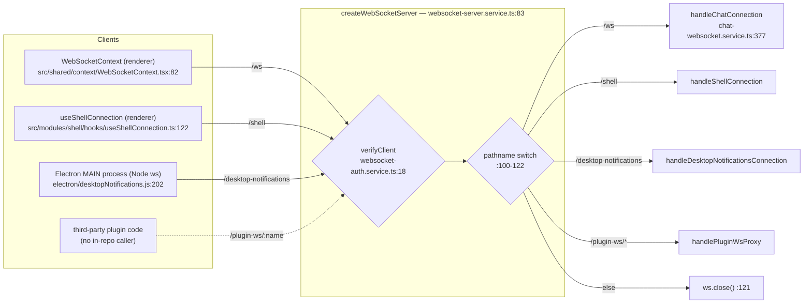

There are exactly three `new WebSocket(` call sites in this repo — the three
solid arrows. `/plugin-ws` is dashed because **nothing in this repo opens it**:
`PluginTabContent` loads plugin JS over HTTP and imports it from a Blob URL, and
the route exists for plugin-authored code to use. Note also that the
`/desktop-notifications` client is the Electron **main** process using the Node
`ws` package (it sends headers, which a browser `WebSocket` cannot), not a
renderer.

**Auth happens once, at the upgrade** (`websocket-auth.service.ts:18`), for every
path. In platform mode it resolves the first DB user and ignores tokens
entirely; in OSS mode it reads a JWT from `?token=` then `Authorization`. On
success it hangs `request.user` on the request; on failure the handshake is
rejected. `/shell` and `/plugin-ws` do no further authorization beyond this.

Every connection gets a 30-second ping/pong heartbeat
(`websocket-server.service.ts:95`, implementation `:23`). A socket that misses one
pong is terminated so the client's reconnect logic can take over.

> The module README documents three routes; the code has four
> (`/desktop-notifications` is missing from the docs).

### 1.2 The protocol

**Client → server** — four message types, `type`-keyed, dispatched at
`chat-websocket.service.ts:397`:

| Message | Payload | Handler |
|---|---|---|
| `chat.send` | `{sessionId, content, options?}` | `:146` |
| `chat.abort` | `{sessionId}` | `:254` |
| `chat.subscribe` | `{sessions: [{sessionId, lastSeq?}]}` | `:287` |
| `chat.permission-response` | `{requestId, allow, updatedInput?, …}` | `:350` |

Anything else gets a `protocol_error` with code `UNKNOWN_MESSAGE_TYPE` (`:411`).

**Server → client** — every frame is `kind`-keyed. The union is
`ServerEventKind = MessageKind | GatewayEventKind` (`server/shared/types.ts:216`):

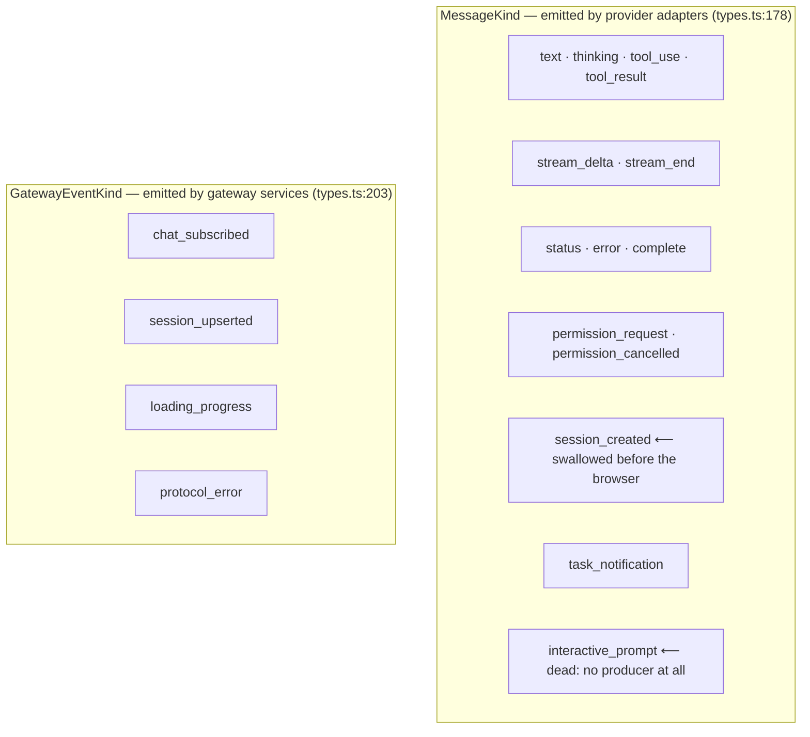

Two entries there will mislead you if you read the union alone:

- **`session_created` never reaches the browser over `/ws`.**
  `ChatSessionWriter` swallows it and uses it to capture the provider-native
  session id (`chat-session-writer.service.ts:83`). The frontend already holds
  the stable app-side id, so there is no id handoff to perform. (It *is*
  forwarded verbatim by the external agent API's `SSEStreamWriter`,
  `server/modules/agent/agent.routes.ts:479` — an API-key-gated route with no
  frontend caller.)
- **`interactive_prompt` is dead in both directions.** No server producer
  exists. The client re-encoder at `useChatSessionState.ts:151` is guarded by
  `msg.isInteractivePrompt`, and the only writer of that flag is
  `useChatMessages.ts:234` — inside `case 'interactive_prompt':`, i.e. reachable
  only from a frame that never arrives. The ~90-line render branch at
  `MessageComponent.tsx:238` is unreachable.

One non-`kind` protocol is still alive on `/ws`: TaskMaster sends
`taskmaster-project-updated` / `taskmaster-tasks-updated`, which are `type`-keyed
(`taskmaster.routes.ts:28-53`).

### 1.3 The chat run lifecycle

This is the single most important sequence in the app.

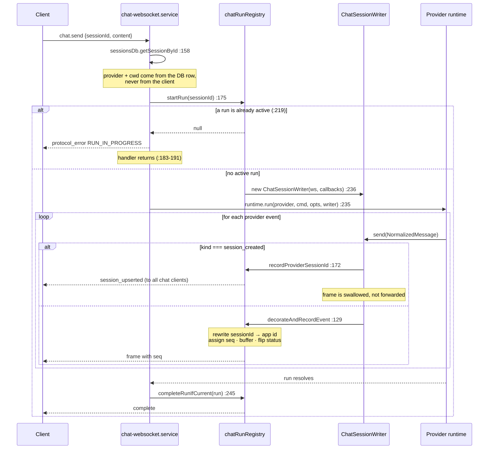

Three subtleties the code comments exist to protect:

1. **`completeRunIfCurrent`, not `completeRun`** (`:245`, guard at
   `chat-run-registry.service.ts:329`). The `finally` block is a safety net for a
   runtime that crashed without emitting `complete`. It is scoped to *this* run
   because a queued message can start the session's next run before this promise
   settles, and a session-keyed completion would kill that new run.
2. **Exactly-one-`complete`** (`chat-run-registry.service.ts:134`). On abort the
   handler emits the terminal `complete` immediately, but the killed runtime may
   still emit its own. Whichever arrives first wins; the duplicate is dropped.
3. **`seq` is assigned at the registry, not the provider.** It is the monotonic
   per-run counter that makes replay possible.

### 1.4 Fan-out: three different client sets

Diagrams of this system usually show one broadcast path. There are three, with
different reach:

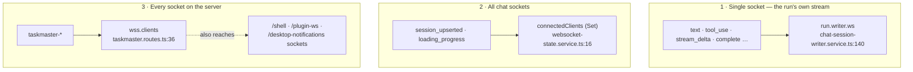

Path 1 has a consequence that is easy to trip over. The run's frames go to the
single connection passed into `startRun` — the socket that sent `chat.send`.
A *second* tab viewing the same session receives nothing, regardless of when it
subscribed. `attachConnection` (`chat-run-registry.service.ts:282` →
`updateWebSocket`, `chat-session-writer.service.ts:119`) **replaces** that
connection, and it only runs for a subscribe that lands while a run is already
in flight (`chat-websocket.service.ts:316`) — so a mid-run reload or reconnect
moves the stream to the new socket, taking it away from the old one.

Path 3 sends chat-shaped JSON to shell and plugin sockets that have no idea what
to do with it.

### 1.5 Reconnect and replay

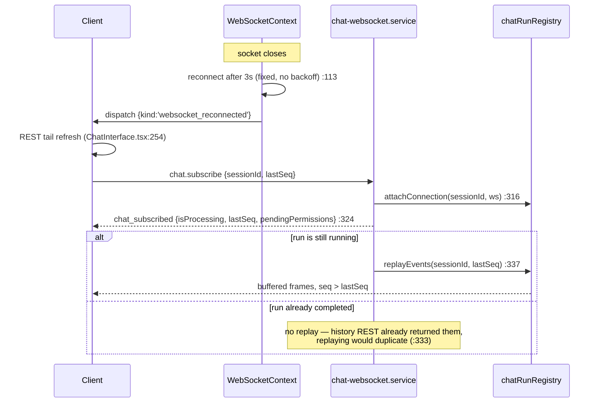

Buffering bounds, both deliberate:

- `MAX_BUFFERED_EVENTS_PER_RUN = 5000` (`chat-run-registry.service.ts:54`).
  Overflow drops the oldest; a client whose `lastSeq` predates the buffer falls
  back to REST, which is always authoritative.
- `COMPLETED_RUN_RETENTION_MS = 5 min` (`:46`), covering the window between a run
  finishing and a sleeping tab refreshing history.

The `/shell` socket has a *separate* resume mechanism: a ring buffer of the last
5000 PTY chunks is replayed (`shell-websocket.service.ts:435`), and the PTY
itself survives socket loss for `PTY_SESSION_TIMEOUT = 30 min` (`:34`).

### 1.6 The client half

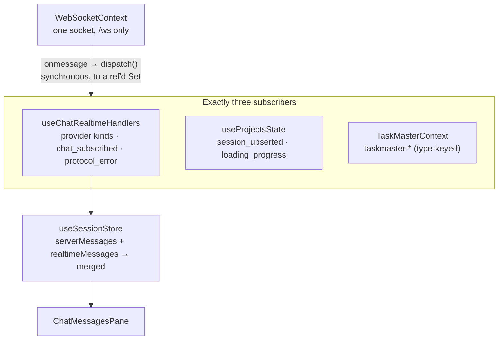

Frames are dispatched **synchronously** and are deliberately never copied into
React state (`WebSocketContext.tsx:14-21`) — that is what stops rapid back-to-back
frames from being coalesced or dropped by React's batching.

A streaming reply takes this path:

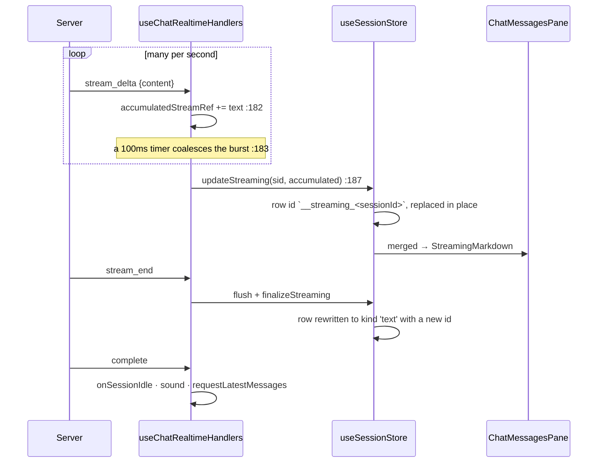

`StreamingMarkdown` exists because of the last step's hazard: a completed reply
that switches component *type* in the same position makes React throw away the
DOM and rebuild it, destroying any text selection the user had started
(`StreamingMarkdown.tsx:13-45`).

Note the row is *replaced in place* (`useSessionStore.ts:745`), so
`chatMessages.length` does not change while text streams — which matters for
scroll (§2.2).

---

## 2. Scroll

### 2.1 Ownership

There is one scrollable node — the transcript pane, created in
`ChatMessagesPane.tsx:150` — and its behaviour is owned almost entirely by one
hook, `useChatSessionState.ts`.

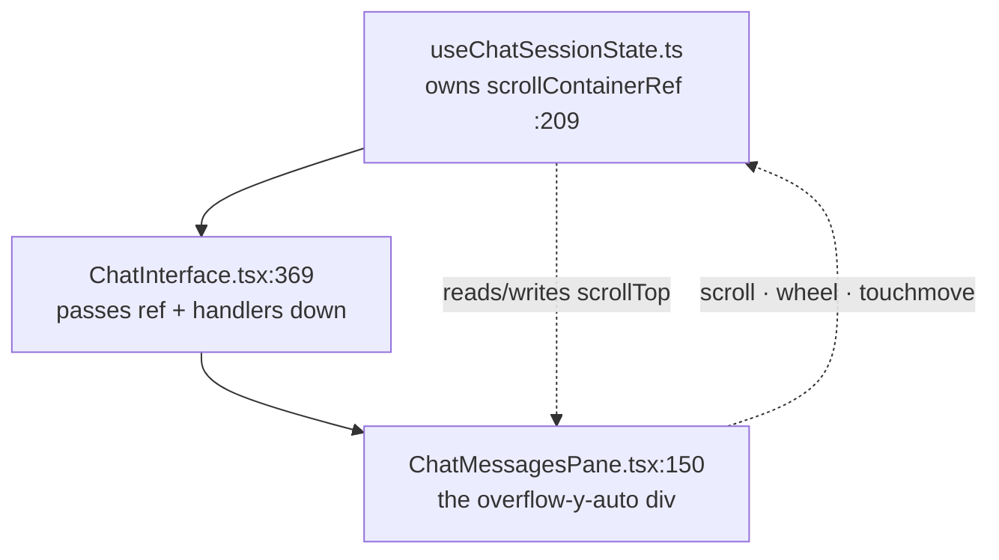

### 2.2 The seven behaviours

| Behaviour | Trigger | Where |
|---|---|---|
| Initial scroll to bottom | session opens | rAF loop, `:593` |
| Stick to bottom on each new **message** | `chatMessages.length` changes, if not scrolled up | `:941` |
| "User scrolled up" detection | scroll, < 50px from bottom | `:434`, `:506` |
| Anchor-preserving restore | older page prepended | `:106`, `:543` |
| Restore on tab re-activation | tab becomes active | `:564` |
| Infinite scroll upward | `scrollTop < 100` | `:513`, `:441` |
| Scroll to a search hit | sidebar search | `:810-904`, DOM probe `:39` |

Row 2 is per *message*, not per streaming tick: the effect depends on
`chatMessages.length`, and a streaming reply replaces one row in place rather
than adding rows. Growing text inside the streaming row does not re-fire it.

### 2.3 Why the initial scroll is a rAF loop

The obvious implementation — scroll once, on a timer — was tried and failed:

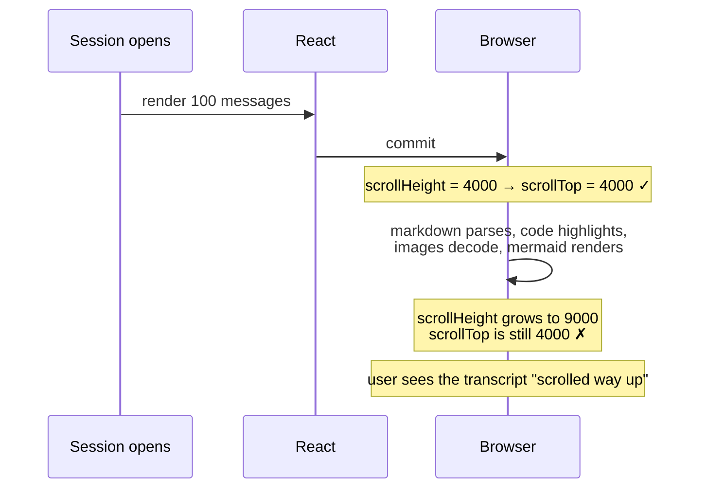

The fix (`:593-625`) re-scrolls every animation frame while `scrollHeight` is
still growing, stopping after 3 stable frames or 60 frames (~1s). The comment at
`:583` records exactly this failure.

### 2.4 Why prepending pages needs an anchor

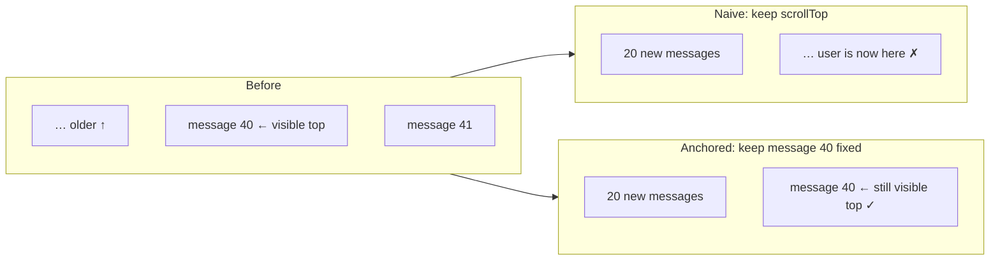

`captureScrollRestoreState` (`:106`) records the first `.chat-message` whose
bottom is at or below the container top, plus its offset. After the prepend, a
layout effect (`:543`) restores that offset if the anchor is still connected, and
falls back to a `scrollHeight`-delta adjustment if it is not.

### 2.5 The coordination problem

This is what makes the code hard to follow. **Five sites write `scrollTop` on the
same node**, plus one `scrollIntoView`, and nothing arbitrates between them:

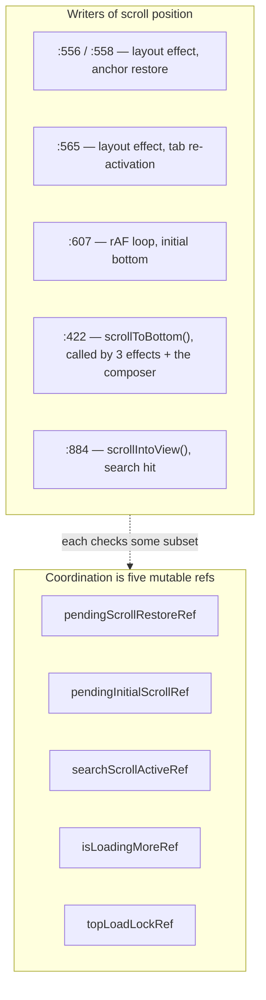

`scrollToBottom` is reached from three different `setTimeout` delays — 50 ms
(`:941` new message), 200 ms (`:766` external update) and 100 ms
(`useChatComposerState.ts:825`, on send) — which can land in any order relative
to each other and to the rAF loop.

`handleScroll` is additionally **bound three times** to the same node: once as a
`scroll` listener (`:955`) and twice as React props, `onWheel` and `onTouchMove`
(`ChatInterface.tsx:370-371`). It is `async` and can start a page fetch, so one
gesture can enter it more than once; only `topLoadLockRef` and `isLoadingMoreRef`
prevent a double page load.

"Is the user scrolled up" also exists in three representations: the
`isUserScrolledUp` state (`:201`), a live `isNearBottom()` recomputation
(`:434`), and `scrollPositionRef` (`:222`) — and the composer writes the state
directly on send (`useChatComposerState.ts:824`).

### 2.6 What bounds the rendered list today

There is **no virtualization**. Bounding comes from two places:

- A tail window: `chatMessages.slice(-visibleMessageCount)` (`:929`), starting at
  `INITIAL_VISIBLE_MESSAGES = 100` (`:15`), growing by a page on each upward
  load, and set to **`Infinity`** by "Load all" (`:999`).
- CSS containment: `.chat-message { contain: layout style paint;
  content-visibility: auto; contain-intrinsic-size: auto 180px }`
  (`src/index.css:591`). This is the browser doing the off-screen skipping that a
  virtualizer would do in JavaScript.

---

## 3. Tool views

### 3.1 From wire frame to rendered card

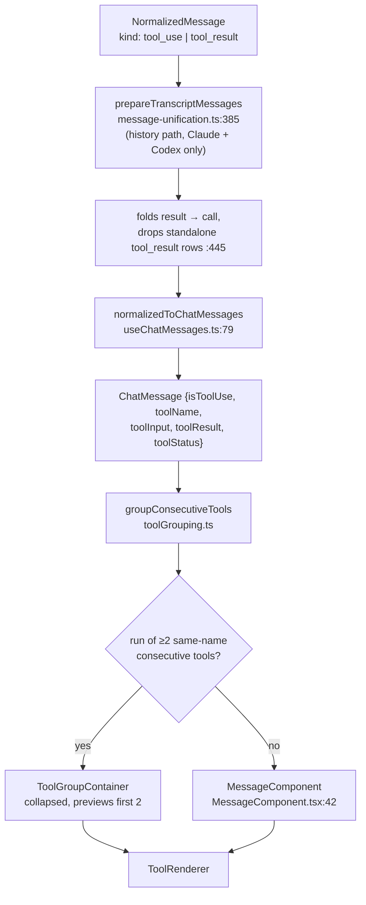

`prepareTranscriptMessages` runs on the **history** path only, and only for
Claude (`claude-sessions.provider.ts:935`) and Codex
(`codex-sessions.provider.ts:2048`). Cursor and OpenCode history never gets the
checklist unification, the tool-output cap, or the standalone-`tool_result`
drop. Live websocket frames bypass it entirely for every provider, so the client
rebuilds a `toolResultMap` keyed by `toolId` for anything still unpaired
(`useChatMessages.ts:82`).

### 3.2 Grouping rules

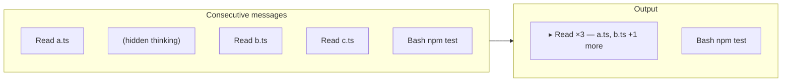

- Groupable = `isToolUse && toolName && !isSubagentContainer` — a subagent never
  groups (`toolGrouping.ts:16`).
- A run must be consecutive **and** same-`toolName` (`:109`).
- Rows that render nothing (hidden thinking) do not break a run (`:23`) —
  Codex interleaves hidden reasoning between consecutive tool calls.
- Threshold is 2 (`:4`).
- **The group carries the *first* message's timestamp** (`:123`). This is exactly
  why the search-hit locator must accept a nearest match on its final retry
  (`useChatSessionState.ts:33`): a hit on the second call of a collapsed group has
  no row of its own.

### 3.3 The renderer registry

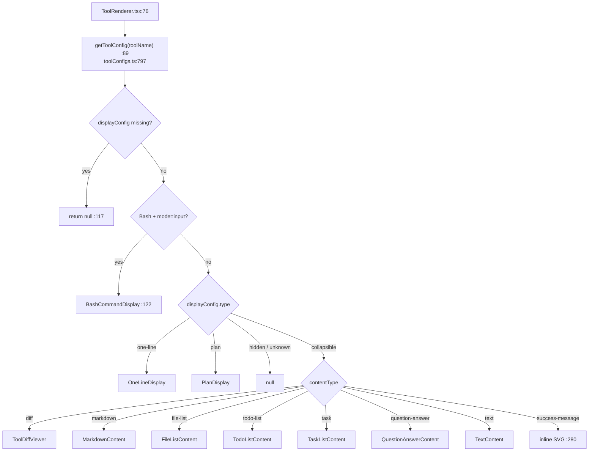

The registry lookup runs **first** (`:89`); the Bash special case sits after it
and after the `if (!displayConfig) return null` guard at `:117`. A `Bash` entry
with no `input` config would therefore return `null` and never reach
`BashCommandDisplay`.

`TOOL_CONFIGS` (`toolConfigs.ts:109`) holds 22 bespoke entries plus `Default`.
An unmapped tool is *not* rendered as a blank "Parameters" row:
`summarizeToolInput` (`:54`) walks a list of descriptive input keys (`command`,
`file_path`, `pattern`, `query`, …) to build a one-line summary.

A **second, independent registry** exists for interactive permission prompts:
`permissionPanelRegistry.ts:6`, populated by a module-level side effect in
`PermissionRequestsBanner.tsx:17`.

### 3.4 Subagents own their whole card

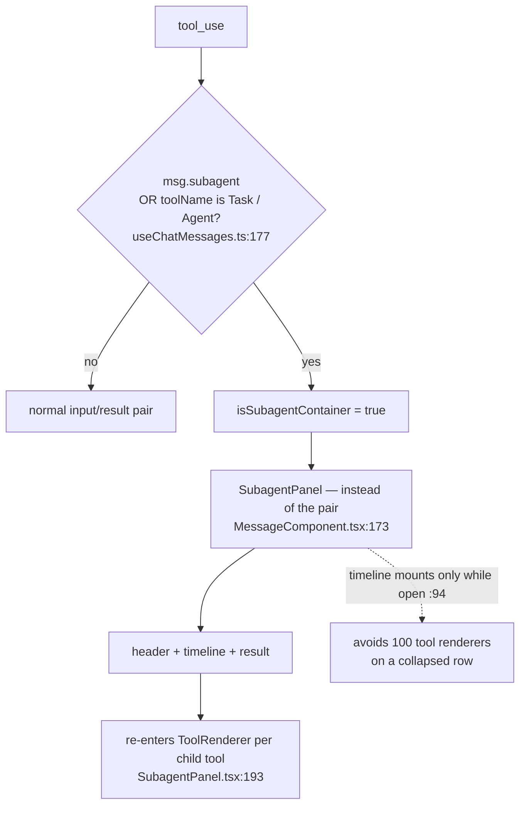

The `toolName` half of that condition matters: a live `Task`/`Agent` spawn whose
metadata has not been indexed yet is still rendered as a subagent card.

For Claude, the backend reads
`<projectDir>/<providerSessionId>/subagents/agent-<id>.jsonl`
(`claude-sessions.provider.ts:190`); Codex uses a sibling rollout keyed by
`agent_thread_id` (`codex-sessions.provider.ts:1621`). Both normalize to the same
`SubagentActivity[]`, are truncated for transport, and are hung off the spawning
`tool_use`. The `task_notification` is folded back onto that same call so an
async agent produces one card rather than a card, a status line and a stray
reply.

### 3.5 Adding a renderer

| Goal | Change | Router edit needed? |
|---|---|---|
| New tool, existing content type | add a key to `TOOL_CONFIGS` | no |
| New border colour | extend `getToolCategory` (`ToolRenderer.tsx:33`) | yes |
| New `contentType` | extend the union **and** add a case at `ToolRenderer.tsx:220` | yes |
| New display `type` | new branch in `ToolRenderer` | yes |
| Interactive permission panel | `registerPermissionPanel(name, Component)` | no |

The "config-driven, no scattered conditionals" claim in the tools README holds
for row 1 only.

---

## 4. Suggested improvements

Ordered by (value ÷ risk). Nothing here is implemented; each item names the
evidence it rests on.

### 4.1 Close the protocol dead ends — *low risk; one of them is a live bug*

The `/shell` message handler branches on **`output` and nothing else**
(`useShellConnection.ts:94`). Everything else the shell server sends is parsed
and then silently dropped:

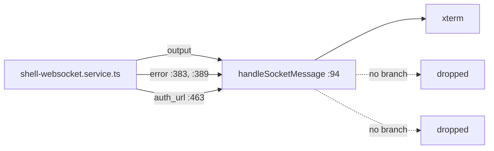

- **`error` is the live bug.** The server sends
  `{type:'error', message:'Invalid project path'}` and
  `{type:'error', message:'Invalid session ID'}` (`shell-websocket.service.ts:383,389`)
  and then returns without starting a PTY. The user sees a terminal that simply
  never does anything, with no message. TypeScript does not object, because
  `ShellIncomingMessage` ends in a catch-all `{type: string; [key: string]: unknown}`
  member (`socket.ts:34`) — which is exactly why the drop is invisible. Worth
  fixing regardless of the rest of this list.
- **`auth_url`** is emitted once per detected login URL (`:463`, with a server
  test asserting it) and typed on the client (`socket.ts:32`) but never handled —
  so the `autoOpen` affordance the server implements does not exist in the UI.
- **`url_open`** is the mirror image: typed in the client union (`socket.ts:33`)
  with no producer anywhere.

Two more phantoms outside the shell:

- **`interactive_prompt`** is unreachable in both directions (§1.2). The honest
  fix is to delete the union member *and* the ~90-line render branch at
  `MessageComponent.tsx:238`, not to redocument it.
- **`taskmaster-mcp-status-changed`** is handled (`TaskMasterContext.tsx:335`)
  but never emitted.

Grep each before deleting. The point is that all five are currently *invisible*
dead ends: nothing fails, so nothing tells you they are unreachable.

### 4.2 Give the transcript one scroll arbitrator — *medium risk, high value*

Section 2.5 is the single biggest source of confusion in the codebase. The
improvement is not "rewrite the scrolling" but "make the writers explicit":

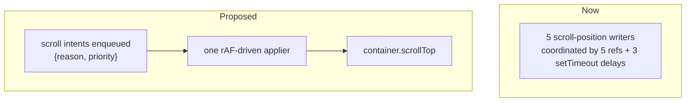

Concretely: a `useTranscriptScroll` hook exposing
`requestScroll({reason: 'initial' | 'sticky' | 'restore' | 'search'})`, with a
documented precedence (search > restore > initial > sticky) and one rAF applier.
The five refs become one piece of state inside that hook.

Do this **before** any virtualization work — a windowed list would otherwise
have to be threaded through every writer.

A tempting smaller step is to drop the `onWheel`/`onTouchMove` bindings
(`ChatInterface.tsx:370-371`) as redundant with the `scroll` listener. **It is
not a no-op.** `scroll` only fires when `scrollTop` actually changes, whereas
`wheel`/`touchmove` also fire at the scroll extremes — so at `scrollTop === 0`
with `topLoadLockRef` set (`:533`), a further wheel-up currently re-enters
`handleScroll` and a `scroll`-only binding would not. That path drives both the
"Load all" overlay (`:516`) and `loadOlderMessages`. Treat it as a behaviour
change and test it at the top of a long transcript, on both a mouse and a touch
device.

### 4.3 Cap the "Load all" path — *low risk, directly fixes the only unbounded render*

`loadAllMessages` sets `visibleMessageCount = Infinity` (`:999`). On the 7.5 MB
transcript that commit `7356033f` measured, that mounts every message, every code
block and every mermaid diagram in one commit.

Keep loading all the *data* (search and export need it) but keep the *window*
finite — e.g. `Infinity` → 2000.

Be precise about the consequence: `loadAllMessages` also sets
`allMessagesLoadedRef.current = true` (`:967`), and the scroll-driven pager is
gated on `!allMessagesLoadedRef.current` (`:531`). So after "Load all" the only
way to widen the window further is the explicit "load earlier" link
(`ChatMessagesPane.tsx:226` → `:1024`), which steps 100 at a time. Capping at
2000 is still right, but on a multi-thousand-message transcript it trades one
enormous commit for repeated clicking — so either pick a cap above the realistic
maximum, or make the post-"Load all" pager step larger.

### 4.4 Fix the two-tab live-stream drop — *medium risk, real user-visible bug*

A run's frames go to one connection: the socket that sent `chat.send`, replaced
wholesale by `attachConnection` when a subscribe lands mid-run
(`chat-run-registry.service.ts:282`). A second tab on the same session sees
nothing live, and a mid-run reload steals the stream from the first tab.

The fix is to make `ChatSessionWriter` hold a `Set<RealtimeClientConnection>` and
forward to all live members, pruning closed ones. The replay path already works
per-connection, so each tab keeps its own `lastSeq`.

Before building it, decide whether two tabs on one session is a case worth
supporting — if not, the honest fix is a comment saying so, because today's
behaviour looks like a bug either way.

### 4.5 Collapse the duplicated `session_upserted` builders — *low risk*

The payload is constructed in **three** places:

| Builder | Includes `providerSessionId`? |
|---|---|
| `sessions-watcher.service.ts:136` | no |
| `chat-run-registry.service.ts:65` | **yes** |
| `useProjectsState.ts:577` (client-side optimistic) | no |

They have already diverged, and the divergence is load-bearing:
`useProjectsState.ts:806` uses `providerSessionId` to detect that the session it
is showing has been aliased, and rewrites the selected session's id in place.
Reading any one producer alone gives you the wrong model of the event. Extract
one builder — and remember the third one when you do.

### 4.6 Split `useChatSessionState` — *high risk, do last*

1058 lines, ~9 concerns, returning **29** values (`:1027-1057`) that are
re-scattered into a 40-prop `ChatMessagesPane` (`ChatMessagesPaneProps`,
`ChatMessagesPane.tsx:20-61`). The natural seams are: session loading +
pagination, scroll (4.2), search navigation, and token budget.

Worth doing only *after* 4.2, and only with the existing tests as the safety net
— `sessionMessagePagination`, `sessionMessageReconciliation` and
`messageHistoryRefreshCoordinator` already cover the merge rules that are easiest
to break.

### 4.7 Document the third fan-out path — *trivial*

`taskmaster.routes.ts:36` iterates `wss.clients`, so TaskMaster JSON is delivered
to `/shell`, `/plugin-ws` and `/desktop-notifications` sockets. Either switch it
to `connectedClients` (matching every other broadcast) or write down why it does
not. The websocket README documents only the first two paths.
