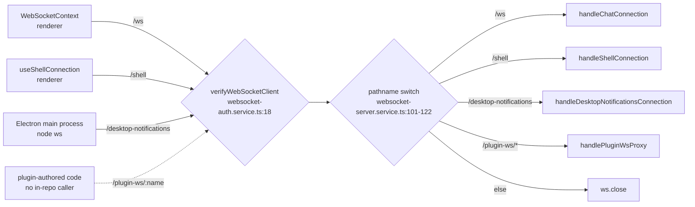
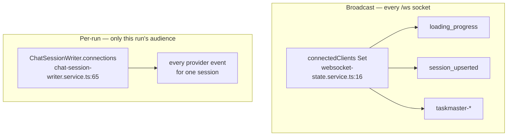
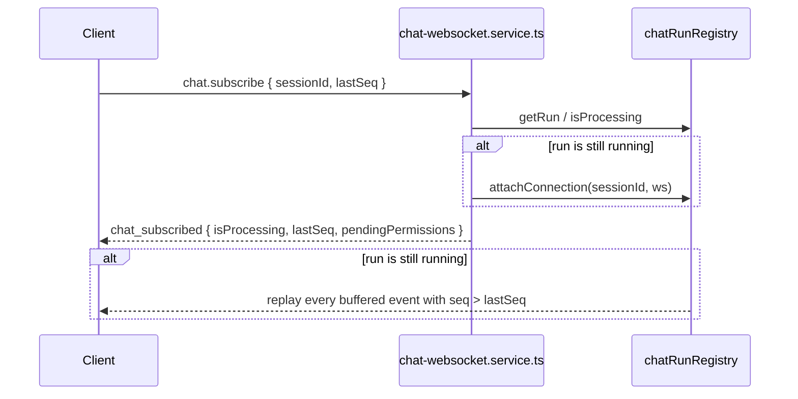
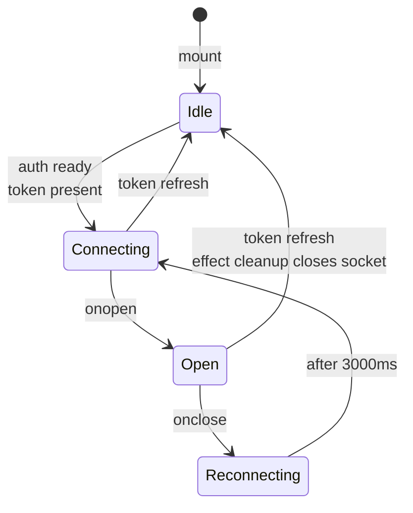

# The WebSocket layer

*One socket, four paths, and the protocol that runs over the chat one. Covers transport, auth, the message vocabulary in both directions, and how a client catches up after a drop. What the client does with the events is [The realtime stream](03-realtime-stream.md); how session ids are handled is [Conversation handoff](02-conversation-handoff.md).*

## In one paragraph

There is exactly **one** `WebSocketServer`, attached to the HTTP server and routed by
pathname — there is no second server and no socket.io-style namespacing. Auth happens
once, at the HTTP upgrade, for every path. The interesting path is `/ws`, the chat
socket: browsers open exactly one of these per tab, and every feature that needs live
data subscribes to it. The protocol on it is deliberately small — five inbound message
types — and every outbound frame is tagged with a `kind`, so the client needs one
switch statement and no provider-specific branching. The server never trusts the client
for anything that matters: provider, project path and provider-native session id are all
read from the database using only the session id the client sent.

## Transport topology

Two things about this diagram are easy to get wrong:

- **`/plugin-ws` has no in-repo client.** The route exists for plugin-authored
  frontend code. `PluginTabContent` loads plugin JS over HTTP and imports it from a
  Blob URL; it does not open this socket.
- **The `/desktop-notifications` client is the Electron *main* process**, using the
  Node `ws` package — not a renderer. It sends headers, which a browser `WebSocket`
  cannot.

Every connection, on every path, gets a heartbeat attached before routing
(`websocket-server.service.ts:95`).

## Auth at the upgrade

`verifyClient` runs before the `connection` handler, so an unauthenticated socket never
reaches a route handler (`websocket-auth.service.ts:18`).

| Mode | Behaviour |
| --- | --- |
| Platform (`isPlatform`) | Resolves the first DB user and **ignores tokens entirely** (`:32-42`) |
| OSS | Reads a JWT from the `token` query parameter, falling back to the `Authorization` header (`:45-48`) |

On success the user object is attached as `request.user`; on failure `verifyClient`
returns `false` and the upgrade is rejected. The token is redacted from the connection
log (`:25-27`).

The query parameter exists because a browser `WebSocket` cannot set headers. That is
also why the client's URL builder appends `?token=` only in OSS mode
(`src/shared/context/WebSocketContext.tsx:36-45`).

## Heartbeat

`attachWebSocketHeartbeat` (`websocket-server.service.ts:23`) pings every **30 s**. A
socket that did not answer the previous ping is considered half-open and `terminate()`d,
which emits `close` and lets the client's own reconnect timer take over (`:59-65`).

## The chat protocol: inbound

Five message types, dispatched by `data.type` in `handleChatConnection`
(`chat-websocket.service.ts:603-622`). Anything else gets a `protocol_error` with code
`UNKNOWN_MESSAGE_TYPE`.

| `type` | Payload | What the server does |
| --- | --- | --- |
| `chat.send` | `sessionId`, message content, attachments, model/permission options | Resolves the session row from the DB, registers a run, dispatches to the provider runtime (`:146`) |
| `chat.edit-send` | as above plus `anchorId` | Announces `history_truncated`, rewinds the provider transcript to the anchor, then dispatches (`:363-407`) |
| `chat.abort` | `sessionId` | Aborts the runtime and emits the terminal `complete` on its behalf (`:415`) |
| `chat.subscribe` | `sessions: [{ sessionId, lastSeq }]` | Acks with `chat_subscribed`, attaches the socket to any running run, replays missed events (`:448`) |
| `chat.permission-response` | `requestId`, `allow`, `updatedInput?`, `message?`, `rememberEntry?` | Resolves the pending tool approval (`:511`) |

**The client is not trusted for anything but the session id.** `resolveSendTarget`
(`:170`) reads the session row from `sessionsDb`, and takes provider, project path and
provider-native id from there:

> the session row and provider come from the database, never from the client.
> — `chat-websocket.service.ts:167-168`

A send for an unknown session is rejected with `SESSION_NOT_FOUND` and an instruction to
create it over REST first (`:186-188`) — which is the entry point described in
[Conversation handoff](02-conversation-handoff.md).

### Protocol errors have their own kind

`sendProtocolError` (`:121`) emits `kind: 'protocol_error'` rather than a provider
`error` message, and the reason is worth keeping:

> so the frontend can distinguish "your request was invalid" from "the model run
> produced an error" without inspecting text.
> — `chat-websocket.service.ts:117-119`

Every code in the source, with the line that emits it:

| Code | Line | Meaning |
| --- | --- | --- |
| `SESSION_ID_REQUIRED` | `:178`, `:422` | The frame carried no usable `sessionId` |
| `SESSION_NOT_FOUND` | `:184` | No DB row — create it over REST first |
| `UNSUPPORTED_PROVIDER` | `:195` | The session's provider has no registered runtime |
| `RUN_IN_PROGRESS` | `:230` | A run is already active for this session; the duplicate send is rejected |
| `ANCHOR_REQUIRED` | `:328` | `chat.edit-send` without an `anchorId` |
| `EDIT_NOT_SUPPORTED` | `:336` | The provider cannot re-run from a point |
| `ANCHOR_NOT_FOUND` | `:345` | The anchor is not in the transcript |
| `ANCHOR_LOOKUP_FAILED` | `:351` | The anchor lookup itself threw |
| `EDIT_REWIND_FAILED` | `:400` | The provider transcript could not be rewound |
| `NO_ACTIVE_RUN` | `:428` | `chat.abort` for a session with nothing running |
| `UNKNOWN_MESSAGE_TYPE` | `:620` | Unrecognised `type` |
| `INTERNAL_ERROR` | `:626` | Anything thrown out of a handler |

One inbound message fails **silently**: `chat.permission-response` returns without an
error when `requestId` is missing or empty (`:512-514`).

### The attachment trust boundary

`chat.send` options come straight from the browser, and provider runtimes read the
referenced files off disk — Claude base64-encodes them into the prompt. So every
attachment path is filtered before it goes anywhere:

`filterAttachmentsToUploadStore` (`:34`) resolves each path against the global upload
store (`~/.cloudcli/assets`, where `POST /api/assets/images` writes) and keeps it only if
it is a **direct child** of that directory. Relative paths are anchored there; absolute
paths must already be inside it; traversal and subdirectories are dropped with a warning
(`:40-55`). `tests/chat-attachment-filter.test.ts` covers the rejected shapes.

Survivors are re-split into `attachments` / `images` / `files` and deduped by path before
dispatch (`:258-276`).

## The chat protocol: outbound

Every frame carries a `kind`. The union is declared in two halves in
`server/shared/types.ts`:

**`MessageKind` (`:178`) — produced by provider runtimes:**
`text`, `tool_use`, `tool_result`, `thinking`, `stream_delta`, `stream_end`, `error`,
`complete`, `status`, `permission_request`, `permission_resolved`,
`permission_cancelled`, `session_created`, `history_truncated`, `task_notification`.

**`GatewayEventKind` (`:204`) — produced by the gateway, no provider involved:**
`chat_subscribed`, `session_upserted`, `loading_progress`, `protocol_error`.

Two kinds never reach the browser:

- **`session_created`** is swallowed by `ChatSessionWriter`
  (`chat-session-writer.service.ts:98-109`) and converted into a provider-id mapping.
  The frontend never learns provider-native ids.
- **`websocket_reconnected`** is the reverse case: it is *injected client-side* when the
  socket re-opens (`WebSocketContext.tsx:91`) and never sent by the server.

| Kind | Origin | Consumed by |
| --- | --- | --- |
| `text`, `thinking`, `tool_use`, `tool_result`, `task_notification` | Provider runtime | `useChatRealtimeHandlers` → session store |
| `stream_delta`, `stream_end` | Provider runtime | `useChatRealtimeHandlers`, buffered at 100 ms |
| `status` | Provider runtime | Activity indicator; `text === 'token_budget'` updates the context counter |
| `error` | Provider runtime | Rendered as a message row — **not** terminal |
| `complete` | Runtime, or synthesised by the registry | Terminal event; clears processing state, triggers a history refresh |
| `permission_request`, `permission_cancelled` | Provider runtime | Permission banner / inline panel |
| `history_truncated` | `chat-websocket.service.ts:388` | `sessionStore.truncateAt` |
| `chat_subscribed` | `chat-websocket.service.ts:485` | Authoritative processing state + pending permissions |
| `protocol_error` | `chat-websocket.service.ts:127` | Logged, surfaced as an error row, clears the spinner |
| `session_upserted` | `session-upsert-broadcast.service.ts` | `useProjectsState` — sidebar rows and alias rewriting |
| `loading_progress` | `projects-with-sessions-fetch.service.ts:164` | `useProjectsState` — project scan progress |

### The exception to "every frame has a kind"

Task Master broadcasts are `type`-keyed, not `kind`-keyed
(`server/modules/taskmaster/taskmaster.routes.ts:39-50`): `taskmaster-project-updated`
and `taskmaster-tasks-updated`. They are consumed by `TaskMasterContext`
(`src/modules/task-master/context/TaskMasterContext.tsx:315`, `:328`), and the chat
handler ignores them because it returns early when `msg.kind` is absent
(`useChatRealtimeHandlers.ts:96-98`).

So the doc comment on `WebSocketEventKind` in `server/shared/types.ts:211-213` — "Every
server-to-client websocket frame carries a `kind`" — is true of everything the *chat
gateway* sends, and not quite true of the socket as a whole.

Note also why those frames go to `connectedClients` rather than `wss.clients`:

> Broadcasting over the raw `wss.clients` set instead delivered them to every `/shell`,
> `/plugin-ws` and `/desktop-notifications` socket as well, where they were parsed and
> dropped — and, on `/plugin-ws`, handed to third-party plugin frontends that have no
> business seeing them.
> — `taskmaster.routes.ts:32-37`

## Addressing: who receives what

There are two delivery mechanisms and they are not the same thing.

- **`connectedClients`** (`websocket-state.service.ts:16`) is every open `/ws` socket. A
  socket joins on connect (`chat-websocket.service.ts:589`) and leaves on close
  (`:632`). Sidebar and project-level events fan out to all of them; clients filter by
  session id themselves.
- **A run's audience** is the `connections` Set inside its `ChatSessionWriter`. This is a
  *set*, not a single socket, and that matters:

  > A session can legitimately be open in more than one place — a second browser tab, a
  > phone alongside a laptop, the desktop app beside the web app… Holding a single
  > connection here meant the newest subscriber took the stream away from everyone
  > before it, so a second tab silently froze mid-run.
  > — `chat-session-writer.service.ts:56-63`

Dead sockets are collected lazily, on send: `forward` drops any connection whose
`readyState` is not open as it iterates (`:160-174`).

## Runs, sequence numbers and replay

`chatRunRegistry` (`chat-run-registry.service.ts:162`) is the single in-memory answer to
"is anything running for this session". A `ChatRun` holds the app session id, the
provider-native id once known, a status, a `lastSeq` counter and an event buffer.

Every outbound event passes through `decorateAndRecordEvent` (`:84`), which does four
things:

1. Rewrites `sessionId` to the **app** session id — provider-native ids never leave the
   backend.
2. Assigns the next `seq`.
3. Pushes the event into the replay buffer.
4. On `complete`, flips the run to `completed` and schedules eviction.

| Constant | Value | Why |
| --- | --- | --- |
| `COMPLETED_RUN_RETENTION_MS` (`:43`) | 5 minutes | A finished run stays replayable while a sleeping tab catches up |
| `MAX_BUFFERED_EVENTS_PER_RUN` (`:51`) | 5000 | Oldest events are dropped past this; a client whose `lastSeq` predates the buffer falls back to a REST history refresh |

### Catching up

Two details in `handleChatSubscribe` (`:448`) carry real weight:

- **Replay happens strictly after the ack**, so the client has authoritative processing
  state before events start arriving.
- **Completed runs are never replayed**, even when the client's `lastSeq` is 0:

  > Completed runs are fully persisted to the provider transcript and served over REST —
  > replaying them (e.g. after a page reload where the client's `lastSeq` is 0) would
  > duplicate messages the history fetch already returned.
  > — `chat-websocket.service.ts:494-497`

- **Replayed permission prompts retract themselves.** Answering a prompt resolves it over
  the inbound socket only, but the `permission_request` frame stays in the replay buffer.
  The Claude runtime therefore emits `permission_resolved` onto the run stream when a
  client answers, so a mid-run refresh replays request-then-resolution and nets out to no
  pending prompt (and a second tab watching the run drops it live). `pendingPermissions`
  on the ack is the authoritative snapshot; the replayed pair must agree with it.

The client tracks `lastSeq` per session in `lastSeqRef`, updated on every sequenced frame
(`useChatRealtimeHandlers.ts:104-109`), and sends it with each `chat.subscribe`.

### Exactly one `complete`

A run ends with exactly one terminal `complete`, whatever happened. Three things
cooperate to guarantee that:

- The abort path emits `complete` on the runtime's behalf (`:434`), because runtimes skip
  their own for aborted runs.
- If the killed runtime emits one anyway, `decorateAndRecordEvent` drops it — first one
  wins (`chat-run-registry.service.ts:89-91`).
- `completeRunIfCurrent` (`:296`) is the safety net for a runtime promise that resolves
  *after* a new run has already replaced it in the registry, which happens when a queued
  message sends milliseconds after the previous turn ended. Session-keyed `completeRun`
  would terminate the newer run.

Note that `error` is **not** terminal — providers emit it for mid-run stderr too. Only
`complete` ends a run (`useChatRealtimeHandlers.ts:281-283`).

## Runs outlive their audience

A run is registered with `connection: null` when nobody is watching — a scheduled message
firing with no browser attached (`chat-run-registry.service.ts:171-177`). Everything still
flows through the writer into the replay buffer, so a client that subscribes later
replays the run from its start.

Symmetrically, closing the tab only removes the socket from `connectedClients`
(`chat-websocket.service.ts:632`). The run keeps going.

## The client side

### One socket, one provider, many subscribers

`WebSocketProvider` is mounted once by `App` and owns the single chat socket
(`WebSocketContext.tsx:188-197`). Features do not each open a connection; they call
`subscribe(listener)`.

The listener registry is a **ref-held `Set`, dispatched synchronously** — not React
state. The reasoning is in the type declaration:

> events are dispatched synchronously to every listener, so rapid back-to-back frames
> cannot be coalesced or dropped. Frames are deliberately not copied into React state;
> each listener updates only the state owned by the feature that handles it.
> — `WebSocketContext.tsx:16-20`

Putting frames in state would batch them, and two frames arriving in the same tick would
collapse into one render with only the later frame's data. A listener that throws is
caught individually so it cannot take down the others (`:61-69`).

There are exactly three `useWebSocket()` call sites, and two of them immediately hand
`subscribe` down to the hook that does the work:

| Call site | Handler that owns it | Acts on | Owns |
| --- | --- | --- | --- |
| `ChatInterface.tsx:72` | `useChatRealtimeHandlers` | provider kinds, `chat_subscribed`, `history_truncated`, `protocol_error`, `websocket_reconnected` | the session store, processing state, pending permissions, token budget |
| `ProjectWorkspaceRoute.tsx:32` | `useProjectsState` | `session_upserted`, `loading_progress` | project list, sidebar sessions, session aliasing, selection |
| `TaskMasterContext.tsx:102` | itself | `taskmaster-*` (`type`-keyed) | task board data |

`useChatRealtimeHandlers` explicitly ignores the sidebar kinds
(`useChatRealtimeHandlers.ts:175-178`) so ownership stays disjoint.

### Connection lifecycle

The reconnect is a flat **3 second** timer, no backoff (`WebSocketContext.tsx:113-116`).
On re-open, if the socket had ever connected before, a synthetic
`websocket_reconnected` event is dispatched so subscribers can catch up (`:89-92`).

Four guards do real work here, and each prevents a specific observed failure:

| Guard | Line | Prevents |
| --- | --- | --- |
| `if (wsRef.current !== websocket) return` in `onclose` | `:106` | A deliberately-closed old socket scheduling a reconnect that fights the new one |
| Handlers nulled before `close()` in cleanup | `:151-155` | The same, from the other direction — an old-token socket firing `onclose` after the refreshed effect started |
| `unmountedRef.current = false` at the top of the effect | `:136` | Every re-run (e.g. token refresh) short-circuiting at the unmounted guard and leaving the socket permanently dead |
| Storing the socket in `wsRef` while still *connecting* | `:85` | A token refresh being unable to close a socket whose handshake has not completed |

`sendMessage` silently warns and drops if the socket is not open (`:161-168`) — there is
**no outbound queue**. A message sent during a reconnect window is lost, which is why
session state is re-established with `chat.subscribe` rather than by replaying sends.

### What survives a drop

| | Lost | Recovered |
| --- | --- | --- |
| The provider run | — | Keeps running server-side |
| Events during the gap | Not delivered | Replayed from the run buffer, if `lastSeq` is still in it and the run is still running |
| Events past the 5000-event buffer | Not replayed | REST history refresh after `complete` |
| An outbound message sent while closed | Dropped | Nothing re-sends it |

## The other three paths, briefly

**`/shell`** (`shell-websocket.service.ts`) carries PTY sessions. Its own protocol is
`type`-keyed: `init` (`:314`), `input` (`:561`) and `resize` (`:568`). Each session keeps
a rolling output buffer capped at 5000 chunks (`:442-446`) and replays it to a returning
client (`:368-373`), so a reconnect shows recent terminal output rather than a blank
screen. It also watches output for provider auth URLs and forwards them as
`type: 'auth_url'` (`:470`).

**`/plugin-ws/:pluginName`** (`plugin-websocket-proxy.service.ts`) opens
`ws://127.0.0.1:<port>/ws` against the plugin's own process (`:23`) and forwards messages
in both directions, preserving binary frames (`:29`, `:35`). Pure passthrough — no
`kind`, no `seq`, no interpretation.

**`/desktop-notifications`** (`desktop-notification-clients.service.ts`) is how the
Electron main process learns it should raise an OS notification.

## Gotchas and sharp edges

1. **`kind` versus `type`.** Server-to-client frames use `kind`; client-to-server
   messages use `type`; Task Master's broadcasts use `type` in the server-to-client
   direction. A handler keying off the wrong field silently sees nothing.
2. **`error` is not terminal.** Only `complete` ends a run. Treating `error` as terminal
   leaves the spinner cleared while events keep arriving.
3. **`session_created` never reaches the client.** If you are looking for where the
   frontend handles it, the answer is that it does not — see
   `chat-session-writer.service.ts:106-108`.
4. **A run's audience is a Set, not a socket.** Code that assumes one viewer per run will
   break the second-tab case that `chat-session-writer.service.ts:56` exists to fix.
5. **Completed runs do not replay.** After a page reload the transcript comes from REST,
   not from the buffer. A "missing messages after reload" bug is a history-fetch bug.
6. **There is no send queue.** `sendMessage` drops when closed.
7. **Platform mode ignores tokens entirely** (`websocket-auth.service.ts:32`). Local
   `.env` here sets `VITE_IS_PLATFORM=true`, so auth behaves differently in this working
   copy than in CI.
8. **Reconnect has no backoff.** A server that is down produces one connection attempt
   every 3 seconds indefinitely.
9. **`ws` in the context value is a snapshot.** `value` memoises `ws: wsRef.current`
   (`:179`) at render time, so it can be stale. Use `sendMessage` and `subscribe`, not
   `ws` directly.

## Where to look when something breaks

| Symptom | Start here |
| --- | --- |
| Socket never opens | `buildWebSocketUrl:36` — platform mode? token expired? |
| Connects then immediately closes | `verifyWebSocketClient:18`, and the server log line at `:29` |
| Reconnect loop | The `onclose` identity check, `WebSocketContext.tsx:106` |
| Socket dies permanently after login | The `unmountedRef` reset, `:136` |
| Events stop after a page refresh mid-run | `handleChatSubscribe:448` and `attachConnection:249` |
| Second tab freezes mid-run | `ChatSessionWriter.connections`, `chat-session-writer.service.ts:65` |
| Duplicate messages after reload | The completed-run replay guard, `chat-websocket.service.ts:494` |
| Spinner never clears | Terminal `complete` — `completeRun:279`, `completeRunIfCurrent:296` |
| Two spinners / a run terminated early | `completeRunIfCurrent:296`, the queued-message race |
| "Session not found" on send | The session was never created over REST — see [Conversation handoff](02-conversation-handoff.md) |
| Plugin frontend receiving chat frames | Something is broadcasting over `wss.clients` instead of `connectedClients` |
