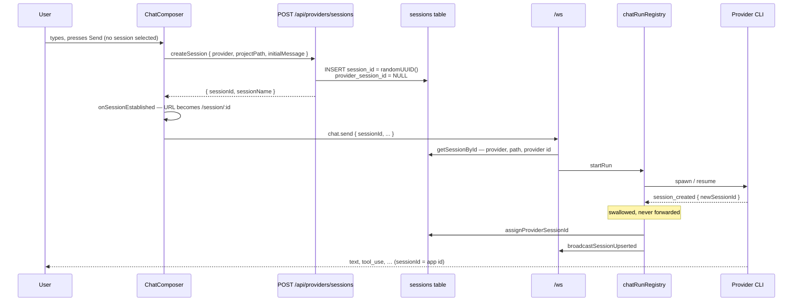
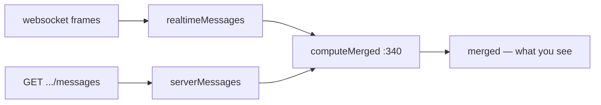
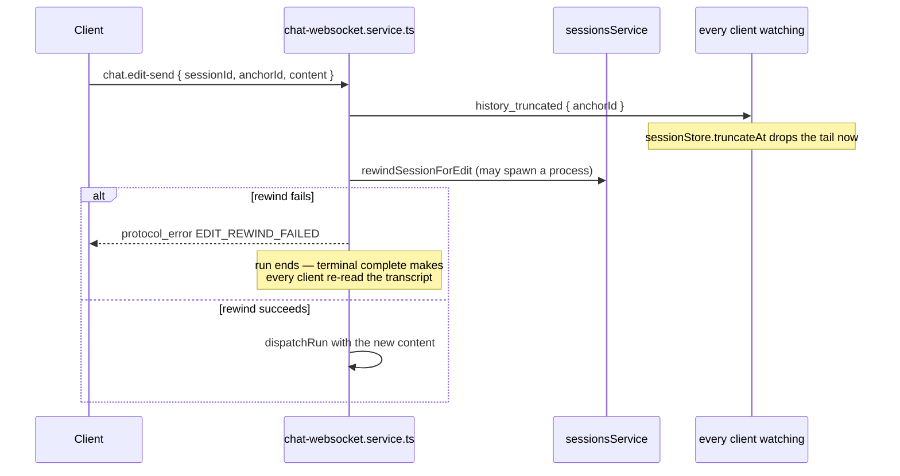

# Conversation handoff

*The identity and ownership of a conversation: which ids exist, which of them the browser is allowed to see, and the three places where a conversation is handed from one owner to another. The event transport is [The WebSocket layer](01-websocket-layer.md); how messages are assembled is [The realtime stream](03-realtime-stream.md).*

## In one paragraph

A conversation has **two** ids: a stable app session id that the browser and the URL
use, and a provider-native id that only the backend ever sees. The app id is a
`randomUUID()` allocated over REST *before the first websocket frame is sent*, and it
never changes for the life of the conversation. Everything else people call "the
handoff" is not about ids at all — it is about **ownership**: a live run owns the
transcript while it is streaming, then hands it to the persisted file on disk; and the
filesystem watcher, which discovers transcripts independently, hands its provisional
sidebar row to the app row when the two turn out to be the same conversation.

## The misconception to clear first

If you have read this code before, or seen an older version of it, you may be looking
for a temporary client-side id that gets swapped for a real one mid-stream. **That
design is gone.** The code says so in three places:

> The conversation always has a stable backend-allocated session id BEFORE the first
> websocket send… There is no client-visible session-id handoff later — this id stays
> valid for the conversation's lifetime.
> — `src/modules/chat/hooks/useChatComposerState.ts:744-747`

> Swallowed on purpose: the frontend already has the stable app session id, so there is
> no client-side handoff to perform anymore.
> — `server/modules/websocket/services/chat-session-writer.service.ts:106-107`

> Session ids are stable for the whole conversation lifetime (the backend allocates them
> before the first send), so slots are keyed directly with no alias/redirect indirection.
> — `src/modules/chat/hooks/useSessionStore.ts:555-557`

There is still one aliasing path in the app, but it lives in the **sidebar**, not in
chat, and it exists for a different reason — see [The watcher's provisional
row](#the-watchers-provisional-row) below.

## The two ids

| | App session id | Provider-native session id |
| --- | --- | --- |
| Minted by | `randomUUID()` in `sessionsService.createAppSession` (`sessions.service.ts:228`) | The provider CLI, mid-run |
| When | Before the first message is sent | The first time the runtime announces it |
| Stored | `sessions.session_id` (primary key) | `sessions.provider_session_id` |
| Seen by the browser | Yes — it is the URL (`/session/:id`) and every event's `sessionId` | **No**, with one exception |
| Lifetime | The whole conversation | The whole conversation, but may not exist yet |

The one exception: `getProviderSessionId` (`sessions.service.ts:317`) exposes it for an
explicit user "copy session ID" action, and errors with
`PROVIDER_SESSION_ID_NOT_AVAILABLE` if the session has never run.

Everything else in the system is addressed by the app id. `decorateAndRecordEvent`
rewrites `sessionId` on **every** outbound event to the app id
(`chat-run-registry.service.ts:95-99`), and the `complete` event's `actualSessionId` is
set to the app id too, because:

> The provider may report its own id here; the frontend only ever knows the app id, so
> the "actual" id is by definition the app id as well.
> — `chat-run-registry.service.ts:102-103`

## Handoff 1 — starting a conversation



The key ordering: **the id exists and the URL is correct before any run starts.** If
`createSession` fails, the composer surfaces an error and never sends
(`useChatComposerState.ts:770-788`). A `chat.send` for an id with no DB row is rejected
with `SESSION_NOT_FOUND` and a message telling you to create it over REST first
(`chat-websocket.service.ts:186-188`).

The session's initial title comes from the first message, capped at four whole words
(`buildCloudCliSessionName`, used at `sessions.service.ts:229`), because at that moment
no provider-owned storage exists to take a title from.

## Handoff 2 — live run to persisted transcript

This is the one that actually causes bugs, and the one worth understanding properly.

While a run streams, its messages exist only in memory on both ends. When the run
finishes, the provider has written them to its own transcript file, and the client
re-reads that file over REST. For a window of time **both copies exist**, and they are
not byte-identical: ids may differ, the provider may have merged or reordered rows, and
JSONL indexing lags behind the `complete` event.

The client's answer is to keep the two sources in separate arrays and project a merged
view:

```ts
// src/modules/chat/hooks/useSessionStore.ts:32
export type SessionSlot = {
  serverMessages: NormalizedMessage[];   // fetched from the persisted transcript
  realtimeMessages: NormalizedMessage[]; // arrived over the websocket
  merged: NormalizedMessage[];           // what the transcript renders
  ...
};
```



### The merge

`computeMerged` (`:340`) takes everything in `serverMessages`, adds only the realtime
rows the server does not already own, and interleaves by timestamp:

> Interleave by timestamp so live rows stay with their turn instead of piling up at the
> bottom after every refresh.
> — `useSessionStore.ts:361-362`

`recomputeMergedIfNeeded` (`:380`) makes this cheap: it compares the two input arrays by
*reference* and skips the work when neither changed.

### The pruning, and why it is conservative

After each server refresh, `pruneRealtimeSupersededByServer` (`:296`) drops realtime rows
the persisted transcript has taken over. Its restraint is the important part:

> After a server refresh, drop only the realtime rows the persisted transcript already
> owns. Anything not yet on disk (common right after `complete`, while JSONL indexing
> lags) stays in `realtimeMessages` so the chat pane never flashes the empty "Continue
> your conversation" state.
> — `useSessionStore.ts:291-294`

The rules it applies, in order (`:307-336`):

| Realtime row | Dropped when |
| --- | --- |
| Any row whose `id` is in `serverMessages` | Always |
| `stream_delta` or the synthetic `__streaming_<sessionId>` row | The same turn's assistant text is already on the server (`isAssistantTextEchoedInSameTurnOnServer`) |
| assistant `text` | Same as above |
| user `text` | Never — kept (optimistic user echoes are removed separately by `removeOptimisticUserEchoes`) |
| `tool_use` with a `toolId` | The server has a `tool_use` with the same `toolId` |
| anything else | Never |

`dedupeAdjacentAssistantEchoes` (`:260`) is the last line of defence: two adjacent
assistant rows with identical trimmed text collapse to one, so a finalised stream row
does not stack on top of its persisted copy in the moment before pruning catches up.

### What triggers the refresh

On the terminal `complete`, and only for the session currently on screen:

```ts
// useChatRealtimeHandlers.ts:274
if (sid && sid === activeViewSessionId) {
  void requestLatestMessages(sid, isActiveRef.current);
}
```

Those requests are coalesced by `createMessageHistoryRefreshCoordinator` — see
[Lazy loading](05-lazy-loading.md).

## Handoff 3 — the watcher's provisional row

The filesystem watcher indexes provider transcripts independently of anything the app
did. It watches four roots (`sessions-watcher.service.ts:13-30`):

| Provider | Root |
| --- | --- |
| claude | `~/.claude/projects` |
| cursor | `~/.cursor/projects` |
| codex | `~/.codex/sessions` |
| opencode | `~/.local/share/opencode` |

Events are debounced 500 ms with a 2 s maximum wait (`:44-45`), then flushed as one
`session_upserted` batch.

The problem: **transcript file names on disk only ever contain provider ids**
(`sessions-watcher.service.ts:52-56`). So a transcript that appears before the app has
mapped it produces a session row keyed by the *provider* id. Now the same conversation
has two rows.

`assignProviderSessionId` (`sessions.db.ts:252`) resolves this in a transaction: it looks
for any other row matching the provider id, deletes it, and folds its `jsonl_path` and
`custom_name` into the app row.

The client then has to learn that the row it was displaying no longer exists. The only
signal is the `providerSessionId` field on the `session_upserted` event:

> The `providerSessionId` field on the delta is the only signal the client gets that the
> row it is showing has been merged away — without it the sidebar keeps a duplicate and
> the URL points at an id no session row has.
> — `src/modules/project-workspace/tests/projectsStateSessionAlias.test.ts:12-15`

`useProjectsState` handles it in two steps:

1. `getSessionAliasIds` (`:227`) collects `sessionId`, `providerSessionId` and
   `session.id` into one set; `upsertSessionIntoProject` (`:254`) updates the matching
   row **and deletes any other row matching an alias** (`:287-290`).
2. If the currently-selected session is the aliased one, the selection is rewritten and
   the URL is replaced (`:844-857`).

There is a third path for deep links: a URL carrying a provider-native id resolves
through `GET /api/sessions/:id` and, if the backend reports a different canonical id,
`navigate(..., { replace: true })` swaps it (`useProjectsState.ts:952-957`).

One guard here is easy to miss and easy to reintroduce:

> Never let a later upsert that carries an empty summary blank out a title we already
> have. Fresh sessions momentarily broadcast an empty `custom_name` before the disk
> indexer fills it in, which would otherwise flash the row back to the "New session"
> placeholder.
> — `useProjectsState.ts:273-276`

## Reattaching to a run

A run belongs to the server, not to the socket that started it. When a client opens or
re-opens a session it sends `chat.subscribe` with the highest `seq` it has seen, and the
server acks with authoritative state and replays the gap. The mechanics — the replay
buffer, its 5000-event cap, the 5-minute retention of completed runs, and why completed
runs are deliberately *not* replayed — are in
[The WebSocket layer](01-websocket-layer.md#runs-sequence-numbers-and-replay).

What matters for handoff:

| Scenario | Outcome |
| --- | --- |
| Refresh the page mid-run | New socket subscribes, attaches to the run, replays from `lastSeq` 0 — the whole run so far |
| Open the same session in a second tab | Both tabs receive the stream; `ChatSessionWriter.connections` is a Set |
| Switch to another session mid-run | The run continues; its events still arrive and land in that session's slot |
| Close the tab mid-run | The run continues to completion and is persisted; nothing is lost |
| Return after the run completed | No replay; the transcript comes from REST |
| Return after the buffer overflowed | Partial replay is skipped; REST history is authoritative |

The client keeps `lastSeqRef` as a `Map<sessionId, seq>`, updated on every sequenced
frame (`useChatRealtimeHandlers.ts:104-109`).

## Resuming across process restarts

Nothing in-memory survives a server restart, so resume is entirely DB-driven.
`resolveSendTarget` reads `provider`, `project_path` and `provider_session_id` from the
session row (`chat-websocket.service.ts:170-199`) and hands them to the runtime, which
resumes the provider-native conversation. This is why `assignProviderSessionId` is called
the moment the id is known rather than at the end of the run: an interrupted run must
still leave a resumable mapping behind.

## Editing a message

`chat.edit-send` replaces a turn and everything after it. The order is deliberate and
counter-intuitive — the truncation is announced **before** the rewind, not after:



> holding the frame until that came back left the message the user had just edited away
> sitting on screen for about a second — the very flicker this feature exists to avoid.
> Announcing first is safe because a rewind that fails still ends the run, and the
> terminal `complete` makes every client re-read the transcript, which puts back anything
> that turned out not to have been replaced after all.
> — `chat-websocket.service.ts:380-387`

`history_truncated` goes through the run's writer, so it is sequenced and replayed like
any other event — a second tab watching the session truncates too (`:376-378`).

Editing is only offered while the session is idle:

> Editing replaces the turn and everything after it, so it is only offered when the
> session is idle — a half-truncated transcript with a live stream writing into it is not
> recoverable.
> — `src/modules/chat/ChatInterface.tsx:467-469`

## Forking

`forkSessionById` (`sessions.service.ts:247`) branches a conversation into an independent
one. **The source is left completely untouched** — this is the "try two approaches"
action, not a destructive one.

The fork gets a fresh `randomUUID()` app id and is inserted with `createForkedSession`
rather than `createAppSession`, because its transcript already exists:

> Unlike `createAppSession` this writes `provider_session_id` and `jsonl_path`
> immediately, because a fork's transcript file exists before the row does — and the
> filesystem watcher would otherwise index it as an unrelated session under its own id.
> — `sessions.db.ts:197-200`

That is Handoff 3 being pre-empted rather than resolved after the fact. The fork also
carries the source's `model` and `effort` forward, so it does not silently answer
differently from the conversation it branched from (`sessions.service.ts:297-300`).

Preconditions: the provider must implement `fork` (`FORK_NOT_SUPPORTED`), and the source
must already have a transcript (`FORK_SOURCE_NOT_READY`, `:270-275`).

## Orphan pruning

Sessions rows are only ever upserted; nothing else deletes them, and the watcher reacts to
`add` and `change` but not `unlink`. `pruneOrphanedSessions`
(`session-synchronizer.service.ts:36`) is what removes rows whose transcript has vanished:

> A transcript removed by hand — or written by a test run that pointed at the real
> `~/.claude` — left a permanent sidebar entry that opened an empty "Untitled" session.

Its safety rule is worth remembering before you change it: a row is only dropped when its
*containing directory* still exists, so an unmounted home directory is not read as "every
transcript was deleted" (`:32-34`).

## Gotchas and sharp edges

1. **There is no temporary session id.** If you find code that looks like it is handling
   one, it is either dead or you are reading an old branch.
2. **`session_created` is swallowed server-side.** Adding a client handler for it will
   never fire.
3. **The app id and the provider id can be the same string** — for a row the watcher
   created before the app mapped it. That is exactly the aliasing case, and it is why
   `getSessionAliasIds` puts both into one set rather than comparing them.
4. **A session can exist with `provider_session_id = NULL`.** Created but never run.
   Fork and "copy session ID" both reject it explicitly.
5. **The two-array split in the store is load-bearing.** Collapsing `serverMessages` and
   `realtimeMessages` into one array reintroduces the flash-to-empty and the
   duplicate-assistant-row bugs that `pruneRealtimeSupersededByServer` and
   `dedupeAdjacentAssistantEchoes` exist to prevent.
6. **Pruning is deliberately conservative.** It keeps rows it is not sure about. If you
   see a duplicate that clears on the next refresh, that is this trade-off, not a bug.
7. **`tokenUsage: undefined` is not `tokenUsage: null`.** `undefined` means "no page has
   reported usage yet"; initialising it to `null` made a provider that reports no usage
   indistinguishable from one reporting zero, and every history refresh then overwrote the
   value fetched from the token-usage endpoint (`useSessionStore.ts:67-72`).
8. **`history_truncated` is announced before the rewind is done.** A failed rewind is
   repaired by the terminal `complete` forcing a re-read, not by holding the frame.
9. **The watcher ignores `**/subagents/**` and `**/tool-results/**`**
   (`sessions-watcher.service.ts:37-38`). A transcript written under those paths will
   never be indexed.

## Where to look when something breaks

| Symptom | Start here |
| --- | --- |
| "Session not found" on the first message | `createAppSession:215` — did the REST call succeed before `chat.send`? |
| Duplicate session in the sidebar | Aliasing — `getSessionAliasIds:227`, `assignProviderSessionId:252` |
| URL points at a session that does not exist | The alias URL swap, `useProjectsState.ts:856` and `:952` |
| Sidebar row title flashes back to "New session" | The empty-summary guard, `useProjectsState.ts:277-279` |
| Messages duplicated after a turn ends | `pruneRealtimeSupersededByServer:296`, `dedupeAdjacentAssistantEchoes:260` |
| Transcript briefly goes empty after `complete` | The same — pruning was too aggressive, or the server page came back short |
| Messages vanish after a refresh mid-run | Replay — `handleChatSubscribe`, and whether `lastSeq` was still in the buffer |
| Resume produces a fresh conversation | `provider_session_id` is NULL — `assignProviderSessionId` never ran |
| Stale sidebar entry opening an empty session | `pruneOrphanedSessions:36` |
| Edited message reappears | The rewind failed; look for `EDIT_REWIND_FAILED` and the `complete` re-read |
| Fork answers differently from its source | `model` / `effort` carry-forward, `sessions.service.ts:297` |
