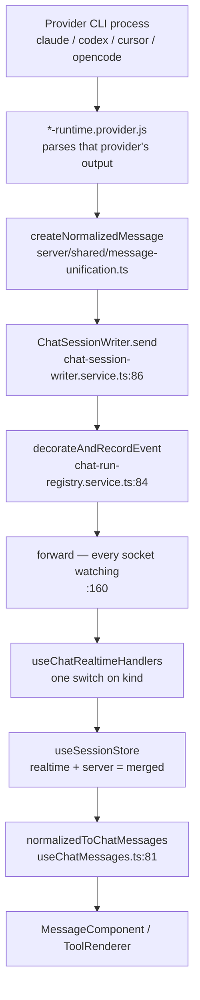
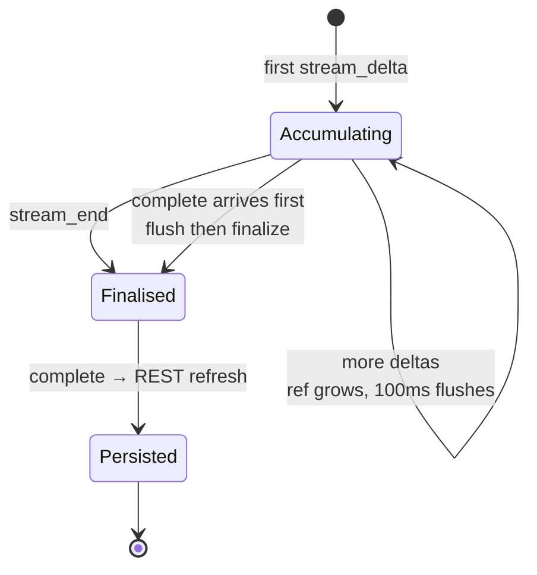
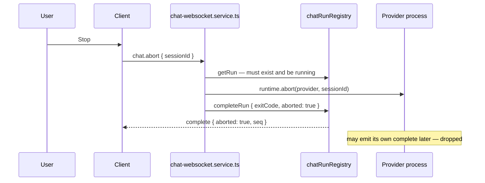

# The realtime stream

*One event's journey from a provider CLI process to a rendered pixel, and the store that assembles a reply out of hundreds of them. Transport is [The WebSocket layer](01-websocket-layer.md); how tool calls are drawn is [Tool views](06-tool-views.md).*

## In one paragraph

Provider CLIs speak four different dialects. The backend normalises all of them into a
single `NormalizedMessage` shape tagged with a `kind`, stamps each one with a per-run
sequence number, and pushes it down the chat socket. On the client, one listener
(`useChatRealtimeHandlers`) routes every frame by `kind` into one store
(`useSessionStore`), which keeps live rows in `realtimeMessages` and persisted rows in
`serverMessages` and projects a `merged` array from the two. Text deltas are the one
thing that does not go straight into the store: they accumulate in a ref and flush every
**100 ms** into a single synthetic row, which is what keeps a fast stream from
re-rendering the transcript on every token.

## The pipeline



Two stages do the heavy lifting and are worth naming precisely:

- **`decorateAndRecordEvent`** rewrites `sessionId` to the app id, assigns `seq`, and
  buffers the event for replay. Nothing reaches a client untouched.
- **`normalizedToChatMessages`** is the client-side projection from store records to UI
  objects. It is memoised through a `WeakMap`, which is why a streaming tick does not
  rebuild every row.

## The message shape

Every frame carries a `kind` from one of two unions in `server/shared/types.ts`:

**`MessageKind` (`:178`)** — from provider runtimes:
`text`, `tool_use`, `tool_result`, `thinking`, `stream_delta`, `stream_end`, `error`,
`complete`, `status`, `permission_request`, `permission_resolved`,
`permission_cancelled`, `session_created`, `history_truncated`, `task_notification`.

**`GatewayEventKind` (`:204`)** — from the gateway, no provider involved:
`chat_subscribed`, `session_upserted`, `loading_progress`, `protocol_error`.

The fields a client actually reads: `id`, `sessionId`, `seq`, `kind`, `role`,
`timestamp`, `provider`, `content`, `toolId`, `toolName`, `toolInput`, `toolResult`,
`isError`, `parentToolUseId`, `subagent`, `subagentTools`, `transcriptAnchorId`.

## Routing: one switch, no provider branching

`useChatRealtimeHandlers` (`src/modules/chat/hooks/useChatRealtimeHandlers.ts:57`) is the
only place that reads raw frames. Its own description is the design statement:

> This is intentionally a thin reducer over the unified `kind`-based protocol: every
> frame is keyed by the stable app session id, so there is no session-id handoff, no
> provider branching, and no navigation here.
> — `useChatRealtimeHandlers.ts:51-54`

Before the switch, two things happen to every frame:

1. Frames without a `kind` return immediately (`:96-98`) — this is what makes the
   `type`-keyed Task Master broadcasts invisible to chat.
2. `lastSeqRef` is advanced for the frame's session (`:104-109`), which is the value sent
   back as `lastSeq` on the next `chat.subscribe`.

| `kind` | What happens |
| --- | --- |
| `websocket_reconnected` | Calls `onWebSocketReconnect` — catch-up, no store change |
| `history_truncated` | `sessionStore.truncateAt(sid, anchorId)` |
| `chat_subscribed` | Authoritative processing state + pending permissions; plays a sound if actionable prompts appeared |
| `protocol_error` | Logs, clears the spinner, appends an `error` row |
| `session_upserted`, `loading_progress` | Ignored — owned by `useProjectsState` |
| `stream_delta` | Accumulates in a ref; 100 ms timer flushes into the store |
| `stream_end` | Flushes the buffer, then `finalizeStreaming` |
| `complete` | Terminal — see below |
| `status` | `token_budget` updates the counter; anything else is activity text |
| `permission_request`, `permission_resolved`, `permission_cancelled` | Maintains the pending-permission list |
| everything else | `appendRealtime` into the store |

Note the `shouldPersist` filter at `:224-233`: `complete`, `status` and the three
permission kinds are **not** stored as message rows. They are control events. Everything
else is.

## Streaming text: the 100 ms buffer

A fast model emits many `stream_delta` frames per second. Storing each one would re-render
the transcript at that rate. Instead:

```ts
// useChatRealtimeHandlers.ts:189
if (msg.kind === 'stream_delta') {
  accumulatedStreamRef.current += text;
  if (!streamTimerRef.current) {
    streamTimerRef.current = window.setTimeout(() => {
      streamTimerRef.current = null;
      sessionStore.updateStreaming(sid, accumulatedStreamRef.current, provider);
    }, 100);
  }
  ...
}
```

The timer is *leading-edge-armed, trailing-edge-fired*: the first delta arms it, later
deltas within the window just append to the ref, and the flush publishes the whole
accumulated text at once.

`updateStreaming` (`useSessionStore.ts:810`) does not append. It writes one synthetic row
with the well-known id `__streaming_<sessionId>`, replacing it in place if it already
exists. So a streaming reply is **exactly one row** in `realtimeMessages`, whose content
grows.

A delta for a session that is *not* on screen is additionally appended to that session's
slot directly (`:201-204`), because the ref-based buffer belongs to the viewed session.

### Finalising



`finalizeStreaming` (`useSessionStore.ts:836`) rewrites the synthetic row in place: it
swaps the `__streaming_` id for a unique `text_<timestamp>_<random>` id, changes `kind`
from `stream_delta` to `text` and sets `role: 'assistant'`. The row does not move, so
React reconciles rather than remounts.

`complete` repeats the flush-and-finalise defensively (`useChatRealtimeHandlers.ts:237-247`)
in case `stream_end` never arrived.

## Streaming markdown

Republishing the whole accumulated reply ten times a second would re-parse the entire
message on every tick — O(length) per tick, O(length²) over a reply. `StreamingMarkdown`
splits the text into a **settled** prefix and a **pending** tail at a safe block boundary,
and renders them as two memoised `<MarkdownBody>` siblings. The settled half's props only
change when a block completes, so only the tail is re-parsed each tick.

The whole design rests on one property, stated precisely:

> Correctness rests on markdown blocks being independent across a blank line: rendering
> `settled` and `pending` as two documents must equal rendering their concatenation. That
> does NOT hold inside a fenced code block, a display-math block, a list, a blockquote, a
> table, an indented code block, or across a link-reference/footnote definition and its
> usage — the boundary search skips all of them.
> — `src/modules/chat/utils/streamingMarkdown.ts:12-17`

`splitStreamingMarkdown` (`:61`) walks lines tracking open fences and `$$` math, and
refuses to split at a blank line adjacent to a `CONTEXT_SENSITIVE_LINE` (`:43`): list
items, indented continuations, blockquotes, table rows, and reference definitions. Three
of those five are demonstrably load-bearing, each with a fixture in
`streamingMarkdownComponent.test.tsx` that renders differently if its arm is removed; the
blockquote and table arms are deliberately conservative.

Two behaviours surprise people:

- **Blocks can move back from settled to pending.** The boundary is recomputed from
  scratch each tick, so a block un-settles when following text makes the old split point
  unsafe. This is correct, not a bug — it is what keeps the two halves rendering
  identically to the unsplit document. Measured at about a third of realistic replies,
  once each (`StreamingMarkdown.tsx:38-45`).
- **A block crossing the boundary loses transient in-block state** — a code block's
  "Copied" tick, a text selection — because it changes parent and its DOM is recreated
  (`:34-36`).

The component also renders *finished* replies, with `isStreaming: false` and no split at
all. That is deliberate:

> MessageComponent used to switch between the two at that position, and React treats a
> different element type in the same position as a different component: every completed
> reply threw away its DOM and rebuilt it, losing any selection the user had started
> making inside it.
> — `StreamingMarkdown.tsx:26-31`

`messageStreamEnd.test.tsx` pins that, and
`streamingMarkdownRenderEquivalence.test.tsx` pins the split-equals-unsplit property.

## Tool calls: correlating use with result

`tool_use` and `tool_result` arrive as separate frames, sometimes far apart. They are
correlated on the **client**, in the first pass of `normalizedToChatMessages`
(`useChatMessages.ts:89`, `:152-158`): a map from `toolId` to the result row, consulted
when the `tool_use` row is projected (`:167-169`).

Between the two, the tool card renders in its running state — see
[Tool views](06-tool-views.md).

This is also why the projection cache is keyed on more than the source record:

> A tool-use projection must be rebuilt when a matching result arrives, even though the
> original tool-use record itself is unchanged.
> — `useChatMessages.ts:175-177`

So `CachedMessageProjection` (`:23`) stores `toolResultSource` alongside the projected
messages, and a cache hit requires both to match.

## Subagents

A subagent's rows stream in stamped with `parentToolUseId` — the tool id of the `Task`
call that spawned it. Until recently the client ignored that stamp, so the rows rendered
as the session's own top-level tool calls and only jumped inside the subagent panel after
a refresh, when the server ships its sidecar-indexed timeline as `subagentTools`. Commit
`21a3489f` fixed it.

The first pass of `normalizedToChatMessages` now folds parented rows into a
`SubagentActivity` timeline keyed by parent tool id (`useChatMessages.ts:96-149`):

| Row kind | Folded as |
| --- | --- |
| `tool_use` | A `{ kind: 'tool' }` entry, indexed by `toolId` so its result can attach later |
| `tool_result` | Attached to the already-recorded tool entry |
| `text` (assistant role) / `thinking` | A prose or reasoning entry |
| `text` (user role) | **Skipped** — those are tool results and the echoed task prompt, matching what the server's reader excludes (`:133-135`) |

Parented rows are then skipped in the second pass (`:163-165`) so they do not also render
top-level.

Two details keep it coherent:

- `lastSubagentSourceByParent` records the newest folded row per container, and that goes
  into the cache key (`subagentActivitySource`, `:27`, `:180`), so the panel rebuilds as
  its timeline grows.
- When a mid-run history refresh attaches a partial server timeline, **the longer of the
  two wins** (`:274-277`).

## Token accounting

The composer's counter shows **context-window occupancy**, not the turn's bill. Those are
different numbers, and conflating them caused a visible bug fixed in `ab13376d`:

> `result.usage` is the turn's bill — every API request it made, summed — so a
> multi-request turn reported several times the context the conversation actually holds,
> and the next assistant message dropped it back. A turn that spawns a subagent absorbs
> that agent's requests into the same sum, which is why the bouncing only showed up once
> subagents were running.

Assistant messages are now the only source. The cumulative reading survives as
`extractCumulativeTokenBudget`, used only when a run produced no per-assistant usage at
all.

Delivery is a `status` frame with `text === 'token_budget'`, and it is scoped to the
viewed session:

```ts
// useChatRealtimeHandlers.ts:330
if (msg.text === 'token_budget' && msg.tokenBudget) {
  // The counter shows the viewed session's context; budgets from
  // other concurrently running sessions must not overwrite it.
  if (sid === activeViewSessionId) setTokenBudget(msg.tokenBudget);
}
```

History responses can also carry `tokenUsage`, and the store distinguishes `undefined`
("no page has reported usage yet") from `null` ("reported, and it is empty") — see
[Conversation handoff](02-conversation-handoff.md).

## Ending a turn

**`complete` is the single terminal event.** Exactly one is emitted per run whatever
happened — success, failure, or abort. The guarantees behind that are in
[The WebSocket layer](01-websocket-layer.md#exactly-one-complete).

On `complete` (`useChatRealtimeHandlers.ts:237-279`) the client, in order: flushes and
finalises any streaming text; clears the session's processing entry; clears pending
permissions for the viewed session; and then branches.

| Outcome | Signal | Client behaviour |
| --- | --- | --- |
| Aborted | `msg.aborted` | Nothing further — the cleared entry is all that is needed |
| Failed | `msg.success === false` | No sound, no title indicator |
| Succeeded | otherwise | Title indicator + completion sound |

Then, for the viewed session only, `requestLatestMessages` re-reads the persisted
transcript.

**`error` is not terminal.** Providers emit it for mid-run stderr too:

> 'error' is an informational message row, not a terminal event — providers emit it for
> mid-run stderr output too. Run teardown is always signalled by the unified 'complete'
> that follows.
> — `useChatRealtimeHandlers.ts:281-283`

## Abort



If there is no running run, the server replies `protocol_error` with `NO_ACTIVE_RUN`
(`chat-websocket.service.ts:428`). The transcript afterwards keeps whatever streamed
before the abort; the finalised partial reply stays as a normal assistant row.

## Ordering and idempotency

| Guarantee | Mechanism |
| --- | --- |
| Ordered within a run | `seq` assigned server-side, monotonically, in `decorateAndRecordEvent` |
| No duplicate delivery on reconnect | The client sends `lastSeq`; only `seq > lastSeq` is replayed |
| No duplicate terminal event | First `complete` wins; later ones dropped (`chat-run-registry.service.ts:89-91`) |
| No duplicate rows after refresh | Id-based pruning plus adjacent-echo dedupe in the store |

`lastSeqRef` only ever moves forward (`useChatRealtimeHandlers.ts:106`), so a
late-arriving lower-`seq` frame does not rewind it. There is no reordering buffer: frames
are applied in arrival order, which is safe because a single TCP connection preserves
order and replay is emitted in buffer order.

Realtime rows are capped at `MAX_REALTIME_MESSAGES` = 500 per session
(`useSessionStore.ts:547`, applied in `appendRealtime:758`), oldest dropped.

## Naming traps

The same concept goes by different names in different layers. This table has saved more
time than any diagram:

| Concept | Backend name | Client name |
| --- | --- | --- |
| One frame | `NormalizedMessage` | `ServerEvent` (`src/shared/types.ts:204`) |
| Frame discriminator | `kind` | `kind` — but client→server messages use `type` |
| Stable session id | `session_id` / `appSessionId` | `sessionId` |
| Provider's own id | `provider_session_id` | never seen |
| Live reply in progress | a series of `stream_delta` | one row, id `__streaming_<sessionId>` |
| Turn is over | `complete` | `complete` |
| A tool's parent subagent | `parentToolUseId` | `parentToolUseId`, folded into `subagentActivity` |
| Subagent timeline from disk | `subagentTools` | `subagentActivity` (merged with live) |

## Gotchas and sharp edges

1. **`error` does not end a run.** Only `complete` does. Clearing the spinner on `error`
   leaves a live stream writing into a UI that thinks it is idle.
2. **A streaming reply is one row, not many.** Code that counts messages during a stream
   will see the count stay flat while the content grows.
3. **`__streaming_<sessionId>` is a real id that appears in the store.** It is filtered
   explicitly in `pruneRealtimeSupersededByServer` (`useSessionStore.ts:312`).
4. **`finalizeStreaming` mutates in place.** It does not append a new row and remove the
   old one; the id changes underneath the same array position, deliberately, so React
   reconciles.
5. **`complete`, `status` and the permission kinds are never stored** (`shouldPersist`,
   `useChatRealtimeHandlers.ts:224`). Looking for them in the transcript array is futile.
6. **The 100 ms buffer belongs to the viewed session.** `accumulatedStreamRef` is a single
   ref; deltas for background sessions take the `appendRealtime` path instead
   (`:201-204`).
7. **Settled markdown blocks can un-settle.** Expect a block to be re-parsed and its DOM
   recreated mid-stream; do not park state inside one.
8. **Never split streaming markdown inside a fence, list, table, blockquote or math
   block.** The whole equivalence property collapses. Extend
   `CONTEXT_SENSITIVE_LINE` rather than relaxing it.
9. **Token budget is occupancy, not spend.** Feeding it a `result.usage` sum reintroduces
   the bouncing counter that `ab13376d` fixed.
10. **Subagent rows must be skipped in the second projection pass.** Forgetting
    `if (msg.parentToolUseId) continue` (`useChatMessages.ts:163`) renders them twice.

## Where to look when something breaks

| Symptom | Start here |
| --- | --- |
| Transcript re-renders on every token | The 100 ms buffer, `useChatRealtimeHandlers.ts:193` |
| Streaming text stutters or duplicates | `updateStreaming:810` — is the `__streaming_` row being replaced or appended? |
| Reply duplicated once the turn ends | `finalizeStreaming:836` plus `dedupeAdjacentAssistantEchoes:260` |
| Code fence renders broken mid-stream | `splitStreamingMarkdown:61` and `CONTEXT_SENSITIVE_LINE:43` |
| Selection lost when a reply completes | The single-component rule, `StreamingMarkdown.tsx:26` |
| Tool card stuck "running" | Result correlation, `useChatMessages.ts:152-169` — is `toolId` present on both rows? |
| Subagent tools appear at top level | `parentToolUseId` folding, `useChatMessages.ts:96` |
| Subagent panel stops growing mid-run | The projection cache key, `useChatMessages.ts:180` |
| Token counter jumps around | Occupancy vs cumulative — commit `ab13376d` |
| Spinner never clears | Terminal `complete`; then `onSessionIdle` at `:252` |
| Events arrive but nothing renders | `msg.kind` missing — the early return at `:96` |
