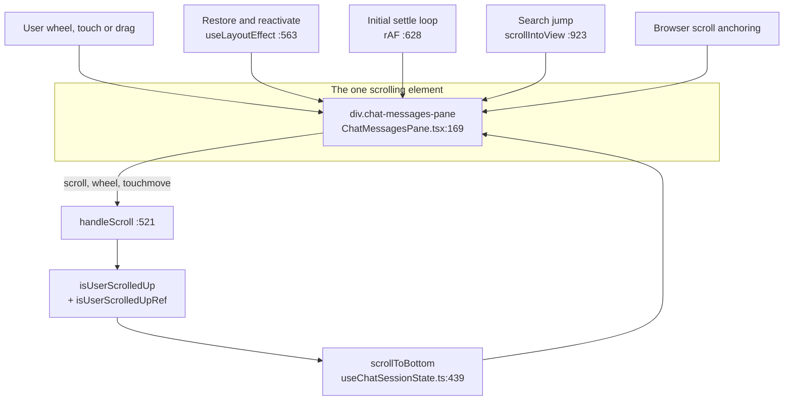
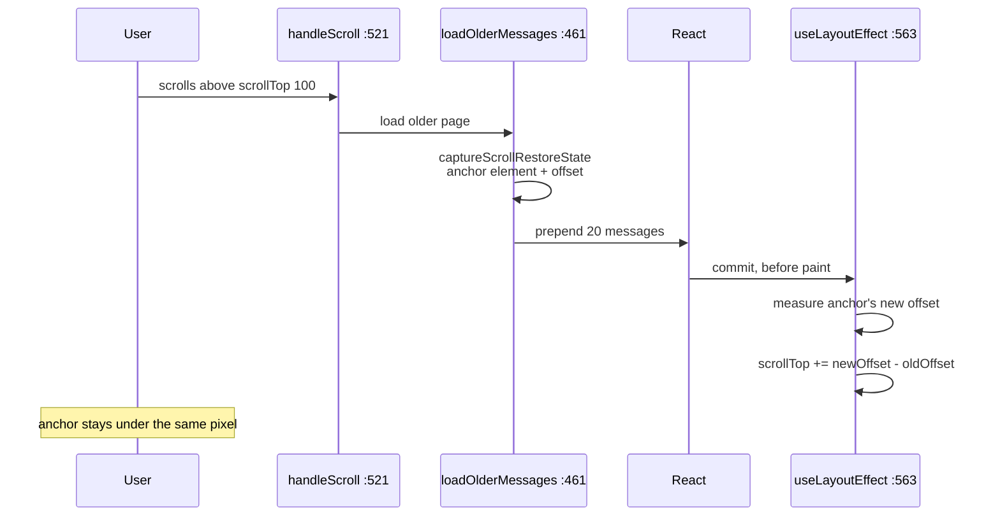
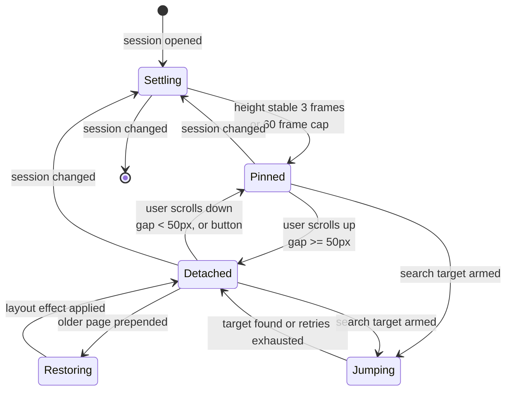

# Scrolling

*How the chat transcript decides where to sit: sticking to the bottom, holding position when older history is prepended, and jumping to a searched message. Network paging itself is covered in [Lazy loading](05-lazy-loading.md).*

## In one paragraph

There is one scrolling element — the transcript pane — and **no single owner of its
scroll position**. Five different mechanisms write `scrollTop`, coordinated not by a
state machine but by a set of boolean refs that each mechanism checks before acting.
The one piece of shared truth is `isUserScrolledUp`: false means "the user is parked
at the bottom, so keep them there", true means "the user is reading history, do not
move them". Everything else — the initial settle, the prepend restore, the search
jump — is a temporary claim on the scroll position, staked by setting a ref that
tells the other mechanisms to stand down until it finishes.

The test file says this out loud, and it is the most honest sentence written about
this subsystem:

> The transcript's scroll position is written from five places coordinated by refs
> and timers rather than by one owner.
> — `src/modules/chat/tests/transcriptScrollOwnership.test.tsx:7-9`

Almost all of the machinery lives in one hook, **`src/modules/chat/hooks/useChatSessionState.ts`**,
not in `ChatInterface.tsx`. That is the first thing to know when you go looking for it.

## The moving parts



`ChatMessagesPane` owns the DOM node but none of the behaviour; it receives
`scrollContainerRef`, `onWheel` and `onTouchMove` as props and wires them to the
container it renders (`ChatMessagesPane.tsx:169-176`).

## Sticking to the bottom

### The test

```ts
// useChatSessionState.ts:454
const isNearBottom = useCallback(() => {
  const container = scrollContainerRef.current;
  if (!container) return false;
  const { scrollTop, scrollHeight, clientHeight } = container;
  return scrollHeight - scrollTop - clientHeight < 50;
}, []);
```

Fewer than **50 pixels** of unseen content below the fold counts as "at the bottom".
`handleScroll` (`:521`) runs this on every scroll event and writes the negation into
`isUserScrolledUp` (`:527`). That single boolean drives the jump-to-bottom button
(`ChatInterface.tsx:476`) and gates every automatic scroll.

### Why wheel and touch are listened to separately

The pane registers a real `scroll` listener (`:1003-1008`) *and* receives `onWheel`
and `onTouchMove`. That looks redundant. It is not, and the reason is worth
internalising because it generalises to other "why isn't my handler firing" bugs
here:

> A first page is 20 rows, tool results fold into their calls, and the "load earlier"
> link is hidden while more pages exist — so a short transcript is often not
> scrollable at all and never emits `scroll`. Wheel and touch are then the only way
> to reach the top pager or the "load all" overlay.
> — `src/modules/chat/ChatInterface.tsx:423-427`

A container with no overflow fires no `scroll` events, so without the wheel and touch
handlers a user on a short transcript could never trigger loading older history.

### Why the deferred scrolls re-read a ref

Two automatic scroll-to-bottoms are deferred behind timers: 50 ms after the message
list changes (`:988-1001`) and 200 ms after an external refresh such as a websocket
reconnect (`:800-832`). Both were armed while the user was at the bottom, but they
fire later — and the user may have scrolled up in between.

So neither closes over `isUserScrolledUp`. Both re-read `isUserScrolledUpRef.current`
at fire time:

```ts
// useChatSessionState.ts:995
setTimeout(() => {
  if (!isUserScrolledUpRef.current) {
    scrollToBottom();
  }
}, 50);
```

The ref is kept in sync by its own effect (`:435-437`) rather than by assignments next
to each `setIsUserScrolledUp` call, because the setter is also returned from the hook
and called from the composer. `transcriptScrollOwnership.test.tsx:137` is the
regression test: *"does not yank the view back down when the user scrolls up inside
the delay"*.

## Holding position when older history is prepended

When you scroll to the top and a page of older messages loads, every existing row
moves down. Without compensation the view would snap to unrelated content.

The fix is anchor-based, not offset-based. Before the fetch, `loadOlderMessages`
captures the state (`:470`, via `captureScrollRestoreState` at `:106`): the first
element with class `.chat-message` whose bottom edge is still at or below the top of
the container, plus that element's offset from the container top. After React commits
the longer list, a `useLayoutEffect` (`:563-582`) shifts `scrollTop` by exactly the
distance that anchor moved.



The fallback, used when the anchor element is gone from the DOM, is the naive
height-delta form (`:578`):

```ts
container.scrollTop = top + Math.max(container.scrollHeight - height, 0);
```

This runs in `useLayoutEffect` rather than `useEffect` deliberately: layout effects
run after commit but **before the browser paints**, so the correction is invisible.
In a `useEffect` the user would see a one-frame jump.

Note the ordering inside that effect: the pending restore is handled first and then
`return`s (`:580-581`). A restore therefore wins over the "became active" branch below
it, and over nothing else — the deferred bottom-scroll at `:988` separately declines to
run while `pendingScrollRestoreRef.current` is set (`:991`).

## The initial paint

Opening a session should land at the newest message with no visible travel. Two
things make that hard: rows mount lazily, and markdown, syntax highlighting and
images all finish rendering *after* the first commit, growing `scrollHeight`
underneath you.

An earlier implementation fired one `scrollToBottom()` at +200 ms and gave up. The
code documents what went wrong:

> When markdown blocks, code highlighting, or images finished rendering after that
> window, `scrollHeight` grew but nothing re-anchored the viewport, leaving the chat
> tab visually "scrolled way up" with the latest assistant message off-screen.
> — `useChatSessionState.ts:619-623`

The current version (`:628-660`) re-pins to the bottom on **every animation frame
while the content is still growing**, stopping after 3 consecutive frames of stable
`scrollHeight` or a hard cap of 60 frames (roughly one second):

```ts
const tick = () => {
  container.scrollTop = container.scrollHeight;
  if (container.scrollHeight === lastHeight) stableCount++;
  else { stableCount = 0; lastHeight = container.scrollHeight; }
  frame++;
  if (stableCount < 3 && frame < 60) rafId = requestAnimationFrame(tick);
  else pendingInitialScrollRef.current = false;
};
```

Helping it along, `ChatMessagesPane` mounts the newest **30** rows
(`INITIAL_MOUNTED_TAIL_ROWS`, `ChatMessagesPane.tsx:26`) with real content on the
first commit instead of as placeholders, so the settle loop is measuring true heights
for the region it is trying to land in. If that number were too small, the tail would
be placeholders of estimated height during the settle and the loop would converge on
the wrong offset.

## The search jump

Opening a session from a sidebar search result must scroll to a specific old message,
which is usually outside the rendered window. The sequence (`:835-949`) is:

1. Resolve the target index and widen `visibleMessageCount` enough to include it plus
   `SEARCH_TARGET_CONTEXT_MESSAGES` (20) rows below, so the hit lands mid-viewport
   rather than at the very bottom edge (`:900-905`).
2. Wait 150 ms, then look for a rendered row carrying the target timestamp.
3. Retry up to `SEARCH_SCROLL_RETRIES` (20) times at
   `SEARCH_SCROLL_RETRY_DELAY_MS` (150 ms) — about three seconds — because widening
   the window can commit thousands of rows, each running the markdown pipeline.
4. On success: `scrollIntoView({ block: 'center', behavior: 'smooth' })` and flash the
   `search-highlight-flash` class for 4 seconds (`:923-925`).

While a jump is armed, `searchScrollActiveRef` is set, and both the initial settle
(`:632`) and the deferred bottom-scroll (`:992`) decline to run. This is the clearest
example of the "temporary claim" pattern.

The jump is also cancelled on session change (`:603-608`), and the comment there
records exactly what happened when it was not:

> the initial scroll bailed (it declines while a jump is pending) so the transcript
> opened part-way up, and then, once the retries ran out and started accepting the
> nearest row by timestamp, it scrolled to an unrelated message and flashed the search
> highlight on it.
> — `useChatSessionState.ts:595-598`

## Every scroll trigger

| Trigger | Where | Timing | Declines if |
| --- | --- | --- | --- |
| New message or streaming tick | `:988-1001` | `setTimeout` 50 ms | `isUserScrolledUpRef` true at fire time; loading more; pending restore; search jump active |
| External refresh (reconnect, background) | `:800-832` | `setTimeout` 200 ms | `isUserScrolledUpRef` true at fire time; session is streaming |
| Session opened / first paint | `:628-660` | `requestAnimationFrame` loop, ≤60 frames | Session still loading; no messages; search jump active |
| Older history prepended | `:563-582` | `useLayoutEffect`, before paint | — (it is the claim) |
| Chat tab becomes active again | `:584-588` | `useLayoutEffect` | Restores saved `scrollPositionRef.top` if the user was scrolled up, else bottom |
| Search jump | `:909-946` | 150 ms + up to 20 retries | Cancelled by session change |
| Jump-to-bottom button | `ChatInterface.tsx:480` | Immediate | Button only rendered while `isUserScrolledUp` |
| User wheel / touch / drag | Native | Immediate | — |

`scrollToBottom` itself (`:439`) is a bare `container.scrollTop = container.scrollHeight`
— always instant, never smooth. The only smooth scroll in the transcript is the search
jump.

The jump-to-bottom button calls `scrollToBottomAndReset` (`:445`), which does one extra
thing: if the user had expanded the full history with "load all", it collapses the
render window back to `INITIAL_VISIBLE_MESSAGES` (100) and clears `allMessagesLoaded`.
Returning to the bottom therefore also discards a very large rendered list.

## Keeping geometry stable under lazy rows

Rows unmount their content when they leave a 1200 px band around the viewport (see
[Lazy loading](05-lazy-loading.md)). That would normally wreck the scroll position, so
`LazyMessageRow` measures a row's height *before* swapping in the placeholder and gives
the placeholder exactly that height (`LazyMessageRow.tsx:50-60`, `:74`). Scrolling back
through content you have already seen changes no geometry at all. Rows never yet
measured fall back to `ESTIMATED_ROW_HEIGHT_PX` (100) and rely on browser scroll
anchoring while they settle.

One guard matters here. When the Chat tab is hidden the whole subtree is
`display: none`, so the IntersectionObserver reports every row as non-intersecting with
a zero-sized rect. Treating that as "scrolled away" would overwrite every recorded
height with zero. The observer skips those entries (`useLazyRowObserver.ts:40-46`).

## The states



The flags backing these states, all in `useChatSessionState.ts`:

| Ref | Meaning while set |
| --- | --- |
| `pendingInitialScrollRef` (`:610`) | Settling — the rAF loop owns the scroll |
| `pendingScrollRestoreRef` (`:501`) | Restoring — a prepend correction is queued |
| `searchScrollActiveRef` (`:607`) | Jumping — automatic scrolls stand down |
| `topLoadLockRef` (`:552-558`) | An older page just loaded; do not immediately load another until `scrollTop` rises above 20 |
| `isUserScrolledUpRef` (`:227`) | Detached, readable from timer callbacks |

## Mobile

`useVisualViewportKeyboardOffset` (`src/modules/project-workspace/hooks/`) tracks the
visual viewport so the composer stays above the on-screen keyboard. It resizes the
layout rather than scrolling the transcript, but shrinking the container changes
`clientHeight`, which changes the `isNearBottom` result — so opening the keyboard can
flip a borderline-pinned transcript to detached.

`onTouchMove` is what keeps `isUserScrolledUp` accurate on touch devices, for the
short-transcript reason given above.

## Gotchas and sharp edges

1. **The scroll code is not in `ChatInterface.tsx`.** It is in
   `useChatSessionState.ts`, a 1100-line hook that also owns pagination, session
   loading and token budget. Searching the component for `scrollTop` finds nothing.
2. **`isNearBottom` returns `false` when there is no container.** A call before mount
   reads as "user scrolled up", which suppresses an automatic scroll rather than
   forcing one. Fail-safe, but the opposite of what the name suggests.
3. **Never close over `isUserScrolledUp` in a deferred scroll.** Read
   `isUserScrolledUpRef.current` at fire time. Closing over the state re-introduces the
   bug at `transcriptScrollOwnership.test.tsx:137` — the view yanks back down under a
   user who scrolled up during the delay.
4. **`scrollToBottomAndReset` is not just a scroll.** It also collapses an expanded
   "load all" window back to 100 rows. Calling it from a new code path will silently
   discard loaded history from the render window.
5. **Load-more is edge-triggered, not level-triggered.** `topLoadLockRef` blocks a
   second load until `scrollTop` climbs back above 20 px (`:553-555`). A prepend that
   leaves the user still under 100 px will not immediately chain another fetch, which
   is why holding at the top loads one page per scroll gesture rather than all of them.
6. **The load-all overlay is on a 2.5 second timer** armed by reaching the top
   (`:536-546`). It is not a persistent affordance; if you scroll away and back, the
   `wasNearTopRef` edge detector re-arms it.
7. **`useLayoutEffect`, not `useEffect`, for the restore.** Moving it to `useEffect`
   makes the prepend correction happen after paint, which the user sees as a jump.
8. **jsdom has no layout.** `scrollHeight` and `clientHeight` are always 0, so the
   scroll tests install property getters on a fake element
   (`transcriptScrollOwnership.test.tsx:48-64`). Any new scroll logic needs the same
   treatment to be testable.

## Where to look when something breaks

| Symptom | Start here |
| --- | --- |
| Transcript opens part-way up | Initial settle loop, `useChatSessionState.ts:628`; check whether `searchScrollActiveRef` is stuck set |
| View jumps back to bottom while reading | A deferred scroll closing over state instead of the ref, `:995` and `:812` |
| View jumps when older history loads | `captureScrollRestoreState:106` and the restore effect `:563`; is the `.chat-message` anchor still in the DOM? |
| Older messages never load | `handleScroll:521` — is the container scrollable at all? Check the wheel/touch wiring at `ChatInterface.tsx:428` |
| Older messages load in a runaway loop | `topLoadLockRef`, `:552-558` |
| Search result scrolls to the wrong message | Retry chain `:909`; the "accept nearest on last retry" branch at `:919` |
| Jump-to-bottom button missing | `isUserScrolledUp`, set from `isNearBottom` — 50 px threshold at `:458` |
| Scroll position drifts while scrolling up fast | `LazyMessageRow` placeholder heights, `LazyMessageRow.tsx:74` |
| Everything breaks only when the Chat tab was hidden | The zero-rect guard, `useLazyRowObserver.ts:40` |
