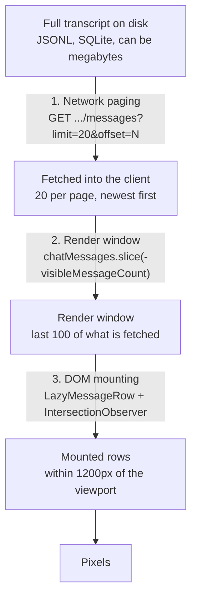

# Lazy loading

*Three independent mechanisms that all get called "lazy loading" and are constantly mistaken for each other: fetching history pages over the network, slicing a render window out of what has been fetched, and mounting row content in the DOM. Their effect on scroll position is covered in [Scrolling](04-scrolling.md).*

## In one paragraph

A long transcript passes through **three separate narrowings** before it reaches
your eyes, and each is owned by different code with a different trigger. The
server holds the whole transcript; the client fetches it 20 messages at a time
from the newest end backwards. Of the messages it has fetched, React renders only
the last 100. Of those 100 rows, only the ones within 1200 px of the viewport
actually mount their markdown and tool subtrees; the rest are fixed-height empty
divs. Debugging "why can't I see message X" means asking which of the three
gates it is stuck behind — and they fail in completely different ways.



| # | Mechanism | Bound | Constant | Owner |
| --- | --- | --- | --- | --- |
| 1 | Network paging | 20 messages per request | `SESSION_MESSAGES_PAGE_SIZE` (`sessionMessagePagination.ts:3`) | `useSessionStore` + `useChatSessionState` |
| 2 | Render window | last 100 messages | `INITIAL_VISIBLE_MESSAGES` (`useChatSessionState.ts:15`) | `useChatSessionState` |
| 3 | DOM mounting | 1200 px band | `LAZY_ROW_VIEWPORT_MARGIN_PX` (`useLazyRowObserver.ts:5`) | `LazyMessageRow` |

There is a fourth, quieter bound that is pure CSS: `.chat-message` carries
`content-visibility: auto` (`src/index.css:593`), so even a mounted off-screen row
skips layout, paint and style.

---

## 1. Network paging

### The endpoint counts backwards

This is the single most surprising thing in the subsystem. `offset` is **not**
measured from the start of the conversation. It is measured from the **end**.

```
GET /api/providers/sessions/:sessionId/messages?limit=20&offset=0
```

`offset: 0` returns the *newest* 20 messages. `offset: 20` returns the 20 before
those. The route is `server/modules/providers/provider.routes.ts:836`, and the
slicing helper is `sliceTailPage` (`server/shared/utils.ts:449`), whose tests spell
out the semantics:

```ts
// server/shared/tests/slice-tail-page.test.ts:8
test('offset 0 returns the most recent page', ...)
test('increasing offsets walk backwards in time', ...)
test('null limit returns everything', ...)
```

`limit: null` means "the whole transcript" and is what "load all" and transcript
export use. Provider and project are resolved server-side from the session id
alone — the client sends nothing else.

The response is the standard envelope; the client reads `data.messages`,
`data.total`, `data.hasMore` and an optional `data.tokenUsage`
(`useSessionStore.ts:97-120`).

### The server cache exists because every read is a full parse

Provider history readers materialise the *complete* normalised transcript and then
slice a page out of it. Without a cache, showing one 20-row page re-reads and
re-parses the entire file:

> For a multi-megabyte JSONL that is most of a second of CPU per request.
> — `server/modules/providers/services/session-history-cache.service.ts:12-13`

The cache (`createSessionHistoryCache`, `:53`) stores full parsed transcripts keyed
by app session id, and validates each entry with a single `stat` against the
transcript file's identity — path, mtime and size. Anything that rewrites history
(a new turn, an edit, a rewind, a fork) touches the file and invalidates the entry
naturally, so **there are no explicit invalidation hooks and none are needed**.

Budget: `MAX_CACHED_TRANSCRIPT_FILE_BYTES` = 256 MB of source file bytes across at
most `MAX_CACHE_ENTRIES` = 8 entries (`:50-51`). The newest entry is always kept
even if it alone blows the budget.

The cache is bypassed entirely for providers whose messages do not live in a file
the reader parses — Cursor's `store.db` and OpenCode's shared SQLite pass
`transcriptPath: null` (`:22-25`).

### Pages are stitched by overlap, not by arithmetic

You cannot simply concatenate pages, because the transcript is a moving target:
the model may be appending to it while you page backwards through it. So every
merge finds the **overlap** between what is cached and what arrived, and splices
there.

`messagesRepresentSamePersistedRow` (`sessionMessagePagination.ts:50`) decides
whether two rows are the same persisted row. It prefers `id`, but cannot rely on
it:

> Persisted IDs are preferred, but some provider readers (notably Codex) generate
> fresh IDs on every read. The fallback uses stable transcript fields and
> deliberately excludes enrichment such as `toolResult`, which may change when the
> provider finishes writing a turn.
> — `sessionMessagePagination.ts:44-49`

Built on that:

| Function | Purpose |
| --- | --- |
| `findLatestPageOverlapLength:79` | Longest cached-suffix / latest-prefix overlap |
| `mergeLatestServerPage:161` | Replace the overlapping cached tail with the fresh newest page, keeping every older row already loaded |
| `mergeOlderServerPage:191` | Prepend an older page, tolerating overlap if the transcript grew while the request was in flight |
| `planLatestPageBridge:105` | When a single turn added *more than one page* of rows, plan finite extra chunks until the two ends meet |
| `hasReachedCachedTailTimeBoundary:140` | Stop a backward bridge that will never find an id overlap (a rewritten transcript), using timestamps |
| `resolveLatestPagePagination:225` | Preserve the oldest-page boundary after a tail stitch |

The bridge logic exists because a single turn can add many messages. If the newest
page no longer overlaps the cached tail at all, the client walks backwards in
bounded chunks until it reconnects — and `hasReachedCachedTailTimeBoundary` is the
guard that stops it walking backwards forever when no overlap will ever be found.

### Requests for one session are serialised

Two history reads racing would compute offsets against each other's stale state.
Each slot carries a promise chain, `_historyMutationQueue`
(`useSessionStore.ts:43`), and every read goes through `enqueueHistoryMutation`
(`:85`):

> Serializes history reads for this session so an older-page request calculates its
> offset after any latest-page refresh completes.

Requests also carry a 30 s abort timeout (`SESSION_HISTORY_REQUEST_TIMEOUT_MS`,
`:53`) and a `canRequest()` predicate re-checked after the queue wait, so a request
queued for a session the user has since navigated away from is dropped rather than
applied.

### Automatic refreshes are coalesced

After each turn completes the client re-reads the persisted tail. Bursts of those
signals are collapsed by `createMessageHistoryRefreshCoordinator`
(`src/modules/chat/utils/messageHistoryRefreshCoordinator.ts:16`):

> Hidden sessions remain dirty until they become visible; active bursts collapse
> into the current request plus at most one trailing request.

So a background session accumulates a single pending flag rather than a queue of
requests, and flushes once when it becomes visible (`useChatSessionState.ts:788-798`).

### The load-earlier trigger

`handleScroll` (`useChatSessionState.ts:521`) fires `loadOlderMessages` when
`scrollTop < 100`. Two guards stop it running away:

- `isLoadingMoreRef` / `isLoadingMoreMessages` — one request at a time (`:464`).
- `topLoadLockRef` — after a successful load, further loads are blocked until
  `scrollTop` climbs back above 20 px (`:552-558`). Without this, staying at the top
  would chain fetch after fetch, because a prepend leaves you at the top again.

`hasMoreMessages` comes straight from the server's `hasMore`.

### Load all

"Load all" (`:1013`) is a different request, not a faster loop: one call with
`limit: null, offset: 0` that replaces `serverMessages` wholesale, then
`setVisibleMessageCount(Infinity)` (`:1050`) to drop the render window too.

The overlay has three flags, and they are easy to confuse:

| Flag | Meaning | Set / cleared |
| --- | --- | --- |
| `showLoadAllOverlay` | The prompt is visible | Armed by reaching the top (`:541`), auto-hidden after 2500 ms (`:542-545`) |
| `isLoadingAllMessages` | The single big request is in flight | `:1020` / `:1070` |
| `loadAllJustFinished` | Success confirmation | `:1053`, cleared with the overlay after 2500 ms (`:1055-1059`) |

Export uses a separate path, `loadFullTranscript` (`:1082`), which fetches
everything into the store and returns it **without touching the render window** —
because "export needs every message; the screen does not". That separation is why
exporting a long conversation no longer produces a file containing only its last
page.

---

## 2. The render window

Independent of what has been fetched, the transcript renders only a tail slice:

```ts
// useChatSessionState.ts:976
const visibleMessages = useMemo(() => {
  if (chatMessages.length <= visibleMessageCount) return chatMessages;
  return chatMessages.slice(-visibleMessageCount);
}, [chatMessages, visibleMessageCount]);
```

`visibleMessageCount` starts at `INITIAL_VISIBLE_MESSAGES` = 100 (`:15`) and is
reset to it on every session change (`:611`). It grows in three ways:

- `+SESSION_MESSAGES_PAGE_SIZE` when an older page is prepended (`:502`) — so the
  window keeps pace with the fetch.
- `+100` from the "load earlier" link (`loadEarlierMessages`, `:1097`).
- To `Infinity` on load-all (`:1050`), or to whatever a search jump needs
  (`:900-905`).

`scrollToBottomAndReset` (`:445`) collapses it back to 100 — see
[Scrolling](04-scrolling.md).

This layer is why `chatMessages.length` and `visibleMessages.length` differ, and
why `ChatMessagesPane` receives both (`ChatMessagesPane.tsx:56-57`). Export and the
export menu are handed the full `chatMessages`, the list is handed
`visibleMessages`.

---

## 3. DOM row mounting

The newest layer, added in `f537a3a9` *"perf(chat): mount transcript rows lazily so
huge sessions stay light"*. The problem it solves:

> The transcript renders every loaded message into the DOM, so "Load all" on a long
> session used to commit tens of thousands of markdown/tool subtrees at once — a
> gigabyte-scale tab.
> — `src/modules/chat/transcript/LazyMessageRow.tsx:11-13`

### How it works

One `IntersectionObserver` is shared by every row of a transcript, rooted at the
scroll container with a 1200 px margin on the vertical axis
(`useLazyRowObserver.ts:49-52`):

```ts
{ root: scrollContainerRef.current, rootMargin: `${LAZY_ROW_VIEWPORT_MARGIN_PX}px 0px` }
```

Each `LazyMessageRow` always keeps its **wrapper div** in the DOM. The wrapper
carries `data-message-timestamp`, so search jumps and scroll anchors still find the
row even while its content is unmounted (`LazyMessageRow.tsx:13-16`, `:73`). Only the
expensive subtree comes and goes.

Rows do unmount again when they leave the band — this is not a one-way "mount and
stay" cache.

### Heights

Before swapping in the placeholder, the row measures itself while its content is
still in the DOM, and the placeholder is given exactly that height
(`LazyMessageRow.tsx:50-60`, `:74`):

```ts
const handleNearViewportChange = useCallback((nextIsNearViewport: boolean) => {
  if (!nextIsNearViewport) {
    const height = elementRef.current?.offsetHeight ?? 0;
    if (height > 0) setMeasuredHeight(height);
  }
  setIsNearViewport(nextIsNearViewport);
}, []);
```

Scrolling back through content you have already seen therefore changes no scroll
geometry at all. Rows never yet measured use `ESTIMATED_ROW_HEIGHT_PX` = 100
(`LazyMessageRow.tsx:25`) and lean on browser scroll anchoring while they settle.

### Two guards worth knowing

**The hidden-tab guard.** When the Chat tab is not the active tab its subtree is
`display: none`, so the observer reports every row as non-intersecting with a
zero-sized rect. Treating that as "scrolled away" would overwrite every recorded
height with zero. Those entries are skipped (`useLazyRowObserver.ts:40-46`).

**The jsdom guard.** `useLazyRowObserver` returns `null` where
`IntersectionObserver` does not exist, and `LazyMessageRow` treats `lazyRows ===
null` as "always mounted" (`LazyMessageRow.tsx:68`). Tests therefore see the
pre-existing, fully-mounted behaviour.

### The first commit

The newest `INITIAL_MOUNTED_TAIL_ROWS` = 30 rows (`ChatMessagesPane.tsx:26`) mount
with real content on the very first commit rather than waiting for the observer to
report:

> Rows near the tail mount their content on first commit so the initial
> scroll-to-bottom measures real heights; older rows start as placeholders and
> mount when scrolled toward.
> — `ChatMessagesPane.tsx:271-273`

---

## React keys, and why they are computed the hard way

`ChatMessagesPane` builds a `WeakMap` of message → key on every render pass
(`ChatMessagesPane.tsx:143-160`) instead of using object identity or array index.
Both naive alternatives break, in different ways:

- **Array index** breaks on prepend. Loading 20 older messages shifts every index by
  20, so React reconciles row *n* against a different message, throwing away DOM
  and component state (collapsed/expanded tool cards, mounted-ness, measured
  heights) for the entire list.
- **Object identity** breaks on refresh. A server refresh replaces source records
  with equivalent *new* objects, so identity is not durable across pagination or
  hydration (`ChatMessagesPane.tsx:137-142`).

So keys are *intrinsic*: `getIntrinsicMessageKey` (`messageKeys.ts:12`) takes the
first present of `id`, `messageId`, `toolId`, `toolCallId`, `blobId`, `rowid`,
`sequence`, and falls back to a composite of timestamp + tool name + the first 48
characters of content. Because that fallback can collide, the pane disambiguates by
occurrence index within the render: the second row with the same intrinsic key
becomes `${key}__1` (`ChatMessagesPane.tsx:150`).

---

## What happens when the three layers interact

**Messages arrive while older history is fetching.** The store keeps live rows in
`realtimeMessages`, separate from the fetched `serverMessages`, and merges them (see
[Conversation handoff](02-conversation-handoff.md)). The older-page merge only
touches `serverMessages`, so a live message cannot be lost by a concurrent
prepend. `_historyMutationQueue` keeps the two fetches from computing offsets
against each other.

**A page arrives for a session you already left.** `canRequest()` is re-checked
after the queue wait and the result is discarded (`useChatSessionState.ts:475-478`,
`:1034-1037`).

**Realtime is bounded too.** `MAX_REALTIME_MESSAGES` = 500 (`useSessionStore.ts:547`)
caps live rows per session, and `truncateAt` drops superseded turns when a message
is edited (`sessionStoreTruncate.test.tsx`).

---

## Why there is no virtual list

This has been assessed and deliberately declined. The short version:

- **The bounding already exists.** Three layers plus CSS containment, above.
  `content-visibility: auto` is the browser's native version of what a windowed list
  buys you — off-screen rows skip layout, paint and style while staying in the tree.
- **Staying in the tree is the point.** Browser find-in-page reaches
  `content-visibility: auto` content; it cannot reach unmounted DOM. Virtualising
  would narrow Ctrl+F and cross-message text selection from ~100 messages to roughly
  the viewport.
- **The scroll machinery reads the DOM directly.** The prepend anchor restore does
  `querySelectorAll('.chat-message')` and checks `anchor.isConnected`
  (`useChatSessionState.ts:108`, `:571`); the search jump does
  `querySelectorAll('[data-message-timestamp]')` then `scrollIntoView`. A
  virtualizer unmounts exactly those nodes by design, and turns `scrollHeight` into a
  synthetic spacer height that the fallback restore (`:578`) is not computing
  against.

`LazyMessageRow` is what came of that assessment: it closed the one genuinely
unbounded path — load-all committing every subtree — while keeping the wrapper
element, its `data-message-timestamp` and its measured height in the tree, so none
of the DOM-reading machinery above had to change.

---

## Gotchas and sharp edges

1. **`offset` counts backwards.** `offset: 0` is the *newest* page. Reading the
   endpoint as conventional forward pagination will produce an inverted transcript
   and a lot of confusion.
2. **Three layers, three failure modes.** "Message not visible" can mean not
   fetched (layer 1), outside the render window (layer 2), or unmounted (layer 3).
   Check `chatMessages.length` vs `visibleMessages.length` vs the DOM before
   assuming.
3. **`hasMoreMessages` and `allMessagesLoaded` are not opposites.**
   `allMessagesLoadedRef` is set optimistically at the *start* of load-all
   (`:1018`) and rolled back on failure (`:1066`), so mid-flight both can be
   misleading.
4. **`totalMessages` comes from the provider and can undercount.** Claude and Codex
   omit paginated tool results from `total`, which is exactly why
   `planLatestPageBridge` needs the "more than one bounded chunk" path
   (`useSessionStore.ts:418-420`).
5. **Never key transcript rows by index.** See above; it silently destroys
   collapsed/expanded state and measured heights on every prepend.
6. **Row content unmounts again.** Anything that stores state inside a row's subtree
   loses it when the row leaves the 1200 px band. State that must survive belongs
   above `LazyMessageRow`.
7. **The wrapper div is load-bearing.** Removing `data-message-timestamp` from it,
   or letting the wrapper unmount, breaks the search jump and the scroll anchor for
   off-screen rows.
8. **Tests see no lazy rows.** jsdom has no `IntersectionObserver`, so every row is
   mounted in tests. A regression in the lazy path will not be caught by a default
   render test.
9. **The history cache has no invalidation API** — by design. If you add a code path
   that rewrites a transcript without touching the file's mtime or size, the cache
   will serve stale history and there is no hook to tell it otherwise.

## Where to look when something breaks

| Symptom | Start here |
| --- | --- |
| Older messages never load | `handleScroll:521`; is the container scrollable at all? Then `topLoadLockRef:552` |
| Older messages load in a loop | `topLoadLockRef:552-558` |
| Duplicated messages after a turn | Overlap stitching — `findLatestPageOverlapLength:79`, `messagesRepresentSamePersistedRow:50` |
| Transcript order inverted | Tail-offset semantics — `sliceTailPage`, `server/shared/utils.ts:449` |
| Gap in the middle of history | The bridge path — `planLatestPageBridge:105`, `hasReachedCachedTailTimeBoundary:140` |
| Stale history after an edit | `session-history-cache.service.ts` — did the transcript file's mtime/size change? |
| Export contains only the last page | `loadFullTranscript:1082` vs `loadAllMessages:1013` |
| Tool card collapses itself on scroll | Row unmounting — state living inside `LazyMessageRow` |
| Collapsed/expanded state resets on prepend | Key derivation — `messageKeys.ts:12`, `ChatMessagesPane.tsx:143` |
| Rows have zero height after tab switch | The zero-rect guard, `useLazyRowObserver.ts:40` |
| Huge memory on "load all" | `LazyMessageRow` mounting — is `lazyRows` null? |
