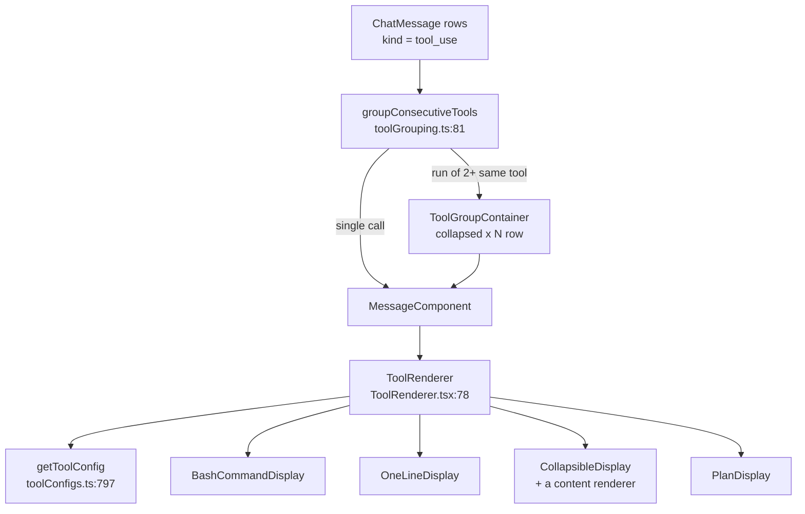
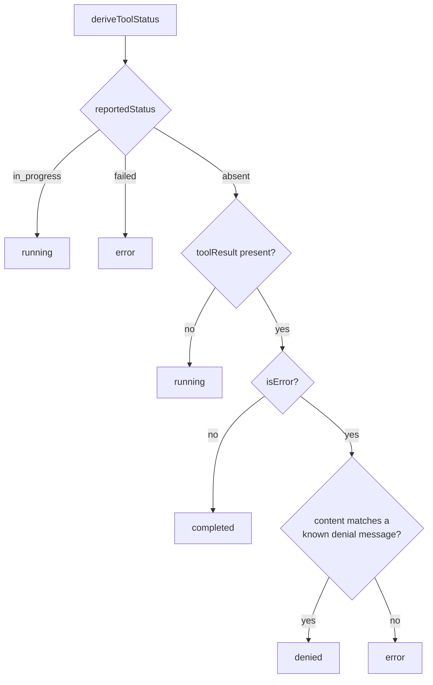
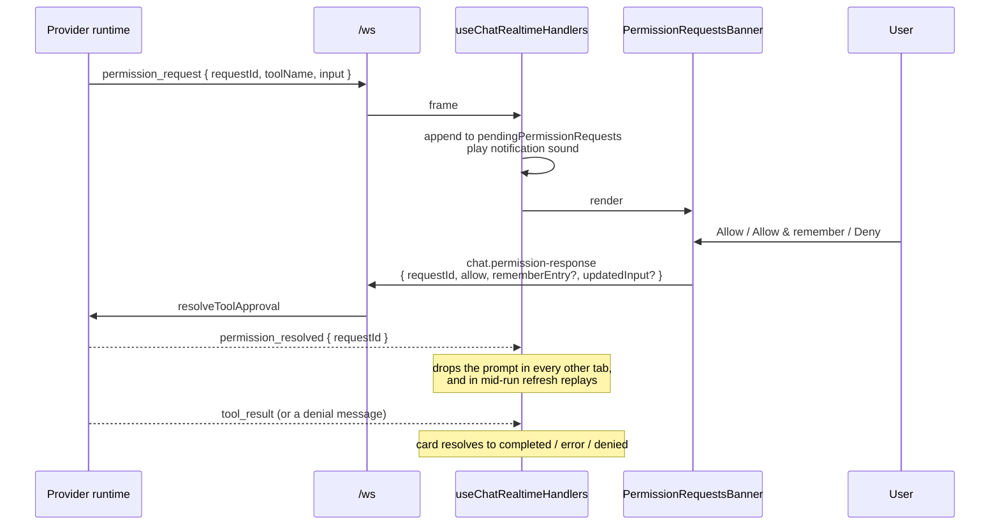

# Tool views

*How a `tool_use` message becomes a card in the transcript: grouping, the renderer registry, status, diffs, subagent panels and the permission flow. How the underlying messages arrive and are correlated is [The realtime stream](03-realtime-stream.md).*

## In one paragraph

Every tool call goes through one dispatcher, `ToolRenderer`, which looks the tool up in a
single registry (`TOOL_CONFIGS`) and picks one of four presentations: a one-line row, a
collapsible section, a plan panel, or nothing. The registry entry — not the component —
decides the icon, the label, the summary text, whether it starts open, and which content
renderer fills the body. Before any of that, consecutive calls to the *same* tool are
folded into a single collapsed group row, so a burst of ten `Read`s is one line rather
than ten cards. Everything that varies per tool lives in the registry; adding a tool view
means adding a data entry, not a component.



## Grouping

`groupConsecutiveTools` (`src/modules/chat/utils/toolGrouping.ts:81`) runs on every render
pass over the visible messages and returns a mixed list of plain messages and group
objects.

```
for each message:
  if not groupable (not a tool_use, no toolName, or IS a subagent container):
      emit it; advance
  else:
      run = [message]
      scan forward:
          if candidate renders nothing (thinking while showThinking is off): skip it
          if candidate is groupable AND same toolName: append to run
          else: stop
      if run.length >= TOOL_GROUP_THRESHOLD (2): emit one group
      else: emit the run's messages individually
      advance past everything scanned
```

Three details matter:

- **Only identical tool names group.** `Read, Read, Grep, Read` produces a group of two,
  then a `Grep`, then a lone `Read`.
- **`TOOL_GROUP_THRESHOLD` is 2** (`:4`) — two consecutive calls are already a group.
- **Subagent containers never group** (`isGroupableToolMessage:16` excludes
  `isSubagentContainer`), because each one carries its own timeline.

Invisible messages are skipped rather than breaking a run:

> Messages that render nothing (e.g. reasoning hidden when `showThinking` is off)
> shouldn't split an otherwise-continuous run of the same tool — providers like Codex
> interleave hidden reasoning between consecutive tool calls.
> — `toolGrouping.ts:20-22`

A consequence worth knowing: skipped messages are **consumed**, not re-emitted — `index`
jumps to `nextIndex` at `:130`. Since they render nothing anyway this is invisible, but it
means the item list is not a strict superset of the input.

### The group summary line

`buildGroupPreview` (`:59`) spells out the first `PREVIEWED_TOOL_COUNT` (2) inputs and
appends `+N more`. The arithmetic is deliberately "names actually printed", not "slots
reserved":

> A tool whose input yields no text — a `Read` with no `file_path`, an input still
> arriving as partial JSON — is genuinely not named, so it belongs in the remainder.
> Counting slots instead makes a group of three whose first preview is empty render
> "/b.ts, +1 more" beside an x3 badge.
> — `toolGrouping.ts:66-71`

It is computed during grouping rather than in the component, once per pass instead of once
per group render, and deliberately not cached — grouping re-runs on every 100 ms stream
tick, and a run's preview changes as the run grows, so a cache would have to key on the
whole run. Measured at 0.18 ms per tick over a 100-message window (`:48-57`).

### The group row

`ToolGroupContainer` (`src/modules/chat/transcript/ToolGroupContainer.tsx`) renders a
button showing the tool's icon and label, an `xN` badge, the preview, and — for edit tools
— an aggregate diff-stats badge. It starts collapsed (`:93`), with one exception:

> Collapsed on screen, always open in an export: the whole point of the group row is to
> hide detail the reader can ask for, and an exported file has no way to ask.
> — `ToolGroupContainer.tsx:90-92`

## Dispatch

`ToolRenderer` (`ToolRenderer.tsx:78`) is the single entry point, and it is called twice
per tool call — once with `mode: 'input'` and once with `mode: 'result'`. The config has
a separate `input` and `result` half, and either can be absent (`if (!displayConfig) return null`, `:115`).

Decision order:

1. **`getToolConfig(toolName)`** (`toolConfigs.ts:797`) — an exact key lookup in
   `TOOL_CONFIGS`, falling back to the `Default` entry. There is no pattern matching and
   no prefix handling.
2. **Bash special case** (`:120`) — `Bash` with `mode: 'input'` short-circuits to
   `BashCommandDisplay`, which shows the command on one line with a chevron that expands
   the output inline. The separate result render is suppressed by `MessageComponent`.
3. **`displayConfig.type`** decides the rest: `one-line`, `plan`, `collapsible`. Anything
   else falls through to `return null` (`:340`).
4. For `collapsible`, **`displayConfig.contentType`** picks the body renderer.

### Content renderers

| `contentType` | Component | Notes |
| --- | --- | --- |
| `diff` | `ToolDiffViewer` | Skipped entirely if no `createDiff` was passed |
| `markdown` | `MarkdownContent` | |
| `file-list` | `FileListContent` | Clickable paths |
| `todo-list` | `TodoListContent` | Only rendered when there is at least one todo |
| `task` | `TaskListContent` | |
| `question-answer` | `QuestionAnswerContent` | |
| `text` | `TextContent` | Takes a `format` prop |
| `success-message` | inline JSX (`:278-289`) | A green tick plus `getMessage()` |

### Display names

`formatToolDisplayName` (`toolConfigs.ts:96`) is applied to every renderer while lookups
keep using the provider's real name. It does two things: maps a few tools to unified
labels (`TodoWrite`/`TodoRead` → "Checklist", `AskUserQuestion` → "Question", `:90-94`),
and rewrites namespaced MCP ids — `mcp__server__tool` becomes `tool (server)` (`:102-106`).

## The registry

`TOOL_CONFIGS` (`toolConfigs.ts:109`) has 23 entries.

| Key | Input presentation | Result presentation |
| --- | --- | --- |
| `Bash` (`:114`) | one-line — but short-circuited to `BashCommandDisplay` | `special` |
| `PowerShell` (`:140`) | one-line | `special` |
| `WebSearch` (`:167`) | one-line | collapsible / `text`, closed |
| `WebFetch` (`:188`) | one-line | collapsible / `text`, closed |
| `Read` (`:213`) | one-line, `action: open-file` | — |
| `Edit` (`:231`) | collapsible / `diff`, closed | — |
| `Write` (`:254`) | collapsible / `diff`, closed | — |
| `ApplyPatch` (`:277`) | collapsible / `diff`, closed | — |
| `Grep` (`:304`) | one-line | collapsible / `file-list`, closed |
| `Glob` (`:337`) | one-line | collapsible / `file-list`, closed |
| `TodoWrite` (`:377`) | collapsible / `todo-list`, **open** | — |
| `TodoRead` (`:410`) | one-line | collapsible / `todo-list` |
| `TaskCreate` (`:444`) | one-line | — |
| `TaskUpdate` (`:462`) | one-line | — |
| `TaskList` (`:485`) | one-line | collapsible / `task`, **open** |
| `TaskGet` (`:508`) | one-line | collapsible / `task`, **open** |
| `Agent` (`:538`) | collapsible / `markdown`, closed | — |
| `Task` (`:551`) | collapsible / `markdown`, closed, purple scheme | collapsible / `markdown` "Subagent result" |
| `AskUserQuestion` (`:643`) | collapsible / `question-answer`, **open** | — |
| `exit_plan_mode` (`:679`) | plan / `markdown`, **open** | — |
| `ExitPlanMode` (`:695`) | plan / `markdown`, **open** | — |
| `exec` (`:713`) | collapsible / `text`, closed | collapsible / `text` |
| `Default` (`:736`) | collapsible / `text`, closed | collapsible / "Output", `text` |

Defaults are **closed** unless the entry says otherwise (`ToolRenderer.tsx:206-208`); the
open ones are the tools whose whole value is the content — todo lists, task lists,
questions and plans.

`exit_plan_mode` and `ExitPlanMode` are duplicated because different providers spell the
same tool differently. So are `Bash`/`PowerShell` and `Agent`/`Task`.

The `Default` entry's result renderer does real work: it unwraps MCP-shaped payloads
(arrays of `{ type: 'text', text }`) and pretty-prints anything else as JSON
(`:754-789`).

### Hiding results

`shouldHideToolResult` (`:804`) suppresses noisy successful output via `hidden` or
`hideOnSuccess` — but never for errors:

> Hidden/success-only configs suppress noisy successful output, but errors still need to
> be visible so failed tool calls are diagnosable.
> — `toolConfigs.ts:809-810`

## Status

`deriveToolStatus` (`ToolRenderer.tsx:55`) resolves one of four values, and it is only
computed on the **input** render (`:103-106`) — the result render never shows a badge.



Two things to know:

- **A provider-reported status wins.** Codex reports a command's lifecycle directly, so a
  row can show as running while its output streams in, rather than only once it finishes
  (`:56-58`).
- **"No result yet" means running.** The absence of a `tool_result` row *is* the running
  state (`:60`). This is why the correlation described in
  [The realtime stream](03-realtime-stream.md) matters: a `tool_result` whose `toolId`
  does not match leaves the card spinning forever.
- **`denied` is inferred from message text**, matched against four exact strings the
  Claude runtime emits (`CLAUDE_DENIAL_MESSAGES`, `:48-53`). Other providers cannot
  reliably signal denial, so their denials render as plain errors.

`completed` renders **no badge at all** — every call site passes
`status={toolStatus !== 'completed' ? toolStatus : undefined}` (`:142`, `:169`, `:308`).

## Diffs

Diffs are computed **on the client**, from the tool input's `old_string` / `new_string`,
by a `createDiff` function threaded down from `ChatInterface`. It is a *cached* calculator
(`createCachedDiffCalculator`, `messageTransforms.ts`), which is why `ToolRenderer`
deliberately does not memoise the stats:

> Not memoized on purpose: `createDiff` is the session's cached calculator, so this is a
> Map hit on the same key `ToolDiffViewer` is about to use.
> — `ToolRenderer.tsx:299-300`

`summarizeDiff` turns the diff lines into `{ additions, deletions }` for `DiffStatsBadge`.
A group of edit tools gets an aggregate badge via `useGroupDiffStats`
(`ToolGroupContainer.tsx:102`).

For `Edit`, `Write` and `ApplyPatch`, clicking the section title opens the file in the
editor with the diff attached (`ToolRenderer.tsx:292-297`).

If `createDiff` is not passed, the diff body renders as nothing (`:220`) — the section
header still appears.

## Subagents

A `Task` call whose message carries subagent metadata renders as a **subagent container**:
the tool card holds a timeline of the child agent's own tool calls and prose. The timeline
comes from two places and the longer one wins:

- **Live**, folded client-side from rows stamped with `parentToolUseId`.
- **Persisted**, shipped by the server as `subagentTools` on the `Task` row.

The folding logic lives in `normalizedToChatMessages` and is described in
[The realtime stream](03-realtime-stream.md#subagents). What matters here is the
consequence for grouping: containers are excluded from `isGroupableToolMessage`
(`toolGrouping.ts:17`), so two consecutive `Task` calls stay as two separate panels rather
than collapsing into an `x2` row that would hide both timelines.

## The permission flow



The banner lives above the composer (`PermissionRequestsBanner.tsx:32`), and two kinds of
request bypass it:

- **Plan tools.** `ExitPlanMode` / `exit_plan_mode` are filtered out (`:38-40`) because
  `PlanDisplay` handles them inline in the transcript. The same pair is also excluded from
  the notification sound (`useChatRealtimeHandlers.ts:9-11`).
- **Tools with a custom panel.** `getPermissionPanel(toolName)` (`:49`) consults a tiny
  registry; a match renders that component instead of the generic confirmation.

The registry (`permissionPanelRegistry.ts`) is a bare `Record` with a register and a get
function, and today has exactly **one** registration, made at module scope in the banner
itself:

```ts
// PermissionRequestsBanner.tsx:17
registerPermissionPanel('AskUserQuestion', AskUserQuestionPanel);
```

That is how `AskUserQuestion` renders an actual answer form: the panel calls `onDecision`
with `updatedInput` carrying the user's selections, which
`chat.permission-response` forwards to the provider.

### Allow rules and "remember"

`buildClaudeToolPermissionEntry` (`chatPermissions.ts:4`) turns a request into a Claude
settings rule. For most tools that is just the tool name; for `Bash` it derives a command
prefix pattern:

| Command | Rule |
| --- | --- |
| `npm test` | `Bash(npm:*)` |
| `git status` | `Bash(git status:*)` — two words for `git` (`:25-27`) |
| unparseable input | `Bash` |

The banner uses that rule twice: to label the button `Allow (saved)` when the rule is
already stored, and — importantly — to **batch**. Every pending request that derives the
same rule is answered by one click (`:65-72`), so approving `Bash(git status:*)` clears
every queued `git status` at once.

`handlePermissionDecision` (`useChatComposerState.ts:1137`) sends one
`chat.permission-response` per request id and removes them from local state immediately
rather than waiting for a server echo. The echo still happens — the runtime emits
`permission_resolved` on the run stream — but its audience is everyone else: other tabs
watching the run, and the replay buffer, where it retracts the buffered
`permission_request` so a mid-run refresh does not resurrect an answered prompt.

Separately, a **failed** Claude tool call offers a retroactive grant:
`getClaudePermissionSuggestion` (`chatPermissions.ts:41`) inspects an errored tool result,
derives the same rule, and the transcript offers to add it to the allowed list
(`grantClaudeToolPermission:57`). This path is Claude-only — it returns `null` for any
other provider (`:45`).

## Collapse and expand state

Collapse state is **local component state**, not stored anywhere:

- Group rows: `useState(false)` in `ToolGroupContainer` (`:93`).
- Individual sections: `defaultOpen` from the registry, then local state inside
  `CollapsibleDisplay`.

So it survives ordinary re-renders and streaming ticks, but is lost whenever the component
unmounts. That happens more often than you might expect:

- Switching sessions.
- A row leaving the 1200 px lazy-mount band (see [Lazy loading](05-lazy-loading.md)).
- A key change — which is exactly why the intrinsic-key scheme exists, so a prepend does
  *not* cause one.

If you need state that outlives those, it has to live above `LazyMessageRow`.

## Adding a new tool view

1. **Add a `TOOL_CONFIGS` entry** keyed by the exact tool name the provider emits. If two
   providers spell it differently, add both keys (as `Bash`/`PowerShell` and
   `exit_plan_mode`/`ExitPlanMode` do).
2. **Choose `input.type`**: `one-line` for a single identifying value, `collapsible` for
   anything with a body, `plan` for the plan panel, `hidden` to render nothing.
3. **Supply `label`, `icon`, and `getValue`/`title`.** `getValue` receives the *parsed*
   input, so write it against an object, not a JSON string — `parseToolPayload` handles the
   parsing (`ToolRenderer.tsx:97-100`).
4. **Pick a `contentType`** and provide `getContentProps(parsed, { selectedProject, createDiff, onFileOpen })`
   returning the props that renderer expects. Reuse an existing renderer if you can; a new
   `contentType` means a new `case` in the switch at `ToolRenderer.tsx:218`.
5. **Set `defaultOpen`** only if the content is the point of the row.
6. **Decide the result half.** Omit it to render nothing, or set `hidden` /
   `hideOnSuccess` to suppress noise while keeping errors visible.
7. **Add a `colorScheme`** if the tool deserves a distinct accent (see `Task`, `:593-596`).
8. **Only write a component** if you need an interactive panel. If it answers a permission
   request, register it with `registerPermissionPanel` and have it call `onDecision` with
   `updatedInput`.
9. **Add a case to `getToolCategory`** (`ToolRenderer.tsx:35`) if the tool needs its own
   styling bucket.

## Gotchas and sharp edges

1. **Registry lookup is an exact string match.** A tool named slightly differently by a
   provider silently falls through to `Default`. There is no prefix or pattern matching.
2. **`ToolRenderer` is called twice per call.** Logic that should run once must be scoped
   with `mode === 'input'`. Status derivation and raw-parameter display already are.
3. **Bash bypasses the config's `type`.** Its `input.type` says `one-line`, but the
   short-circuit at `:120` means that value is never used. Changing it has no effect.
4. **`completed` renders no badge.** An "invisible status" is the success case, not a bug.
5. **`denied` only works for Claude**, and only by matching four exact English strings
   (`:48-53`). Any rewording of those runtime messages silently turns denials into errors.
6. **`ExitPlanMode` is special-cased in three places** — the banner filter (`:38`), the
   sound filter (`useChatRealtimeHandlers.ts:9`), and its own `plan` renderer type. Miss
   one and plan approvals either double up or go silent.
7. **The permission panel registry has one entry, registered as a module side effect.**
   `registerPermissionPanel('AskUserQuestion', …)` runs when `PermissionRequestsBanner` is
   imported. A panel registered from a module nothing imports will never appear.
8. **Group previews are recomputed every tick** by design. Do not add a cache without
   keying it on the whole run — see the note at `toolGrouping.ts:48-57`.
9. **Diff stats are intentionally un-memoised.** Wrapping them in `useMemo` adds a
   dependency array without saving work, because the underlying calculator is already a
   cache.
10. **Subagent containers must never be grouped.** Removing the `isSubagentContainer` check
    at `toolGrouping.ts:17` collapses two `Task` panels into one `x2` row and hides both
    timelines.

## Where to look when something breaks

| Symptom | Start here |
| --- | --- |
| Tool renders as a generic "Output" box | No `TOOL_CONFIGS` key for that exact name — `getToolConfig:797` |
| MCP tool name shown raw | `formatToolDisplayName:96` |
| Card stuck "running" | Result correlation by `toolId` — see [The realtime stream](03-realtime-stream.md) |
| Denial shown as a generic error | `CLAUDE_DENIAL_MESSAGES`, `ToolRenderer.tsx:48` |
| Diff body empty but header present | `createDiff` not threaded through — `ToolRenderer.tsx:220` |
| Diff stats badge missing | `contentProps.oldContent` / `newContent` are not both strings, `:301-306` |
| Ten identical cards instead of one group row | `groupConsecutiveTools:81` — are the `toolName`s identical? Is one a subagent container? |
| Group row shows a wrong count next to its preview | `buildGroupPreview:59`, the `extraCount` arithmetic |
| Group hidden in an exported transcript | `useIsExportingTranscript`, `ToolGroupContainer.tsx:89` |
| Permission prompt never appears | The `ExitPlanMode` filter at `PermissionRequestsBanner.tsx:38`, or a custom panel taking over at `:49` |
| "Allow & remember" clears more prompts than expected | Rule batching, `PermissionRequestsBanner.tsx:65-72` |
| Expanded section collapses by itself | Row unmounted — lazy band or key change, see [Lazy loading](05-lazy-loading.md) |
| Subagent timeline empty mid-run | `parentToolUseId` folding, `useChatMessages.ts:96` |
