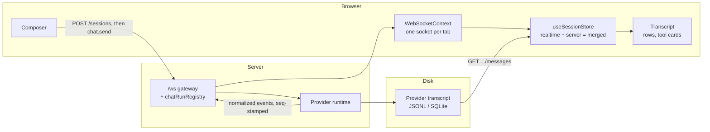

# Chat runtime architecture

*How a message gets from the composer to a provider CLI and back onto the screen. Six documents covering the websocket layer, conversation handoff, the realtime stream, scrolling, lazy loading and tool views.*

These subsystems are hard to read from the source alone, because in each case the
behaviour lives in the *interaction* between files rather than in any one of them. Each
document leads with a mental model you can carry in your head, then a diagram, then the
detail, and closes with the gotchas and a symptom-to-file lookup table.

**A note on citations.** Claims are anchored as `path/to/file.ts:123` with the symbol
named in the prose. Line numbers drift as the code changes — **the file and symbol names
are the durable part.** If a line number does not match, search for the symbol.

## The one-page picture

The shape worth memorising: **two paths carry the same conversation.** Live events come
down the websocket; persisted messages come up over REST. The store holds them in
separate arrays and merges them. Most confusing behaviour in this area is one of those
two paths disagreeing with the other.

## Reading order

| # | Document | Why it comes here |
| --- | --- | --- |
| 1 | [The WebSocket layer](01-websocket-layer.md) | The transport everything else rides on. Read it first — the event vocabulary tables are referenced by every other document. |
| 2 | [Conversation handoff](02-conversation-handoff.md) | Which ids exist and who owns the transcript when. Answers "why does this conversation have two ids" before that question can derail you elsewhere. |
| 3 | [The realtime stream](03-realtime-stream.md) | One event's full journey, and the store that assembles a reply. The heart of the system; needs 1 and 2 as vocabulary. |
| 4 | [Scrolling](04-scrolling.md) | Now that messages arrive, where does the view sit. Self-contained, and the most immediately useful when debugging something visible. |
| 5 | [Lazy loading](05-lazy-loading.md) | The three narrowings between "on disk" and "on screen". Read after scrolling, because they share the height-stability machinery. |
| 6 | [Tool views](06-tool-views.md) | The rendering layer for tool calls. Last because it only makes sense once you know how tool messages arrive and get correlated. |

In a hurry? Read 1 and 3. Debugging something the user can see? Start at 4 or 6.

## Glossary

Terms that mean something specific here, and are easy to guess wrong.

| Term | Meaning |
| --- | --- |
| **App session id** | The stable `randomUUID()` the browser and the URL use. Allocated over REST before the first message. Never changes. |
| **Provider-native session id** | The id the provider CLI knows the conversation by. Backend-only; the browser never sees it except through an explicit "copy session ID" action. |
| **Run** | One provider execution for one session — from `chat.send` to the terminal `complete`. Tracked in `chatRunRegistry`. Outlives the socket that started it. |
| **`kind`** | The discriminator on every **server-to-client** frame. |
| **`type`** | The discriminator on every **client-to-server** message. (Task Master's broadcasts are the one server-to-client exception — they use `type`.) |
| **`seq`** | Per-run monotonic sequence number, assigned server-side. What a reconnecting client sends back as `lastSeq` to replay exactly what it missed. |
| **Replay buffer** | The last 5000 events of a run, kept for 5 minutes after it completes, so a reconnecting client can catch up. Completed runs are deliberately *not* replayed. |
| **Gateway writer** | `ChatSessionWriter` — handed to provider runtimes in place of a raw socket writer. Rewrites session ids, assigns `seq`, swallows `session_created`. |
| **`serverMessages`** | Rows fetched from the persisted transcript over REST. |
| **`realtimeMessages`** | Rows that arrived over the websocket and are not yet known to be persisted. |
| **`merged`** | The projection of the two that the transcript actually renders. |
| **Slot** | One session's entry in the store: its three message arrays plus pagination and status. |
| **Normalized message** | The single message shape every provider's output is translated into, server-side. `NormalizedMessage` on the backend, `ServerEvent` on the frontend. |
| **Session alias** | A provisional sidebar row keyed by a provider-native id, created by the filesystem watcher before the app mapped that id. Folded into the real row later. |
| **Tail-offset paging** | The history endpoint's `offset` counts **backwards from the newest message**. `offset: 0` is the newest page. |
| **Render window** | `visibleMessageCount` — how many of the fetched messages React renders. Starts at 100. Distinct from paging and from DOM mounting. |
| **Lazy row** | A transcript row whose content is mounted only within 1200 px of the viewport. Its wrapper div and measured height always stay in the DOM. |
| **Tool group** | Two or more consecutive calls to the *same* tool, collapsed into one summary row. |
| **Subagent container** | A `Task` tool card holding the child agent's own timeline of tool calls and prose. |
| **Anchor id** | `transcriptAnchorId` — addresses one row of the persisted transcript, used to edit or fork from that point. |

## The files these documents cover

| Area | Frontend | Backend |
| --- | --- | --- |
| Transport | `src/shared/context/WebSocketContext.tsx` | `server/modules/websocket/services/` |
| Handoff | `src/modules/chat/hooks/useSessionStore.ts`, `src/modules/project-workspace/hooks/useProjectsState.ts` | `sessions.service.ts`, `sessions.db.ts`, `session-synchronizer.service.ts`, `sessions-watcher.service.ts` |
| Stream | `useChatRealtimeHandlers.ts`, `useSessionStore.ts`, `useChatMessages.ts`, `StreamingMarkdown.tsx` | `provider-runtime.service.ts`, `message-unification.ts`, `list/*/\*-runtime.provider.js` |
| Scroll | `useChatSessionState.ts`, `ChatMessagesPane.tsx` | — |
| Lazy loading | `sessionMessagePagination.ts`, `LazyMessageRow.tsx`, `useLazyRowObserver.ts` | `session-history-cache.service.ts`, `sessions.service.ts` |
| Tool views | `tools/`, `toolGrouping.ts`, `ToolGroupContainer.tsx` | — |

## Cross-cutting invariants

Five rules that hold across the whole subsystem. Breaking any one of them causes bugs
that look unrelated to the change that caused them.

1. **The browser never learns a provider-native session id.** Every outbound event has
   its `sessionId` rewritten to the app id.
2. **Exactly one `complete` per run**, whatever happened — success, failure or abort.
   `error` is not terminal.
3. **The client is not trusted for anything but the session id.** Provider, project path
   and provider-native id are all read from the database.
4. **Live and persisted messages stay in separate arrays.** Merging them eagerly
   reintroduces duplicate rows and a flash-to-empty transcript.
5. **A run belongs to the server, not to a socket.** It survives disconnects, serves
   multiple viewers, and starts with no viewer at all for scheduled messages.

## Verifying these documents

Every `file:line` citation and every mermaid diagram in this directory was checked
mechanically against the source at the time of writing. If you change one of these
subsystems substantially, the cheapest re-check is to confirm the symbol names still
exist — those are what the prose is anchored to.
