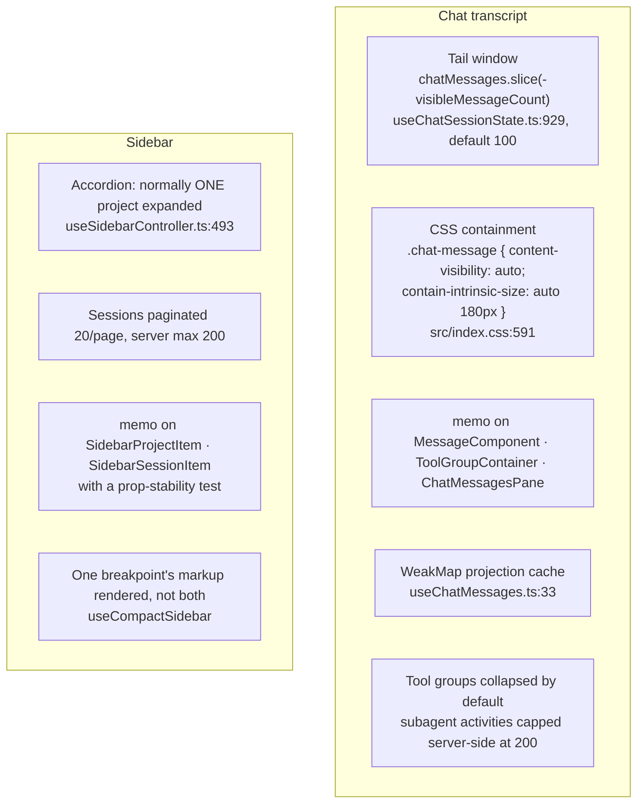
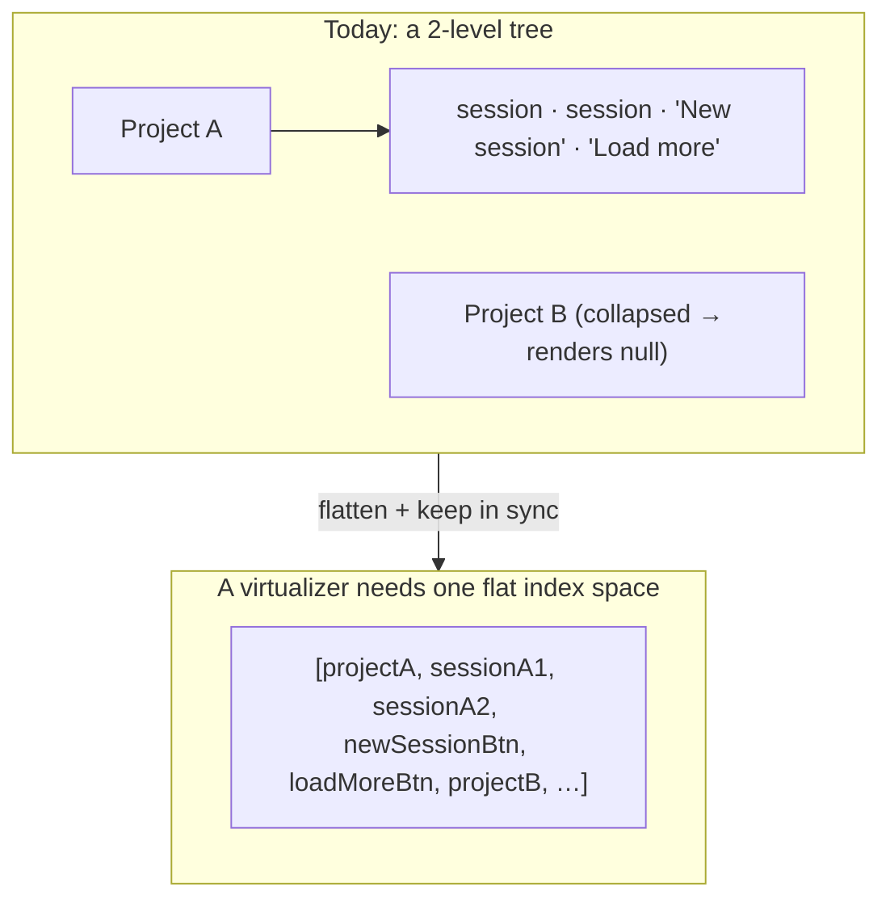
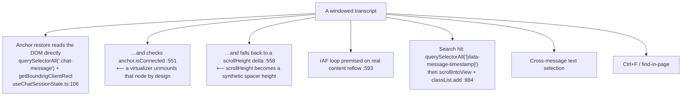
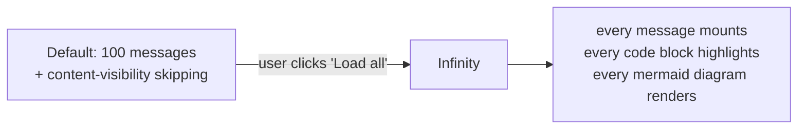

# Should the sidebar and the chat transcript be virtualized?

**Short answer: no for the sidebar, and not yet for the chat — but there is one
unbounded render path worth fixing, and it does not need a virtualizer.**

This is an assessment, not a plan. Numbers are either measured in this repo or
read out of the source; claims about third-party libraries could not be verified
here and are marked *unverified*.

---

## 1. What is already there

The premise "these are plain unbounded lists" is false for both. Each already
has bounding, and the chat has two independent layers of it.

`content-visibility: auto` is the part most virtualization discussions miss. It
is the browser's native version of what a windowed list buys you: off-screen
messages skip **layout, paint and style**, while their DOM stays in the tree.
That last part matters — see §3.

On the subagent cap: `SubagentPanel.tsx:25` renders 25 activities initially and
raises the limit by 100 per "show more" click (`:214`). The real bound is
server-side, `MAX_TRANSMITTED_SUBAGENT_ACTIVITIES = 200`
(`claude-sessions.provider.ts:34`).

## 2. The measurements that already exist

Commit `7356033f` (*perf(chat,sidebar): cut history payload, sidebar DOM and
bundle size*) took its numbers "from the running app rather than from reading
the code", on a 7.5 MB Claude transcript and a workspace of six projects with 63
sessions:

| Metric | Before | After |
|---|---|---|
| Sidebar DOM nodes, six projects expanded | 1064 | **729** |
| History payload, one session | 11.6 MB | 2.5 MB |
| Bundle | 3345 kB (1002 gz) | 2871 kB (829 gz) |

Separately, that commit made React Scan opt-in after measuring that the tool
itself halved the dev frame rate: **median frame 34 ms with it on versus 17 ms
with it off**, 53 of 90 frames over budget versus 9. That is a comparison
between two tool configurations, not a before/after of the commit — but the
17 ms figure is the useful one here, because it is this app's dev-mode baseline
with the existing non-virtualized lists.

The sidebar improvement came from rendering one breakpoint's design instead of
both — not from windowing.

Nothing else in the repo reports slow list rendering: no benchmarks, and
`CHANGELOG.md` / `docs/` contain no mention of jank, frames or virtualization.
`react-scan` and `react-doctor` are both wired up (the latter with a CI
workflow), so someone has already gone looking for render problems and did not
reach for a virtualizer.

**729 DOM nodes is well under the point where windowing pays for itself** —
roughly 4× below the "a few thousand nodes" rule of thumb, not at it.

## 3. What virtualizing would cost

### Sidebar — the shape is wrong for it

There is no flat row array anywhere: `SidebarProjectList` maps projects, and each
`SidebarProjectItem` renders its own `SidebarProjectSessions`, which maps
sessions. Every windowing library indexes a flat list, so step one is
synthesising that index space — including the per-project "New session" button,
skeleton, empty state and "Load more" row.

Against that cost, the row count is capped by design: `toggleProject`
(`useSidebarController.ts:493`) builds a **brand-new empty Set** and adds only
the clicked project, so clicking a project *collapses every other one*. Multiple
projects only accumulate via the auto-expand effect (`:137`), and the one path
that expands everything (`forceExpanded` for `searchMode === 'running'`,
`Sidebar.tsx:204`) is already filtered to running sessions.

Other work a virtualizer would absorb: the rename `scrollIntoView`
(`SidebarProjectItem.tsx:112`, re-fired on `visualViewport` resize), and the fact
that the scroller is a `ScrollArea` component (`SidebarContent.tsx:212`) rather
than a plain div, so the true scrolling element may be an inner viewport node.

### Chat — the scroll machinery is the blocker

Points 6 and 7 are the ones worth weighing carefully, and it is worth being
precise about the size of the loss:

- The default window is already the **last 100 messages**
  (`useChatSessionState.ts:929`, `:15`), so cross-message selection and Ctrl+F
  already reach 100 messages, not "the whole transcript".
- `content-visibility: auto` content **is** reachable by browser find-in-page —
  Chromium, Firefox and Safari all force a matching `auto` subtree relevant on a
  hit. Unmounted DOM is not. So virtualization would narrow the reachable range
  from ~100 messages to roughly the viewport.

That is a real regression, but a smaller one than "you lose the whole
transcript". Note also that nothing in the CSS explicitly protects transcript
selection — the `user-select: text !important` rule at `src/index.css:663` is
scoped to `.xterm`, i.e. the terminal, not `.chat-message`.

Export is *not* affected: `ChatMessagesPane.tsx:161` passes the full
`chatMessages` array (not `visibleMessages`) to `ChatExportMenu`, and
`chatExport.ts` never reads the transcript out of the DOM.

Accessibility is not a blocker either — the transcript carries no `role="log"`,
`role="feed"` or `aria-live`, so nothing assumes a complete list.

## 4. The one real problem, and its actual fix

`loadAllMessages` sets `setVisibleMessageCount(Infinity)`
(`useChatSessionState.ts:999`). That is the only genuinely unbounded render path
in the application.

On the 7.5 MB transcript from commit `7356033f`, that is thousands of
`MessageComponent`s in one commit, each potentially running Prism or Mermaid.

**Fix: keep loading all the data, keep the window finite.** Search and export
need the full array; the DOM does not.

One caveat to get right: `loadAllMessages` also sets
`allMessagesLoadedRef.current = true` (`:967`), and the scroll-driven upward
pager is gated on `!allMessagesLoadedRef.current` (`:531`). After "Load all",
the only remaining way to widen the window is the explicit "load earlier" link
(`ChatMessagesPane.tsx:226` → `:1024`), which steps 100 at a time. So pick a cap
above the realistic maximum, or increase that step — otherwise the fix trades
one enormous commit for repeated clicking.

Even with that caveat, this is a materially better return than a virtualizer, at
a fraction of the risk.

## 5. Library landscape, if it is ever revisited

Nothing in `package.json` helps, and no virtualization library is present even
transitively — `@tanstack/*`, `react-window`, `react-virtuoso`, `react-virtualized`,
`@legendapp/*` and `virtua` all return zero matches in `package-lock.json`. Any
of these is a genuinely new dependency.

Because none of them is installed here, **every capability claim in this table is
unverified from within this repo** and should be confirmed against current docs
before it is relied on:

| Library | React DOM | Measured heights | Bottom-anchored | Prepend without jump | Sticky headers |
|---|---|---|---|---|---|
| `@tanstack/react-virtual` 3.x | yes | `measureElement` | *unverified* — bottom-anchoring is conventionally hand-rolled via `initialOffset` + `scrollToIndex` | needs `getItemKey` with stable ids, not indices | *unverified* |
| `react-virtuoso` 4.x | yes | automatic | `followOutput` (*unverified*) | `firstItemIndex` (*unverified*) | `GroupedVirtuoso` (*unverified*) |
| `react-window` 2.x | yes | v2 adds `useDynamicRowHeight` | *unverified* | *unverified* | *unverified* |
| `@legendapp/list` 3.3.8 | yes — see below | yes | `maintainScrollAtEnd` (*unverified*) | `maintainVisibleContentPosition` (*unverified*) | *unverified* |

**Correction worth recording:** Legend List is no longer React-Native-only. Read
straight off the npm registry metadata for `@legendapp/list@3.3.8`:
`peerDependencies: {react: "*"}` with `react-dom` and `react-native` both
*optional*, and a dedicated `./react` export condition alongside `./react-native`.
Its advertised `maintainScrollAtEnd` / `maintainVisibleContentPosition` map onto
the two behaviours this codebase hand-rolls. Caveat: its web target is much newer
than its RN one, so real-world web maturity is unknown and would need a spike.
(Re-check with `npm view @legendapp/list peerDependencies exports` — this is
pinned to one patch version.)

On the stable-key prerequisite, the codebase is **partway** there.
`ChatMessagesPane.tsx:124` derives deterministic keys, which is more than most
codebases have. But two gaps matter for a virtualizer's `getItemKey`:

- The collision disambiguator counts occurrences over *this render's window*, so
  a key can change from `k` to `k__1` when a prepend introduces an earlier
  colliding row.
- `getIntrinsicMessageKey` prefers `id`/`toolId`/`rowid`, but
  `normalizedToChatMessages` carries no `id` on most rows
  (`useChatMessages.ts:109`) — only tool rows get `toolId`. Everything else falls
  back to a `${type}-${timestamp}-${toolName}-${content.slice(0,48)}` hash.

Good enough for React reconciliation today; it would want shoring up before it
carried a virtualizer's scroll anchoring.

## 6. Verdict

| | Strongest case FOR | Strongest case AGAINST | What would settle it |
|---|---|---|---|
| **Sidebar** | A project with hundreds of sessions, repeatedly "load more"-d, has no upper bound on rendered rows; and `forceExpanded` in running-search mode expands every filtered project at once. | 729 DOM nodes with six projects expanded, an accordion that normally keeps exactly *one* expanded, rows already memoized with a prop-stability test — against the cost of flattening a 2-level tree. **Do not virtualize.** | Expand one project with 200+ sessions and profile: total node count, and React commit duration for one `session_upserted` delta (these arrive every 0.5–2 s during a run — `PROJECTS_UPDATE_DEBOUNCE_MS`/`MAX_WAIT_MS`, `sessions-watcher.service.ts:46`). Under ~8 ms commit and ~5k nodes, there is no case. |
| **Chat** | `visibleMessageCount = Infinity` after "Load all" mounts an entire 7.5 MB transcript at once. | Already windowed at 100 *and* already using `content-visibility: auto`, so off-screen rows already skip layout/paint/style. Virtualizing means reimplementing ~200 lines of DOM-reading scroll code and narrowing Ctrl+F and selection from ~100 messages to the viewport. **Not worth it for the default path.** | Profile the "Load all" path alone on that transcript: time-to-interactive, peak node count, long-task count — versus the same session at the 100-message default. If the regression is confined to "Load all", cap that path (§4) instead of virtualizing. |

If the sidebar ever does need help, `content-visibility` is the cheaper lever —
but not by copying the chat rules verbatim: they pair `content-visibility: auto`
with `contain-intrinsic-size: auto 180px` (`src/index.css:591`), and sidebar rows
are a fraction of that height. A wrong intrinsic size inflates `scrollHeight` and
misplaces the scrollbar until rows render, so it needs its own measurement.

**Recommended order of work:** §4 (cap `Infinity`) → §4.2 of the
[realtime/scroll doc](./realtime-scroll-and-tool-views.md) (one scroll
arbitrator) → *then* re-measure and decide whether virtualization is still on the
table. Virtualizing before the scroll refactor would mean threading a windowed
list through five independent scroll-position writers.
