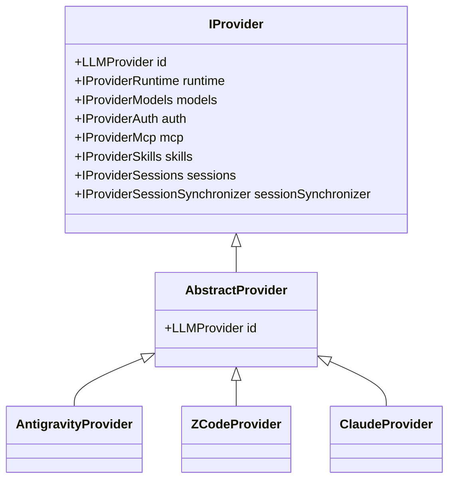

# Coding Agent 接入集成指南 (Coding Agent Integration Guide)

本指南详细说明了在 CloudCLI 中接入新的 AI Coding Agent（例如 Google Antigravity CLI、Cursor CLI 等）的系统架构、核心接口契约、分步集成流程、消息归一化规范及常见注意事项。

> **参考实现**：ZCode Provider 接入（`docs/zcode-integration-plan.md`）作为完整的参考实现，展示了如何按照本指南完成从 Phase 0 验证到 Phase 6 上线的全流程。ZCode 实现包含约 2,842 行生产级 TypeScript 代码，覆盖了所有 7 个分面的完整集成。

---

## 1. 架构总览与分面模式（Facets Architecture）

CloudCLI 后端采用**分面模式（Facets Architecture）**，所有支持的 Agent 在系统中均被抽象为一个具体的 **Provider**，统一继承基类 `AbstractProvider`，并向外暴露 7 个核心能力分面：



### 1.1 七大分面与服务层映射

| 分面 (Facet) | 核心职责 | 对应契约接口 | 消费服务 (Service Layer) |
| :--- | :--- | :--- | :--- |
| **`runtime`** | 驱动 SDK / CLI 进程生命周期、实时输出流解析及会话任务中断 | `IProviderRuntime` | `providerRuntimeService` |
| **`models`** | 提供预设模型目录、自定义模型支持及查询会话活跃模型 | `IProviderModels` | `providerModelsService` |
| **`auth`** | 检测 CLI 是否安装、版本及当前凭据鉴权状态 | `IProviderAuth` | `providerAuthService` |
| **`mcp`** | 读写管理该 Agent 原生格式的 MCP 配置文件（stdio / http / sse） | `IProviderMcp` | `providerMcpService` |
| **`skills`** | 发现/读写工作区及全局的自定义技能（`SKILL.md`）与命令前缀（`/` 或 `$`） | `IProviderSkills` | `providerSkillsService` |
| **`sessions`** | 原始事件/消息的标准化转换（`NormalizedMessage`）及历史记录分页读取 | `IProviderSessions` | `sessionsService` |
| **`sessionSynchronizer`** | 扫描本地磁盘转储文件（JSONL / SQLite）并将元数据同步至系统数据库索引 | `IProviderSessionSynchronizer` | `sessionSynchronizerService` |

---

## 2. 核心接口与类型契约

所有接口均定义在 `server/shared/interfaces.ts` 与 `server/shared/types.ts` 中：

### 2.1 运行时接口 (`IProviderRuntime`)

```typescript
export interface IProviderRuntime {
  /**
   * 启动一次 Agent 运行（新会话或续接会话）
   * @param command 用户提示词（含附件标签）
   * @param options 运行选项（sessionId, workspacePath, model, permissionMode, images 等）
   * @param writer 统一输出流适配器（支持 WebSocket / SSE）
   * @param context 运行上下文（提供 resolveProviderSessionId, resolveResumeModel 等）
   */
  run(
    command: string,
    options: AnyRecord,
    writer: ProviderRuntimeWriter,
    context: ProviderRuntimeContext,
  ): Promise<unknown>;

  /** 中断指定 sessionId 正在运行的任务 */
  abort(sessionId: string): boolean | Promise<boolean>;

  /** 可选：权限网关拦截器（用于审批 Bash 执行、文件写入等高危操作） */
  permissions?: ProviderRuntimePermissionGateway;
}
```

### 2.2 模型元数据接口 (`IProviderModels`)

```typescript
export interface IProviderModels {
  /** 返回该 Provider 官方预置支持的模型列表及默认模型 */
  getSupportedModels(): Promise<ProviderModelsDefinition>;

  /** 读取该 Provider 原生状态下的活跃模型（主要用于外部 CLI 启动的会话） */
  getCurrentActiveModel(sessionId?: string): Promise<ProviderCurrentActiveModel>;
}
```

### 2.3 鉴权状态接口 (`IProviderAuth`)

```typescript
export interface IProviderAuth {
  /**
   * 检查 Agent 的安装与登录凭据状态
   * 注意：当未安装或未登录时应作为合法状态数据返回，不要抛出异常
   */
  getStatus(): Promise<ProviderAuthStatus>;
}
```

### 2.4 MCP 适配器基类 (`McpProvider`)

继承 `server/modules/providers/shared/mcp/mcp.provider.ts` 中的 `McpProvider`，主要实现：
- `readScopedServers(scope, workspacePath)`: 读取配置文件（如 JSON / TOML）。
- `writeScopedServers(scope, servers, workspacePath)`: 回写标准 MCP 配置。
- `buildServerConfig(server)`: 通用 `ProviderMcpServer` 转 Provider 专用格式。
- `normalizeServerConfig(name, rawConfig)`: Provider 专用格式转通用结构。

### 2.5 技能发现基类 (`SkillsProvider`)

继承 `server/modules/providers/shared/skills/skills.provider.ts` 中的 `SkillsProvider`：
- `getSkillSources(workspacePath)`: 定义项目根目录与全局用户根目录下的技能搜索路径和命令前缀。

### 2.6 消息归一化接口 (`IProviderSessions`)

```typescript
export interface IProviderSessions {
  /** 将 Agent 底层的原始事件转换为 CloudCLI 统一消息类型 NormalizedMessage */
  normalizeMessage(raw: unknown, sessionId: string | null): NormalizedMessage[];

  /** 读取历史记录，严格支持 limit、offset 分页 */
  fetchHistory(sessionId: string, options?: FetchHistoryOptions): Promise<FetchHistoryResult>;
}
```

### 2.7 会话同步接口 (`IProviderSessionSynchronizer`)

```typescript
export interface IProviderSessionSynchronizer {
  /** 扫描磁盘目录下的 session 文件，提取 title、时间戳等元数据并 upsert 至 SQLite */
  synchronize(since?: Date): Promise<number>;

  /** 单个文件变更时的增量同步（由文件系统 watcher 驱动） */
  synchronizeFile(filePath: string): Promise<string | null>;
}
```

---

## 3. 新 Agent 接入实施步骤

以接入 `antigravity`（Google Antigravity CLI）为例（ZCode 已作为参考实现完成接入，详见 `docs/zcode-integration-plan.md`）：

### Step 1: 扩展类型定义

1. **后端**：在 `server/shared/types.ts` 中将新 Provider ID 加入 `LLMProvider` 联合类型：
   ```typescript
   export type LLMProvider = 'claude' | 'codex' | 'cursor' | 'opencode' | 'antigravity';
   ```
2. **前端**：在 `src/types/app.ts` 中同步修改 `LLMProvider`。

---

### Step 2: 编写 Provider 模块代码

在 `server/modules/providers/list/<provider>/` 目录下创建 8 个标准文件：

```text
server/modules/providers/list/antigravity/
├── antigravity.provider.ts                      # 主包装类
├── antigravity-runtime.provider.js (或 .ts)      # CLI 进程派生与实时事件解析
├── antigravity-auth.provider.ts                 # 安装与认证检测
├── antigravity-models.provider.ts               # 模型列表与默认值
├── antigravity-mcp.provider.ts                  # MCP 配置文件适配
├── antigravity-skills.provider.ts               # 技能发现根路径配置
├── antigravity-sessions.provider.ts             # 消息归一化与历史拉取
└── antigravity-session-synchronizer.provider.ts # 磁盘转储扫描与数据库同步
```

#### 模板参考实现

> **完整参考**：ZCode Provider 实现位于 `server/modules/providers/list/zcode/`，包含所有 11 个标准文件的完整实现，可直接作为参考模板。

##### 1. Provider 包装类 (`antigravity.provider.ts`)
```typescript
import { AbstractProvider } from '@/modules/providers/shared/base/abstract.provider.js';
import { AntigravityProviderAuth } from './antigravity-auth.provider.js';
import { AntigravityProviderModels } from './antigravity-models.provider.js';
import { AntigravityMcpProvider } from './antigravity-mcp.provider.js';
import { antigravityRuntime } from './antigravity-runtime.provider.js';
import { AntigravitySkillsProvider } from './antigravity-skills.provider.js';
import { AntigravitySessionsProvider } from './antigravity-sessions.provider.js';
import { AntigravitySessionSynchronizer } from './antigravity-session-synchronizer.provider.js';
import type {
  IProviderAuth,
  IProviderMcp,
  IProviderModels,
  IProviderRuntime,
  IProviderSessionSynchronizer,
  IProviderSessions,
  IProviderSkills,
} from '@/shared/interfaces.js';

export class AntigravityProvider extends AbstractProvider {
  readonly runtime: IProviderRuntime = antigravityRuntime;
  readonly models: IProviderModels = new AntigravityProviderModels();
  readonly auth: IProviderAuth = new AntigravityProviderAuth();
  readonly mcp: IProviderMcp = new AntigravityMcpProvider();
  readonly skills: IProviderSkills = new AntigravitySkillsProvider();
  readonly sessions: IProviderSessions = new AntigravitySessionsProvider();
  readonly sessionSynchronizer: IProviderSessionSynchronizer =
    new AntigravitySessionSynchronizer();

  constructor() {
    super('antigravity');
  }
}
```

##### 2. 技能发现配置 (`antigravity-skills.provider.ts`)
```typescript
import path from 'node:path';
import os from 'node:os';
import { SkillsProvider } from '@/modules/providers/shared/skills/skills.provider.js';
import type { ProviderSkillSource } from '@/shared/types.js';

export class AntigravitySkillsProvider extends SkillsProvider {
  constructor() {
    super('antigravity');
  }

  protected async getSkillSources(workspacePath: string): Promise<ProviderSkillSource[]> {
    return [
      {
        scope: 'project',
        rootDir: path.join(workspacePath, '.agents', 'skills'),
        commandPrefix: '/',
      },
      {
        scope: 'user',
        rootDir: path.join(os.homedir(), '.gemini', 'antigravity', 'skills'),
        commandPrefix: '/',
      },
    ];
  }
}
```

---

### Step 3: 注册后端 Provider 与路由校验

1. 在 `server/modules/providers/provider.registry.ts` 中注册：
   ```typescript
   import { AntigravityProvider } from '@/modules/providers/list/antigravity/antigravity.provider.js';

   const providers: Record<LLMProvider, IProvider> = {
     claude: new ClaudeProvider(),
     codex: new CodexProvider(),
     cursor: new CursorProvider(),
     opencode: new OpenCodeProvider(),
     antigravity: new AntigravityProvider(), // <-- 注册实例
   };
   ```
2. 确保 `server/modules/providers/provider.routes.ts` 和 `server/modules/agent/agent.routes.ts` 中的参数校验放行新的 provider id。
3. 若存在进程终止或全局资源回收逻辑，在 `server/index.ts` 的关闭流程中调用。

---

### Step 4: 前端 UI 与状态适配

在前端配置新 Provider 的交互支持：

1. **状态与默认值** (`src/components/chat/hooks/useChatProviderState.ts`)：
   - 在 `PROVIDERS` 数组中添加 `'antigravity'`。
   - 配置 `FALLBACK_DEFAULT_MODEL`（例如 `'gemini-3.7-flash'`）。
   - 配置 `FALLBACK_PERMISSION_MODES` 支持的权限选项。
2. **空状态选择器** (`src/components/chat/view/subcomponents/ProviderSelectionEmptyState.tsx`)：
   - 补充 Antigravity / Zcode 对应的图标与选项卡。
3. **认证弹窗与登录指引** (`src/components/provider-auth/view/ProviderLoginModal.tsx`)：
   - 补充 CLI 安装命令（如 `agy login` 或 `npm i -g @google/antigravity`）及配置引导。
4. **MCP 常量配置** (`src/components/mcp/constants.ts`)：
   - 定义其原生 MCP 文件的存储路径提示与传输协议范围。
5. **推理深度/思考预算（Effort）** (`src/components/chat/constants/providerEffort.ts`)（若模型支持）。

---

## 4. 消息归一化规范 (NormalizedMessage)

> **实际案例**：ZCode Provider 的消息归一化实现展示了如何处理复杂的事件流、SQLite 历史记录、以及多种消息类型的完整映射（参见 `zcode-sessions.provider.ts` 和 `docs/phase0-3-event-specs.md`）。

Runtime 输出给 Web 前端的所有事件必须归一化为 `NormalizedMessage`：

| 事件类型 (`kind`) | 典型场景 | 核心参数与说明 |
| :--- | :--- | :--- |
| `'text'` | Agent 的最终文本回答 | `content: string` |
| `'stream_delta'` | 实时打字机流式增量 | `content: string` (当前增量文本块) |
| `'thinking'` | 推理思考过程（CoT） | `content: string` |
| `'tool_use'` | 准备调用工具/执行命令 | `toolName`, `toolId`, `toolInput` |
| `'tool_result'` | 工具执行结果返回 | `toolId`, `toolResult: { content, isError }` |
| `'permission_request'` | 拦截高危操作等待用户审批 | `requestId`, `toolName`, `input` |
| `'complete'` | **一次对话运行结束** | `tokens`, `text`（**每个 Run 必须且只能发送一次**） |
| `'error'` | 进程崩溃或致命错误 | `isError: true`, `text: string` |

---

## 5. 关键设计准则与注意事项

1. **消息 ID 唯一性**：若一个底层事件产生多个归一化分片，必须附加 `-suffix` 避免 ID 碰撞引起前端 React Key 重复。
2. **关注点分离**：
   - `sessions`：只负责内存中的通信协议转换与 API 历史加载。
   - `sessionSynchronizer`：只负责磁盘文件的扫描与 SQLite 数据库索引。
3. **安全路径防御**：所有涉及文件读写、会话解析、MCP 路径的操作必须校验路径有效性，防止目录遍历攻击（Path Traversal）。
4. **非阻塞式状态检测**：`IProviderAuth.getStatus()` 遇到未安装或未认证时，应作为合法的状态对象返回，切勿直接 `throw Error`。
5. **跨平台兼容**：在 Windows 上，CLI 常作为 `.cmd` 或 `.ps1` 包装器运行，派生进程时使用 `cross-spawn` 并规避命令行换行符丢失问题。

---

## 6. 验证与测试规范

> **验证参考**：ZCode Provider 的完整测试流程展示了从 Phase 0 协议验证到单元测试的完整验证体系（参见 `docs/phase0-*.md` 和 `docs/phase6-test-results.md`）。

集成完毕后，执行以下命令进行完整性校验：

```bash
# 1. 服务端 TypeScript 静态类型检查
npx tsc --noEmit -p server/tsconfig.json

# 2. 代码规范与 Lint 检查
npx eslint server/modules/providers/list/<provider>/**/*.ts server/shared/types.ts

# 3. 运行核心 Provider 单元测试
npm test -- server/modules/providers/tests/mcp.test.ts
npm test -- server/modules/providers/tests/skills.test.ts
```
