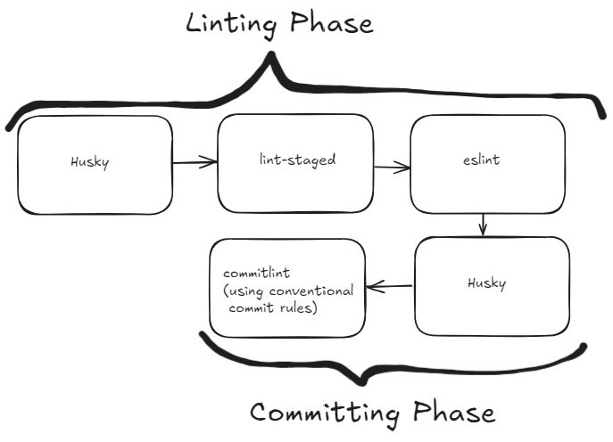

This markdown document provides explanations for how the lint and commit setup works in the project.



## Brief overview of git hooks
- Hooks are named for the event they intercept and use `pre-` or `post-` prefixes to indicate their timing. E.gs are: `pre-commit`, `commit-msg`(after the commit message, but before the commit is created), `pre-push`, and `post-receive` (after successful push).

- Inside any git repo, the hooks are stored in `.git/hooks` directory. The sample hooks can be activated by renaming them and removing the `.sample` extension.

## How does husky work?
- When we run `npm run prepare`, `husky install` command is executed, which creates a `.husky` directory in the root of the project and sets up the files for managing git hooks in `_` subdirectory. It also sets `git config core.hooksPath .husky` to tell git to look for hooks in the `.husky/_` directory instead of the default `.git/hooks` directory. We can override the default hooks by creating files with the same name as the hook we want to override in the `.husky` directory. For example, if we want to override the `pre-commit` hook, we can create a file named `pre-commit` in the `.husky` directory and add our custom script to it. 

One e.g. commit flow is this:
```txt
git commit
  -> Git notices "pre-commit" should run
  -> Git looks in core.hooksPath (.husky/_)
  -> Git executes .husky/_/pre-commit (The command is: . "$(dirname "$0")/h")
  -> that forwards calls to Husky's  (.husky/_/h) helper script
  -> Husky's helper runs our real .husky/pre-commit script
```

## How commiting works in our project?
- We use a library called `lint-staged` to run linters on the staged files before committing. The configuration for `lint-staged` is defined in the `package.json` file under the `lint-staged` key. It specifies that we want to run `eslint` on all staged JavaScript and TypeScript files.

- Our current pre-commit hook is set up to run `lint-staged` command, which runs `eslint` on the staged files.

- Then, the `commit-msg` hook is set up to run `commitlint` command, which checks the commit message against the defined rules in `commitlint.config.js` file. The rules specify that the commit message should follow the conventional commit format, which includes a type, an optional scope, and a description. If the commit message does not follow the format, the commit will be rejected and an error message will be displayed.

```txt
git commit
    ... (the above flow happens)
    -> `npx lint-staged` is executed in the pre-commit hook
    -> `lint-staged` looks at the configuration in `package.json` and finds that it needs to run `eslint` on all staged JavaScript and TypeScript files
    -> `eslint` runs on the staged files and checks for any linting errors
    -> If there are linting errors, the commit is rejected and an error message is displayed
    -> If there are no linting errors, the commit proceeds to the next step, which is the `commit-msg` hook
    -> `npx commitlint --edit $1` is executed in the `commit-msg` hook
    -> `commitlint` checks the commit message against the rules defined in `commitlint.config.js`
    -> If the commit message does not follow the conventional commit format, the commit is rejected and an error message is displayed
    -> If the commit message follows the conventional commit format, the commit is created successfully.
```

