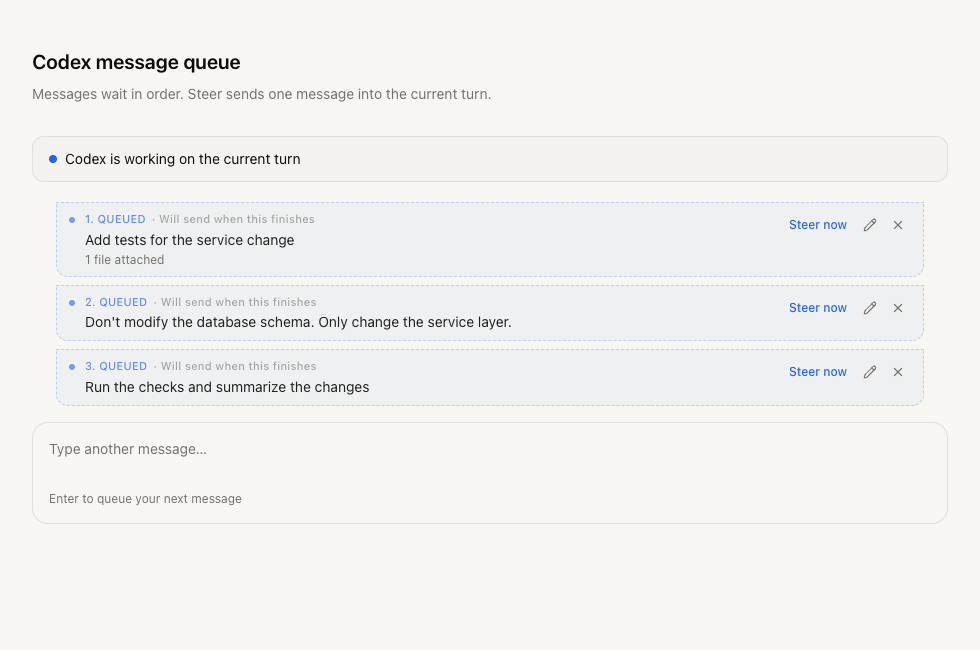

# Message queue and Codex steering

Sending B, C and D while A is running now creates three separate persisted entries. New submissions append to the queue; editing an entry changes only that entry and retains its position. Enter continues to queue during a running task, and also when earlier queued work remains in an idle session.

## Using the queue

1. Submit multiple messages while a session is running. Each card displays its FIFO position and attachments.
2. Edit or discard a specific queued entry. Edits require its current revision, so stale tabs cannot overwrite a newer edit.
3. When the active runtime is Codex app-server, use **Steer now** on any queued card to inject that message into the observed current turn. Other cards retain their relative order.
4. Wait for acceptance. The selected entry is consumed only after a successful app-server response. Explicit rejection returns it to the queue and leaves the running task active.
5. If delivery is **unknown**, check conversation history before discarding/recreating the entry. It blocks later FIFO work rather than automatically repeating input that may already have run. A failed ordinary turn also blocks the queue; editing that card retries it, or discarding it allows the next entry to run.



The screenshot renders the actual queue-card component with sample state. Its surrounding composer and running-turn label are a preview fixture, not a live provider session. Desktop and 390px mobile layouts were inspected.

## Persistence and recovery

The database stores individual `queued_messages` rows, ordered by sequence per session. Conditional claims and a unique index allow only one delivery/steering claim per session. A failed or unknown head blocks later messages. Sessions dispatch independently; completing a queued turn wakes the next queue pass. The existing 30-second scheduler poll remains a fallback, including after an ordinary foreground turn completes.

Each entry preserves its own options and uploaded attachment descriptors. The UI refreshes server state every five seconds and reloads it when reconnecting. Stable creation IDs make a manual retry after a lost HTTP response idempotent. A dispatch or steering operation interrupted by server restart becomes unknown; it is never automatically replayed.

The migration moves the old `session_drafts.queued_message` slot into one queue row without deleting text drafts or attachments. It clears the legacy slot in the same transaction. New clients autosave only composer text; legacy non-null queued-slot writes return 409. Refresh older browser tabs after upgrading to avoid conflicting with the new queue API.

## Protocol

Queue CRUD is authenticated at `/api/queued-messages`:

| Method | Path | Body/query |
| --- | --- | --- |
| GET | `/` | `sessionId` query |
| POST | `/` | `id`, `sessionId`, `content`, `options`, `attachments` |
| PATCH | `/:id` | `revision`, `content`, `options`, `attachments` |
| DELETE | `/:id` | `revision` |
| GET | `/operations/:requestId` | Read a persisted steering outcome |

Responses use the existing API success/error envelope. IDs belong to the authenticated user; updates and deletion compare the entry revision. Creating the same ID with the same payload returns its existing entry.

An accepted app-server `turn/start` publishes a status event with `text: "active_turn"` and an opaque `activeTurnToken`. A `chat_subscribed` ACK also supplies the token when that same adapter has an accepted active turn. SDK and other providers do not advertise it.

```json
{
  "type": "chat.steer",
  "requestId": "stable-operation-id",
  "sessionId": "app-session-id",
  "messageId": "persisted-queue-id",
  "revision": 1,
  "activeTurnToken": "observed-server-token"
}
```

The server loads the entry's saved content and attachments, reserves its revision, checks the observed token against the active run, and calls `turn/steer` with that run's `threadId` and captured `expectedTurnId`. It creates no new ChatRun. An old token cannot target a replacement turn.

```json
{
  "kind": "chat_steer_result",
  "requestId": "stable-operation-id",
  "messageId": "persisted-queue-id",
  "sessionId": "app-session-id",
  "status": "accepted",
  "error": null
}
```

Possible outcomes are `pending`, `accepted`, `rejected` and `unknown`. Duplicate request IDs return the stored outcome rather than repeating the provider RPC. Lost WebSocket ACKs can be recovered through the operations endpoint. Steering errors do not emit run `complete` or generic protocol errors. Local validation and explicit app-server rejection release the claim; transport timeout/exit leaves it unknown.

## Validation

Regression tests cover FIFO/order preservation, concurrent claims, edit/delete revisions, creation and steering idempotency, per-user ownership, legacy migration, restarted claims, independent sessions, attachment handling, stale A-to-B turn tokens, correlated/late ACKs, and failure without clearing the running state or composer input.

Run `npm test`, `npm run test:client`, `npm run typecheck`, `npm run lint` and `npm run build`. Codex protocol tests use a controlled JSON-RPC subprocess and runtime mocks. Live authenticated Codex app-server acceptance has not been tested.
