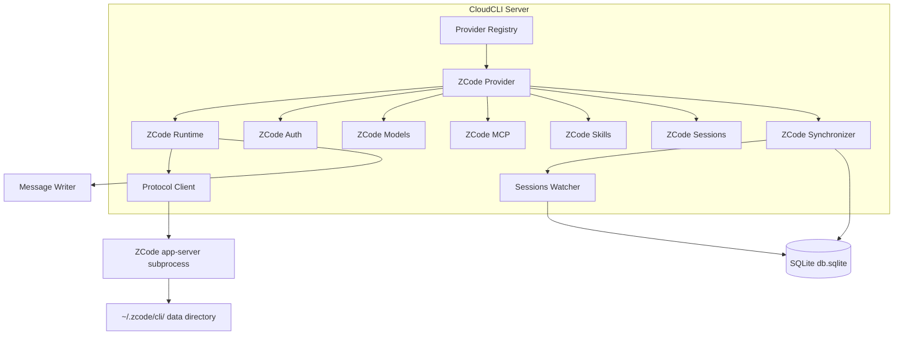

# ZCode Provider Developer Notes

**Technical documentation for ZCode provider implementation and maintenance**

## Table of Contents

1. [Architecture Overview](#architecture-overview)
2. [Protocol Communication Patterns](#protocol-communication-patterns)
3. [SQLite Database Integration](#sqlite-database-integration)
4. [Message Normalization](#message-normalization)
5. [Testing Guidelines](#testing-guidelines)
6. [Troubleshooting](#troubleshooting)
7. [Known Limitations](#known-limitations)
8. [Future Enhancements](#future-enhancements)

---

## 1. Architecture Overview

### 1.1 System Architecture

The ZCode provider implements a comprehensive integration following the CloudCLI provider architecture pattern:



### 1.2 Module Structure

**11 Core Files:**

```
server/modules/providers/list/zcode/
├── index.ts                          # Barrel exports (public API only)
├── zcode.provider.ts                # Main provider class (AbstractProvider)
├── zcode-runtime.provider.ts        # IProviderRuntime implementation
├── zcode-protocol.client.ts         # Protocol client (module-internal)
├── zcode-engine-path.ts             # Engine path resolution
├── zcode-auth.provider.ts           # IProviderAuth implementation
├── zcode-models.provider.ts         # IProviderModels implementation
├── zcode-mcp.provider.ts            # McpProvider implementation
├── zcode-skills.provider.ts         # SkillsProvider implementation
├── zcode-sessions.provider.ts       # IProviderSessions implementation
└── zcode-session-synchronizer.provider.ts  # SQLite synchronizer
```

### 1.3 Design Principles

**1. Protocol Isolation:**
- All ZCode protocol logic isolated in `zcode-protocol.client.ts`
- Protocol types are module-internal (not exported)
- Easy to adapt to protocol changes

**2. Single Responsibility:**
- Each provider facet handles one concern
- Clear separation between runtime, auth, models, etc.
- Minimal interdependencies between modules

**3. Backend Standards Compliance:**
- TypeScript throughout (no legacy .js patterns)
- Barrel exports via `index.ts`
- Cross-module types in `server/shared/types.ts`
- Module-internal types defined in implementation files

**4. Graceful Degradation:**
- Auth provider handles non-installation gracefully
- Protocol client recovers from process crashes
- Runtime handles session state errors properly

---

## 2. Protocol Communication Patterns

### 2.1 ZCode Protocol Specification

**Format:** Line-delimited JSON (NOT JSON-RPC 2.0)

**Request Envelope:**
```json
{
  "id": 123,
  "method": "session/send",
  "params": {
    "sessionId": "sess_abc123",
    "content": "user message here"
  }
}
```

**Response Envelope (Success):**
```json
{
  "id": 123,
  "result": {
    "sessionId": "sess_abc123",
    "status": "sent"
  }
}
```

**Response Envelope (Error):**
```json
{
  "id": 123,
  "error": {
    "code": -32601,
    "message": "Method not found",
    "data": {"availableMethods": ["session/send", "session/create"]}
  }
}
```

**Notification (No ID):**
```json
{
  "method": "session/event",
  "params": {
    "sessionId": "sess_abc123",
    "eventType": "message_delta",
    "data": {...}
  }
}
```

### 2.2 Protocol Client Architecture

**Key Components:**

```typescript
class ZCodeProtocolClient {
  // Process lifecycle management
  private process: ChildProcess | null;
  private restartAttempts: number;
  private readonly maxRestarts = 5;
  
  // Request correlation
  private requestId = 0;
  private pendingRequests = new Map<number, RequestCallback>();
  
  // Event routing
  private eventListeners = new Map<string, Set<EventListener>>();
  
  // Main methods
  async request(method: string, params?: AnyRecord): Promise<unknown>
  onEvent(sessionId: string, callback: EventCallback): void
  private handleStdoutLine(line: string): void
  private startProcess(): void
}
```

### 2.3 Request Lifecycle

**1. Request Submission:**
```typescript
const result = await protocolClient.request('session/send', {
  sessionId: 'sess_abc123',
  content: 'Hello ZCode'
});
```

**2. Protocol Encoding:**
- Generate unique request ID
- Create request envelope
- Serialize to JSON
- Write to stdin with newline
- Register pending promise

**3. Response Handling:**
- Parse stdout line as JSON
- Extract response ID
- Resolve/reject corresponding promise
- Handle error responses appropriately

### 2.4 Event Flow

**Session Event Subscription:**

```typescript
// In runtime provider
protocolClient.onEvent(sessionId, (event) => {
  // Route event to message normalization
  const messages = sessionsProvider.normalizeMessage(event, sessionId);
  
  // Write to frontend
  messages.forEach(msg => writer.write(msg));
});
```

**Event Types:**
- `message_delta` - Streaming text chunks
- `tool_use` - Tool invocation events
- `tool_result` - Tool execution results
- `run_complete` - Run completion with token counts
- `error` - Error conditions

### 2.5 Error Handling Patterns

**Protocol Errors:**
```typescript
try {
  const result = await protocolClient.request('session/create', params);
} catch (error) {
  if (error.code === -32601) {
    // Method not found - protocol mismatch
  } else if (error.code === -32600) {
    // Invalid request - parameter error
  }
}
```

**Process Recovery:**
```typescript
private handleProcessExit(): void {
  if (this.restartAttempts < this.maxRestarts) {
    const delay = Math.min(1000 * Math.pow(2, this.restartAttempts), 30000);
    setTimeout(() => this.startProcess(), delay);
    this.restartAttempts++;
  }
}
```

---

## 3. SQLite Database Integration

### 3.1 Database Schema

**Key Tables:**

```sql
-- Sessions table
CREATE TABLE session (
  id TEXT PRIMARY KEY,                    -- sess_* format
  parent_id TEXT,                         -- For sub-agents
  project_id TEXT,
  title TEXT,
  title_source TEXT,                      -- 'ai' | 'user' | 'auto'
  directory TEXT,                         -- Workspace path
  task_type TEXT,
  time_created INTEGER,                   -- Epoch milliseconds
  time_updated INTEGER,
  mode TEXT,                             -- plan/build/edit/yolo
  status TEXT,                           -- idle/active/etc
  session_kind TEXT
);

-- Messages table
CREATE TABLE message (
  id TEXT PRIMARY KEY,
  session_id TEXT REFERENCES session(id),
  data TEXT,                             -- JSON: {role, modelID, tokens, ...}
  sequence INTEGER,
  time_created INTEGER
);

-- Parts table (message fragments)
CREATE TABLE part (
  id TEXT PRIMARY KEY,
  message_id TEXT REFERENCES message(id),
  part_type TEXT,                        -- text/reasoning/tool_use/...
  content TEXT,
  time_created INTEGER
);

-- Indexes for performance
CREATE INDEX message_session_time_created_id_idx 
  ON message(session_id, time_created, id);
```

### 3.2 Access Patterns

**Read-Only Discipline:**
```typescript
// Correct pattern - short-lived read-only connection
function fetchHistory(sessionId: string, limit: number) {
  const db = new Database(
    `file:${dbPath}?mode=ro`,
    { readonly: true }
  );
  
  try {
    const rows = db.prepare(`
      SELECT m.data, p.part_type, p.content
      FROM message m
      LEFT JOIN part p ON m.id = p.message_id
      WHERE m.session_id = ?
      ORDER BY m.time_created, m.sequence
      LIMIT ?
    `).all(sessionId, limit);
    
    return processRows(rows);
  } finally {
    db.close(); // Always close promptly
  }
}
```

**Anti-Patterns to Avoid:**
- ❌ Long-lived connections
- ❌ Write transactions
- ❌ Holding connections during user operations
- ❌ Accessing WAL files directly (use watcher debouncing)

### 3.3 Session Synchronization

**Incremental Sync Pattern:**

```typescript
async synchronize(since?: number) {
  const db = openReadOnlyDatabase();
  
  const watermarks = since 
    ? `WHERE time_updated > ${since}`
    : '';
  
  const sessions = db.prepare(`
    SELECT id, title, directory, time_created, time_updated
    FROM session
    WHERE parent_id IS NULL
    ${watermarks}
  `).all();
  
  for (const session of sessions) {
    await sessionsDb.createSession(
      session.id,
      'zcode',
      session.directory,
      session.title,
      session.time_created,
      session.time_updated,
      dbPath
    );
  }
  
  return sessions;
}
```

**Watcher Integration:**

The sessions watcher service monitors `~/.zcode/cli/db/db.sqlite` and WAL files:
- 500ms debounce for file changes
- 2s debounce for batch changes
- Calls synchronizer on detected changes
- Handles SQLite WAL rotation

---

## 4. Message Normalization

### 4.1 Normalization Mapping

**Source → Normalized Message:**

| Source | NormalizedMessage.kind | Processing Notes |
|--------|------------------------|------------------|
| SQLite `message.data.role='user'` | `text` (role: user) | Direct mapping for offline history |
| SQLite `part.type='assistant'` | `text` (role: assistant) | Extract content field |
| Event `message_delta` | `stream_delta` | Handle streaming chunks |
| SQLite `part.type='reasoning'` | `thinking` | Extract variant content |
| SQLite `part.type='tool_use'` | `tool_use` | Parse toolName/toolInput |
| SQLite `part.type='tool_result'` | `tool_result` | Parse content/isError |
| Event `run_complete` | `complete` | Extract token counts |
| Process crash / protocol error | `error` | Include error details |

### 4.2 Normalization Pipeline

**Two-Source Processing:**

```typescript
normalizeMessage(raw: unknown, sessionId: string): NormalizedMessage[] {
  // Source 1: SQLite offline data
  if (isSQLiteRow(raw)) {
    return this.normalizeSQLiteRow(raw, sessionId);
  }
  
  // Source 2: Protocol online event
  if (isProtocolEvent(raw)) {
    return this.normalizeProtocolEvent(raw, sessionId);
  }
  
  return [createNormalizedMessage({
    kind: 'error',
    text: `Unknown message format: ${typeof raw}`
  })];
}
```

**SQLite Row Processing:**

```typescript
private normalizeSQLiteRow(row: SQLiteRow, sessionId: string) {
  const messageData = JSON.parse(row.data);
  
  // Main message
  const messages: NormalizedMessage[] = [];
  
  // Extract parts (message fragments)
  for (const part of row.parts) {
    switch (part.part_type) {
      case 'text':
        messages.push(createNormalizedMessage({
          kind: 'text',
          role: messageData.role,
          text: part.content
        }));
        break;
        
      case 'reasoning':
        messages.push(createNormalizedMessage({
          kind: 'thinking',
          text: part.content
        }));
        break;
        
      case 'tool_use':
        messages.push(createNormalizedMessage({
          kind: 'tool_use',
          toolName: part.tool_name,
          toolInput: JSON.parse(part.input_json)
        }));
        break;
    }
  }
  
  return messages;
}
```

### 4.3 Message ID Generation

**Collision Prevention:**

```typescript
// Use protocol message ID with timestamp
function generateMessageId(source: string, timestamp: number, suffix?: string) {
  const base = `${source}-${timestamp}`;
  return suffix ? `${base}-${suffix}` : base;
}

// For multi-part messages, add suffix
const baseId = generateMessageId('zcode', message.time_created);
const partId = generateMessageId('zcode', message.time_created, `part-${index}`);
```

---

## 5. Testing Guidelines

### 5.1 Unit Testing Strategy

**Protocol Client Tests:**

```typescript
describe('ZCodeProtocolClient', () => {
  it('should handle request correlation correctly', async () => {
    const client = new ZCodeProtocolClient();
    
    const request1 = client.request('session/list');
    const request2 = client.request('session/create');
    
    // Verify different request IDs
    // Verify correct response routing
  });
  
  it('should handle malformed JSON gracefully', () => {
    const client = new ZCodeProtocolClient();
    
    // Simulate malformed stdout line
    client['handleStdoutLine']('invalid json');
    
    // Should not crash, should log error
  });
});
```

**SQLite Reader Tests:**

```typescript
describe('ZCodeSessionsProvider', () => {
  it('should fetch history with pagination', () => {
    // Use fixture database
    const provider = new ZCodeSessionsProvider();
    const history = await provider.fetchHistory('sess_test', {limit: 10});
    
    expect(history).toHaveLength(10);
    expect(history[0].kind).toBeDefined();
  });
  
  it('should handle sub-agent filtering', () => {
    // Verify parent_id IS NULL filtering
    // Ensure sub-agent sessions excluded
  });
});
```

### 5.2 Integration Testing

**Mock ZCode Process:**

```typescript
// Test helper that simulates app-server
class MockZCodeServer {
  private responses = new Map<number, unknown>();
  
  respondTo(requestId: number, response: unknown) {
    this.responses.set(requestId, response);
  }
  
  // Read stdin and respond to requests
  // Simulate event streaming
  // Handle errors gracefully
}
```

**Runtime Integration Tests:**

```typescript
describe('ZCodeRuntimeProvider', () => {
  it('should handle complete session lifecycle', async () => {
    const runtime = new ZCodeRuntimeProvider();
    const writer = mockWriter();
    
    await runtime.run('test command', {}, writer, mockContext());
    
    // Verify session creation
    // Verify message sending
    // Verify completion event
    // Verify token counts
  });
});
```

### 5.3 Manual Testing Checklist

**Without ZCode Installation:**
- [ ] Auth provider returns correct status for non-installed state
- [ ] Engine path resolution works with environment override
- [ ] Provider gracefully handles connection failures
- [ ] Frontend shows appropriate error messages

**With ZCode Installation:**
- [ ] Session creation and message sending
- [ ] Event streaming and message normalization
- [ ] Session history loading and pagination
- [ ] MCP server configuration changes
- [ ] Session synchronization with desktop app

---

## 6. Troubleshooting

### 6.1 Common Issues

**Issue: Protocol Version Mismatch**

**Symptoms:** `-32601` Method not found errors  
**Cause:** ZCode version different from tested version (0.16.3)  
**Solution:**
```typescript
// Check version detection logs
console.log('ZCode version:', getEngineVersion());

// Add protocol compatibility layer if needed
// Update field mappings based on new protocol
```

**Issue: SQLite Lock Contention**

**Symptoms:** "database is locked" errors  
**Cause:** Long-lived connections or write attempts  
**Solution:**
```typescript
// Ensure read-only mode
const db = new Database(dbPath, { readonly: true });

// Use short connections
try {
  // quick query
} finally {
  db.close();
}
```

**Issue: Event Routing Failures**

**Symptoms:** Events not reaching frontend  
**Cause:** Session ID mismatch or listener registration  
**Solution:**
```typescript
// Verify session ID mapping
console.log('Active sessions:', activeSessions);

// Check event listener registration
protocolClient.onEvent(sessionId, (event) => {
  console.log('Received event:', event);
});
```

### 6.2 Debugging Techniques

**Protocol Logging:**

```typescript
// Add to protocol client for debugging
private logRequest(id: number, method: string, params: unknown) {
  console.log('[ZCode Protocol] Request:', {id, method, params});
}

private logResponse(id: number, result: unknown) {
  console.log('[ZCode Protocol] Response:', {id, result});
}
```

**SQLite Query Logging:**

```typescript
// Log all SQL queries for debugging
function logQuery(sql: string, params: unknown[]) {
  console.log('[ZCode SQLite]', {sql, params});
}
```

**Event Flow Tracing:**

```typescript
// Trace message normalization
function traceNormalization(raw: unknown, normalized: NormalizedMessage[]) {
  console.log('[ZCode Normalize]', {
    inputType: typeof raw,
    outputCount: normalized.length,
    kinds: normalized.map(m => m.kind)
  });
}
```

### 6.3 Performance Monitoring

**Protocol Client Metrics:**

```typescript
class ZCodeProtocolClient {
  private metrics = {
    requests: 0,
    responses: 0,
    errors: 0,
    avgResponseTime: 0
  };
  
  private async request(method: string, params: AnyRecord) {
    const start = Date.now();
    try {
      const result = await this.sendRequest(method, params);
      this.metrics.avgResponseTime = 
        (this.metrics.avgResponseTime + (Date.now() - start)) / 2;
      return result;
    } catch (error) {
      this.metrics.errors++;
      throw error;
    }
  }
}
```

**SQLite Performance:**

```typescript
// Monitor query performance
function measureQueryPerformance() {
  const start = Date.now();
  // execute query
  const duration = Date.now() - start;
  
  if (duration > 1000) {
    console.warn('[ZCode SQLite] Slow query:', duration, 'ms');
  }
}
```

---

## 7. Known Limitations

### 7.1 Current Limitations

**1. Protocol Dependency:**
- Protocol is reverse-engineered, not officially documented
- May change with ZCode updates without notice
- No official versioning or compatibility guarantees

**2. Platform Support:**
- macOS and Linux paths verified
- Windows paths based on documentation only
- cross-spawn behavior on Windows needs validation

**3. Event Coverage:**
- Some event types not yet observed in testing
- Permission approval events structure unconfirmed
- Streaming delta events need real-world validation

**4. SQLite Access:**
- Read-only access limits some functionality
- No ability to modify session metadata
- Dependent on ZCode's database schema stability

### 7.2 Workarounds

**Protocol Changes:**
```typescript
// Isolate protocol-specific code
// Add version detection
// Provide compatibility shims
```

**Platform Differences:**
```typescript
// Use platform-specific path resolution
// Test on each platform before release
// Provide clear error messages for unsupported platforms
```

**Missing Event Types:**
```typescript
// Provide fallback handling
// Log unknown events for analysis
// Degrade gracefully when events not understood
```

---

## 8. Future Enhancements

### 8.1 Planned Improvements

**1. Comprehensive Testing:**
- [ ] Unit tests with mock ZCode process
- [ ] Integration tests with real ZCode installation
- [ ] Performance benchmarks
- [ ] Cross-platform testing matrix

**2. Enhanced Protocol Support:**
- [ ] Full permission approval UI
- [ ] Sub-agent session management
- [ ] Workspace state synchronization
- [ ] Real-time collaboration features

**3. Advanced Features:**
- [ ] Custom model provider configuration
- [ ] Session branching and merging
- [ ] Advanced MCP server management
- [ ] Skills marketplace integration

### 8.2 Architecture Evolution

**Protocol Abstraction Layer:**
```typescript
// Future protocol version compatibility
interface ZCodeProtocolV1 {
  // Current protocol methods
}

interface ZCodeProtocolV2 {
  // Future protocol methods
}

class ZCodeProtocolClient {
  detectVersion(): string;
  getProtocol(version: string): ZCodeProtocolV1 | ZCodeProtocolV2;
}
```

**Enhanced Error Recovery:**
```typescript
// Automatic protocol adaptation
// Graceful degradation for missing features
// User notification for compatibility issues
```

### 8.3 Monitoring and Observability

**Planned Metrics:**
- Request/response latency
- Event processing throughput
- Error rates and types
- Resource usage patterns
- User interaction patterns

**Debugging Improvements:**
- Structured logging
- Event tracing
- Performance profiling
- Memory leak detection

---

## 9. Maintenance Guidelines

### 9.1 Code Maintenance

**When Updating ZCode:**

1. **Version Detection:**
   ```bash
   /path/to/zcode.cjs --version
   ```

2. **Protocol Verification:**
   - Test all known protocol methods
   - Check for new methods or parameters
   - Verify error response format

3. **Schema Validation:**
   - Check SQLite schema for changes
   - Verify table and column names
   - Test message normalization

4. **Integration Testing:**
   - Run full test suite
   - Test with real ZCode installation
   - Verify desktop app integration

### 9.2 Documentation Maintenance

**Keep Updated:**
- Protocol specification changes
- New ZCode features and capabilities
- Platform-specific behaviors
- Configuration options and defaults

**Update Triggers:**
- ZCode version updates
- New protocol methods discovered
- Platform support additions
- Bug fixes and workarounds

### 9.3 Support and Troubleshooting

**Common Issues:**
- Authentication failures
- Session synchronization problems
- Performance degradation
- Platform-specific issues

**Support Resources:**
- This developer guide
- Integration plan documentation
- User guide documentation
- ZCode official documentation

---

## 10. Code Examples

### 10.1 Custom Permission Handling

```typescript
// Future enhancement for granular permissions
async handlePermissionRequest(request: PermissionRequest) {
  const decision = await this.requestUserDecision({
    toolName: request.toolName,
    operation: request.operation,
    files: request.files
  });
  
  if (decision.granted) {
    await protocolClient.request('session/approveTool', {
      sessionId: request.sessionId,
      toolCallId: request.toolCallId
    });
  } else {
    await protocolClient.request('session/denyTool', {
      sessionId: request.sessionId,
      toolCallId: request.toolCallId
    });
  }
}
```

### 10.2 Advanced MCP Configuration

```typescript
// Dynamic MCP server management
class ZCodeMcpProvider {
  async addServer(scope: 'user' | 'project', config: McpServerConfig) {
    const configPath = this.resolveConfigPath(scope);
    const currentConfig = await this.readConfig(configPath);
    
    currentConfig.mcp.servers[config.name] = {
      command: config.command,
      args: config.args,
      env: config.env
    };
    
    await this.writeConfig(configPath, currentConfig);
  }
  
  async removeServer(scope: 'user' | 'project', name: string) {
    const configPath = this.resolveConfigPath(scope);
    const currentConfig = await this.readConfig(configPath);
    
    delete currentConfig.mcp.servers[name];
    
    await this.writeConfig(configPath, currentConfig);
  }
}
```

### 10.3 Session Management Extensions

```typescript
// Advanced session operations
class ZCodeSessionsProvider {
  async forkSession(sessionId: string, title: string) {
    const result = await protocolClient.request('session/fork', {
      sessionId,
      title
    });
    
    return result.sessionId;
  }
  
  async compactSession(sessionId: string) {
    await protocolClient.request('session/compact', {
      sessionId
    });
  }
  
  async exportSession(sessionId: string, format: 'json' | 'markdown') {
    const messages = await this.fetchHistory(sessionId, {
      limit: Infinity
    });
    
    if (format === 'json') {
      return JSON.stringify(messages, null, 2);
    } else {
      return this.formatAsMarkdown(messages);
    }
  }
}
```

---

**Last Updated:** 2026-08-17  
**Version:** 1.0.0  
**Tested With:** ZCode CLI 0.16.3 / Desktop 3.7.7

For implementation details, see [Integration Plan](./zcode-integration-plan.md).  
For user documentation, see [ZCode Provider Guide](./zcode-provider-guide.md).